# 第一章：多模态学习导论

来源：刘洋（Yang Liu），`1_Introduction_MultimodalLearning-26.pdf`，114 页，封面日期 2026-09-07。下文页码均为 **PDF 页序号**；课件中部分页脚编号有偏移。重复展示页已合并，原图已裁去校徽、口号和装饰边框。

## 1. 模态、多模态与人类交流

### 1.1 两种不同的“多模态”（第 6–10 页）

统计学中的 **multimodal distribution（多峰分布）** 指概率密度函数具有多个局部极大值。这里的 mode 是“峰”，与多模态学习中的信息模态含义不同。

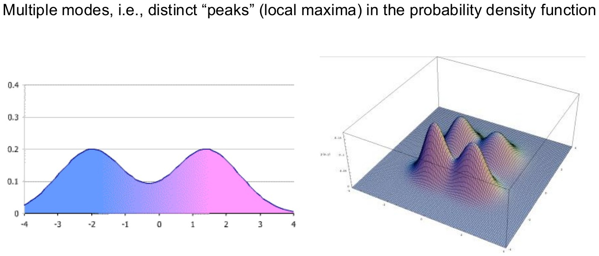

**Modality（模态）** 指信息的类型、获取信息的方式，或者信息的存储与表示形式。感官模态是视觉、触觉等主要感觉形式，也可理解为信息交流的通道。

| 模态 | 课件举例 |
| --- | --- |
| 自然语言 | 口语、书面语 |
| 视觉 | 图像、视频 |
| 听觉 | 语音、其他声音、音乐 |
| 触觉 | 接触、触感 |
| 其他感官与运动 | 嗅觉、味觉、自身运动 |
| 生理信号 | 心电图 ECG、皮肤电导 |
| 其他成像或传感信息 | 红外图像、深度图像、功能磁共振 fMRI |

第 7 页的感官图将外观、声音、触觉、味觉、气味与注意力、记忆、偏好联系起来：人的理解既依赖输入通道，也依赖已有认知状态。

### 1.2 多模态交流行为（第 8 页）

| 交流通道 | 具体信息 |
| --- | --- |
| 视觉行为 | 头部、眼部、手臂手势；身体姿势；人际距离（proxemics）；头部朝向与视线；微笑、皱眉等表情 |
| 言语内容（verbal） | 词汇；词性等句法信息；话语行为等语用信息 |
| 发声方式（vocal） | 语调、音质等韵律；笑声、呻吟等声音表达 |

“说了什么”和“怎样说”是不同的信息来源。相同词句可以通过语调、表情和姿态表达不同情绪。

## 2. 多模态研究的历史与动机

### 2.1 四个研究时期（第 12–17 页）

| 时期 | 时间范围 | 研究重点与课件实例 |
| --- | --- | --- |
| 行为研究时期 | 1970 年代至 1980 年代末 | 研究人类跨感官感知；McGurk 效应（1976）说明看到的口型会影响听到的语音 |
| 计算研究时期 | 1980 年代末至 2000 年 | 视听语音识别 AVSR；多模态／多感官交互界面；情感计算 |
| 交互研究时期 | 2000–2010 年 | 对人类多模态交互进行建模；会议理解、认知助手 |
| 深度学习时期 | 2010 年代起 | 从手工特征走向表征学习、视觉注意力及多模态基础模型 |

**McGurk 效应**：视听信息在感知过程中相互作用，语音识别并非仅由音频决定。课件引用 McGurk 与 MacDonald 的论文 *Hearing lips and seeing voices*，Nature，1976。

**视听语音识别（AVSR）**：联合使用声音和口唇运动。第 14 页用词错误率与信噪比的关系说明，在噪声较强的条件下，视觉信息能补充音频信息；图中的特定系统展示了约 10 dB 的增益，不能把这一数值泛化为所有 AVSR 系统。

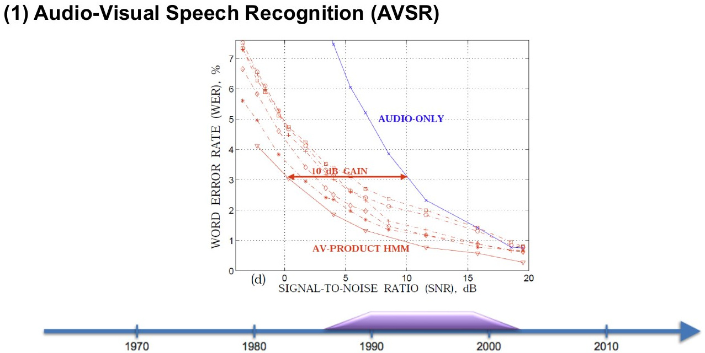

**情感计算**：课件借 Rosalind Picard 的观点说明，自然交互需要识别、理解并表达情绪。这里保留研究动机，不保留书籍封面装饰。

**AMI 项目**（IDIAP，2001–2006）：100 多小时会议录制数据，音视频完全同步，并提供转写与标注。

**CALO 项目**（SRI，2003–2008）：名称为 Cognitive Assistant that Learns and Organizes；与 Personalized Assistant that Learns（PAL）相关。课件指出 Siri 是该项目的衍生应用。

深度学习时期的代表工作：

- *Multimodal Deep Learning*，ICML 2011。
- *Multimodal Learning with Deep Boltzmann Machines*，NIPS 2012。
- *Show, Attend and Tell: Neural Image Caption Generation with Visual Attention*，ICML 2015。
- 多模态基础模型（Multimodal Foundation Models）。

推动因素包括大规模多模态数据集、更快的计算机与 GPU、高层视觉特征、向量化语言特征。

### 2.2 为什么需要多模态学习（第 19–22 页）

人通过视觉大量地感知世界，通过语言大量地交流和传递知识。多模态学习希望模型同时具备 **感知与交流** 的能力：既能看懂，也能理解与生成语言。课件以 ResNet 代表视觉理解、BERT 代表语言理解，将二者指向多模态智能。

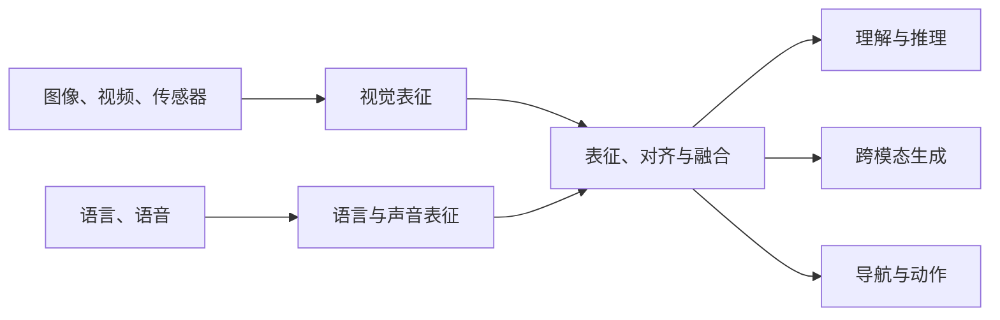
```mermaid
flowchart LR
  V[图像、视频、传感器] --> VE[视觉表征]
  L[语言、语音] --> LE[语言与声音表征]
  VE --> M[表征、对齐与融合]
  LE --> M
  M --> U[理解与推理]
  M --> G[跨模态生成]
  M --> A[导航与动作]
```

第 20–21 页的任务演进图包含：视听语音识别、基于内容的视频检索、情感识别、视频事件识别、多模态情感分析；随后扩展至图像描述、视频描述与定位、视觉问答、视频问答与指代表达、跨模态对话、大规模视频事件检索、视觉语言导航、自动驾驶，以及图像到文本／视频的生成。

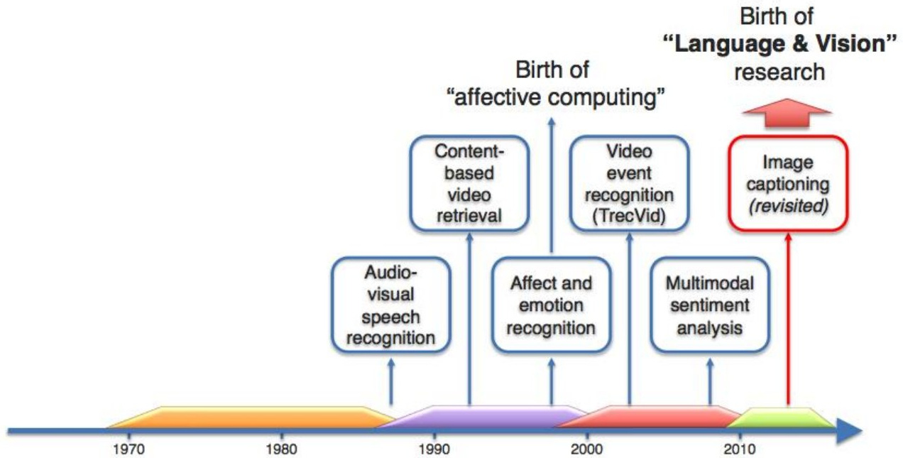

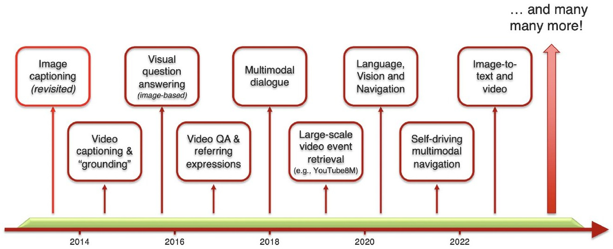

第 22 页列出的模型时间线为：ViT（2020.4）、GPT-3（2020.6）、ChatGPT（2022.11）、Qwen-VL（2023.8）、GPT-4V（2023.9）、PaliGemma 与 GPT-4o（2024.5）、Claude 4（2025.5）、GPT-5（2025.8）、DeepSeek-v3.2（2025.9）、Gemini 3（2025.11）。这些是**课件的历史标记**，用于说明从单模态到多模态的研究演进，并不意味着列表中的每个模型均支持相同模态。

## 3. 典型任务与完整例题

记 $`V`$ 为视觉信息，$`L`$ 为语言信息，$`A`$ 为动作。箭头描述输入与输出的模态关系；$`V`$ 可包括图像、视频或输出的视觉区域。

| 任务 | 输入与输出 | 核心要求 |
| --- | --- | --- |
| 图像描述 | $`V\to L`$ | 概括整张图像 |
| 密集图像描述 | $`V\to L`$ | 对多个区域分别生成描述 |
| 视频描述 | $`V\to L`$ | 理解动作与时间顺序 |
| 指代表达定位 | $`V+L\to V`$ | 根据语言定位目标区域 |
| 视觉问答 | $`V+L\to L`$ | 对图像中的问题作答 |
| 视觉对话 | $`V+L\to L`$ | 结合图像与多轮历史作答 |
| 视频问答 | $`V+L\to L`$ | 结合视频、事件顺序和可能的字幕作答 |
| 视觉常识推理 | $`V+L\to L`$ | 选择答案并给出合理依据 |
| 文本生成图像 | $`L\to V`$ | 将属性、关系和构图落实到图像 |
| 视觉语言导航 | $`V+L\to A`$ | 根据环境观察与指令行动 |
| 自动驾驶多模态导航 | 课件简写为 $`V+L\to A`$ | 融合相机、激光雷达、雷达与地图等信息 |

### 3.1 图像描述与密集图像描述（第 23–24 页）

整图描述例：“一只小动物，可能是啮齿动物，正在吃人递给它的香蕉。”该例强调对象、动作以及人与动物的交互关系。

密集描述同时预测多个区域及其文本。课件餐桌示例中的标签包括：一小碗酱汁、一盘食物、一碗汤、摆着食物的桌子、一碗巧克力、装着红色酱汁的蓝碗、一杯水、一片肉、盘中的食物；图中还有被边缘截断的银色金属物体等标签，保留原图便于理解区域重叠。课件引用 Johnson、Karpathy 与 Fei-Fei（2016）。

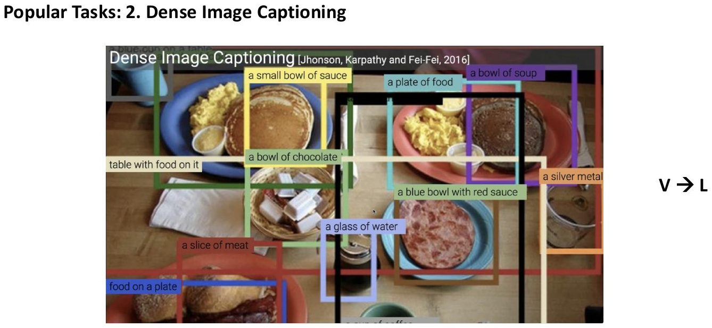

### 3.2 视频描述（第 25 页）

同一视频可以有不同粒度的输出：

- **详细描述**：一个男人从抽屉取出砧板和刀，从冰箱取出橙子，用刀切开橙子，将两半榨汁，丢掉果皮，最后把果汁倒入玻璃杯。
- **一句话摘要**：一个男人在榨橙汁。

技术要点是同时识别对象、动作、先后关系，并根据任务要求控制描述粒度。

### 3.3 指代表达定位（第 26–28 页）

输入图像与查询“粉色头发的玩具”，输出相应玩具的边界框。第 26 页是问题、第 27 页是答案，合并为一个例题。

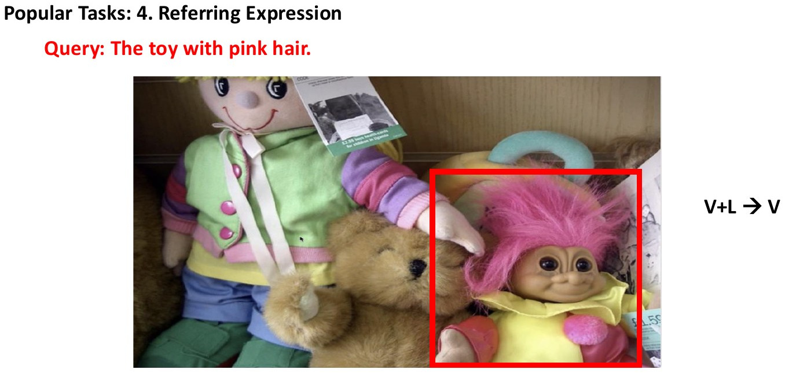

课件展示三个数据集及同一目标的不同表达：

| 数据集 | 示例表达的中文含义 |
| --- | --- |
| RefClef | 右边的石头；右侧沿线的石头；台阶右边的石头 |
| RefCOCO | 右边穿白衬衫的女人；右边的女人；右侧女人 |
| RefCOCO+ | 穿黄色衣服运球的人；黄衬衫和黑短裤；焦点中的黄衬衫 |

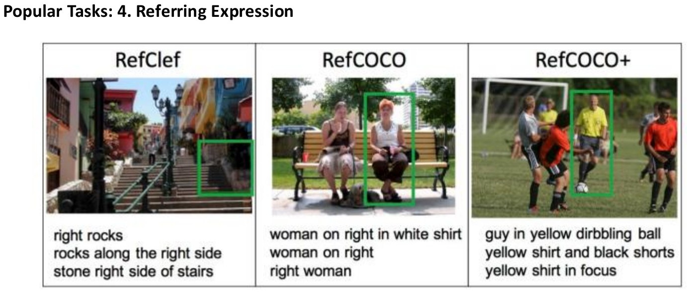

### 3.4 视觉问答与视觉对话（第 29–31 页）

**视觉问答**例：问题“这个孩子在做什么？”答案“玩滑板（Skateboarding）”。第 29–30 页的问答合并。

**视觉对话**例：图中一只戴护目镜的狗坐在摩托车边车内。完整三轮对话：

1. 摩托车在移动还是静止？——停着。
2. 这是什么品种的狗？——看起来像漂亮的比特犬混种。
3. 它是什么颜色？——浅棕色，白色斑块一直延伸到下巴底部。

多轮问题中的“它”需要结合前文确定指代对象。

### 3.5 视频问答（第 32 页）

课件示例将画面、带时间戳的对白及问题对应的时间区间放在同一时间轴上。视频片段中的对白依次包含：Chandler 让 Joey 回房间；Janice 说要走、但不能没有一个吻；Chandler 说也许不吻她以便她留下；Joey 催促他吻她；Janice 告别；后来 Chandler 说她让他快乐，Joey 回应“好吧”。关键对白区间包括 00:00.755–00:02.655、00:06.961–00:08.622、00:08.829–00:10.057、00:10.264–00:12.391、00:12.600–00:14.761、00:16.771–00:19.137、00:39.327–00:40.760、00:41.596–00:44.087。

| 问题 | 选项 | 课件标出的正确答案 |
| --- | --- | --- |
| Chandler 让 Joey 回房间后，Janice 抓着什么？ | A Chandler 的领带；B Chandler 的手；C 她的早餐；D 她的外套；E Chandler 的咖啡杯 | A：Chandler 的领带 |
| 两人在厨房时，Joey 为什么希望 Chandler 吻 Janice？ | A 因为 Chandler 开心；B 喜欢看别人接吻；C 因为这样她就会离开；D 觉得 Janice 很性感；E 因为 Chandler 会离开吐司 | C：因为她就会离开 |
| Joey 站在柜台前时，他身后沙发上是什么？ | A 小鸡；B 足球；C 鸭子；D 枕头；E Janice 的外套 | B：足球 |

三类问题分别需要物体／交互识别、结合对话的动机推理、特定时间段的空间定位。

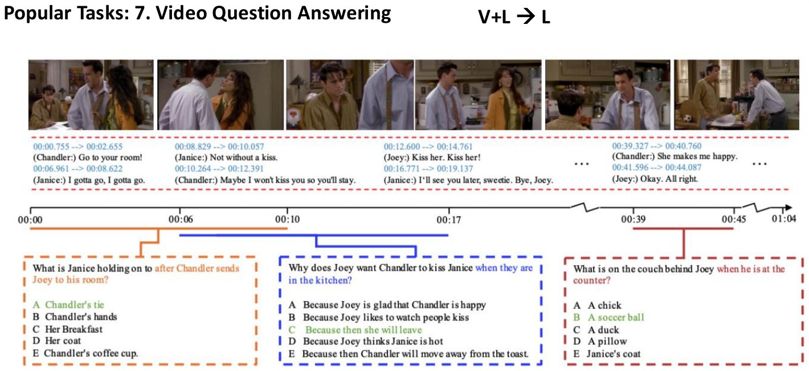

### 3.6 视觉常识推理（第 33 页）

问题：**为什么 person4 指向 person1？**

答案候选：A 告诉 person3，person1 点了薄煎饼；B 刚讲了一个笑话；C 正在指责 person1；D 给 person1 指路。

理由候选：A person1 面前放着薄煎饼；B person4 正在记录大家的订单并要求澄清；C person3 看着薄煎饼，她和 person2 都略带微笑；D person3 正在上菜，可能不知道哪份订单属于谁。

课件未用明确标记给出标准答案。结合画面可将“答案 A、理由 D”作为解释，但这是**读图推断**。原图保留所有候选，避免把推断写成课件已给出的结论。

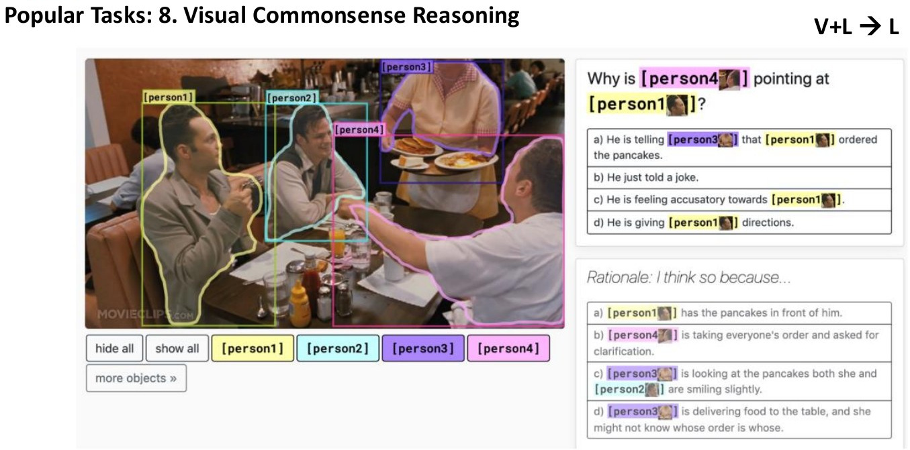

### 3.7 文本生成图像（第 34–35 页）

第 34 页用鸟的细粒度属性控制 Stage-II 图像生成。七条描述分别是：

1. 蓝白色、喙非常短的鸟。
2. 翅膀棕色、腹部黄色的鸟。
3. 白色、头顶黑色、喙黄色的鸟。
4. 白、黑、棕三色，具有棕色喙的鸟。
5. 喙较小、头顶红棕色、腹部灰色的鸟。
6. 黑色小鸟，胸部为白色，翼条纹也为白色。
7. 白、黑、黄三色，具有短黑喙的鸟。

第 35 页进一步展示组合概念：“一个鳄梨形状的扶手椅”和“一个长颈鹿乌龟”。生成必须理解属性、形状和对象之间的组合关系。

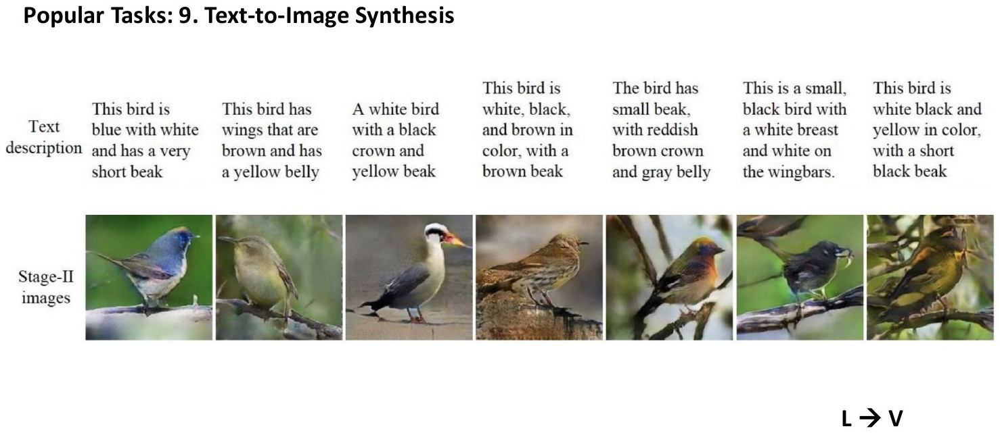

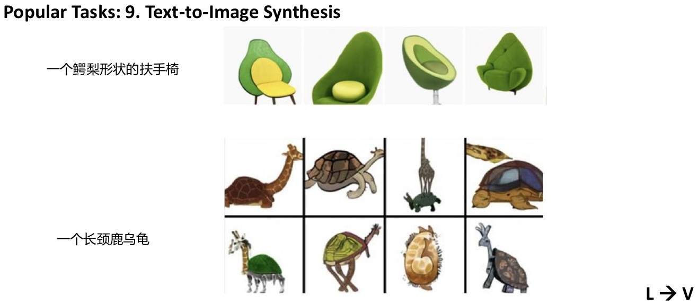

### 3.8 视觉语言导航与自动驾驶（第 36–38 页）

视觉语言导航：具身智能体位于逼真环境中的某个位置，依照自然语言指令到达目标。课件例图标出目标距离 8.2 m，指令为：“离开卧室，进入厨房；向前走，在沙发处左转；停在窗前。”

另一个交互例：用户让机器人去休息区入口；机器人到达后询问下一步；用户补充“右边有一个吧台，台面上有个盒子，把它拿给我”。这里同时要求导航、空间关系理解、指代定位和操作。

自动驾驶图展示 **RGB 图像、激光雷达点、雷达点、地图**，以及车辆、道路标志、交通灯等感知结果。第 38 页的 $`V+L\to A`$ 是课件沿用的任务分类简写；图本身还涉及多种传感器模态，不能把全部传感信息等同于语言。

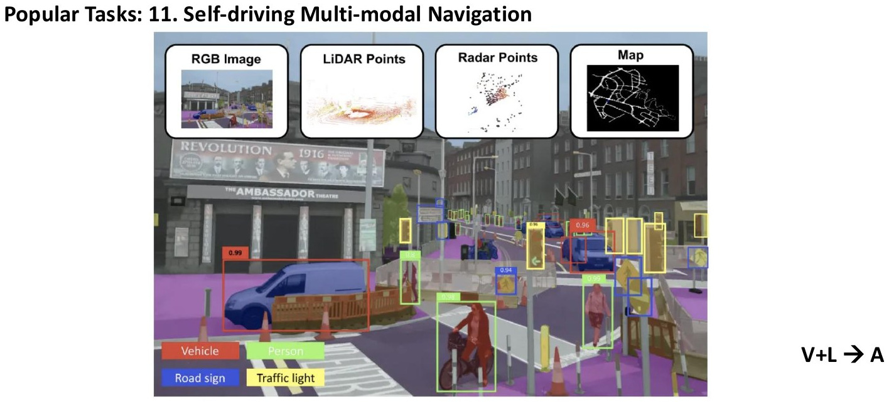

## 4. 单模态理解的困难

### 4.1 计算机视觉（第 43–50 页）

目标是跨越 **像素与语义之间的差距**。计算机得到像素数值阵列，需从中恢复对象、场景和意义。

| 挑战 | 为什么困难 | 课件示例 |
| --- | --- | --- |
| 视角变化 | 同一对象从不同视角看，投影形状不同 | 雕塑的多个视角 |
| 光照变化 | 亮度、阴影会大幅改变像素 | 不同光源照射下的企鹅 |
| 尺度变化 | 对象在图像中的大小变化 | 成人与儿童持笔记本电脑 |
| 形变 | 同一对象可有不同姿态和轮廓 | 奔跑的马 |
| 遮挡 | 部分对象不可见 | 被树干遮挡的人与马 |
| 背景杂乱 | 对象特征与背景混淆 | 融入复杂花纹背景的形象 |
| 类内差异 | 同一类别内部外观差异很大 | 不同结构、材质的椅子 |

### 4.2 自然语言处理（第 51–54 页）

**多语言性**：不同语言有不同词汇、句法与表达习惯。

**歧义例题一：**“I made her duck.” 可理解为：

- 我让她蹲下／低头躲避。
- 我给她做了鸭肉。
- 我把她养的鸭子做成了菜。

歧义来源：duck 是名词还是动词？make 是“烹调”还是“使某人做某事”？her 是“给她”还是“属于她的”？

**歧义例题二：三类歧义。**

| 类型 | 例句 | 需解决的问题 |
| --- | --- | --- |
| 结构歧义 | I eat sushi with tuna / I eat sushi with chopsticks | with 表示食物成分还是工具？ |
| 词义歧义 | I went to the bank | bank 是银行还是河岸？ |
| 指代歧义 | John saw Jim. He was drinking coffee. | He 指 John 还是 Jim？ |

**泛化例题：**“I made her duck cassoulet.” Cassoulet 是法国豆类炖菜。模型总会遇到陌生词汇和结构，必须从训练样本泛化到实际使用场景。

## 5. 多模态学习的五项核心挑战

第 55–73 页主要采用“表征、对齐、转换、融合、协同学习”五项划分。第 55 页另列出新版综述的六项框架；应保留这一分类差异，不能将不同综述混成同一个定义。

### 5.1 表征 Representation（第 56–58 页）

学习如何表示和概括多模态数据，以利用模态间的 **互补性与冗余性**。

- **联合表征（joint representation）**：多个模态共同映射到一个表征。
- **协调表征（coordinated representation）**：各模态分别表示，通过约束或映射使其可比较、可联系。

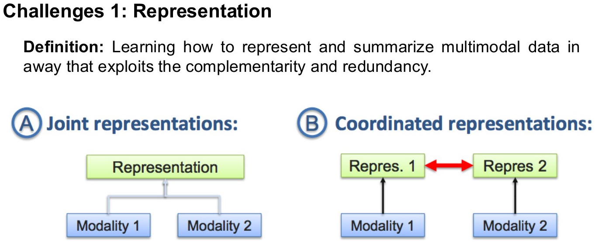

图像、词句（如“Wow!”、“I like it!”）、欢乐或紧张的语气可被映射到具有共同语义的向量空间。

**多模态向量运算例题**（Kiros 等，2014）：

```math
\mathbf e_{\mathrm{新语义}}
\approx \mathbf e_{\mathrm{图像}}
-\mathbf e_{\mathrm{旧属性}}
+\mathbf e_{\mathrm{新属性}}.
```

该式是对课件示意图的符号化整理。图中通过最近邻检索展示：蓝车减蓝加红得到红车；减蓝加黄得到黄车；黄公交减黄加红得到红公交；白衣减白加红得到红衣；白天建筑减白天加夜晚得到夜景；飞机减飞行加航行得到船；碗中猫减碗加盒子得到盒中猫；盒中猫减盒子加碗得到碗中猫。关键是视觉内容与语言属性在嵌入空间中形成对应关系。

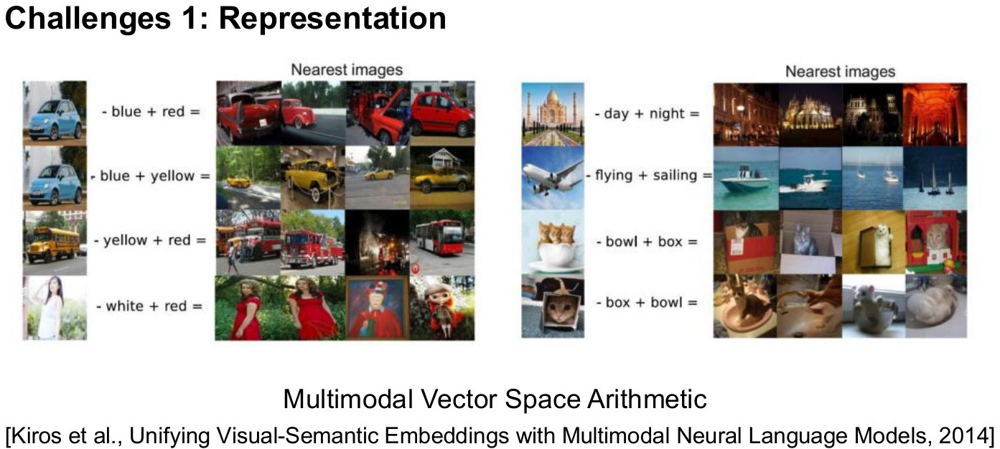

### 5.2 对齐 Alignment（第 59–63 页）

识别两个或多个模态中元素或子元素之间的直接对应关系。

- **显式对齐**：重新对齐不同步的数据，能够估计对齐代价。例如把动作姿态序列与视频帧对应起来。第 60–61 页展示骨架与视频的不同步及重新匹配过程。
- **隐式对齐**：在内部学习潜在对应关系，以帮助完成任务。例如句子“一只含着网球的狗在浑浊的水中游泳”里的 dog、tennis ball、dog swimming、murky water，分别联系对象区域、球、动作及水域。

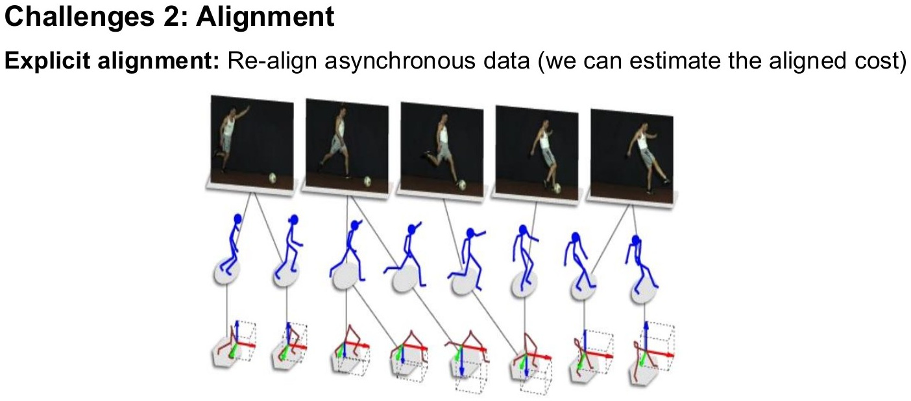

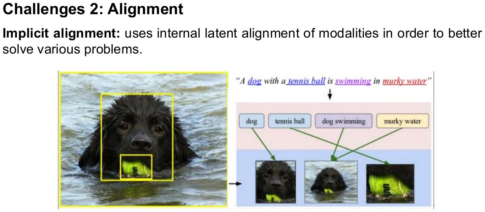

**视频定位（Video Grounding）**：输入视频和句子查询，输出目标片段的开始及结束时间戳。该任务把语言语义落实到视频的时间区间，而非只输出一句描述。

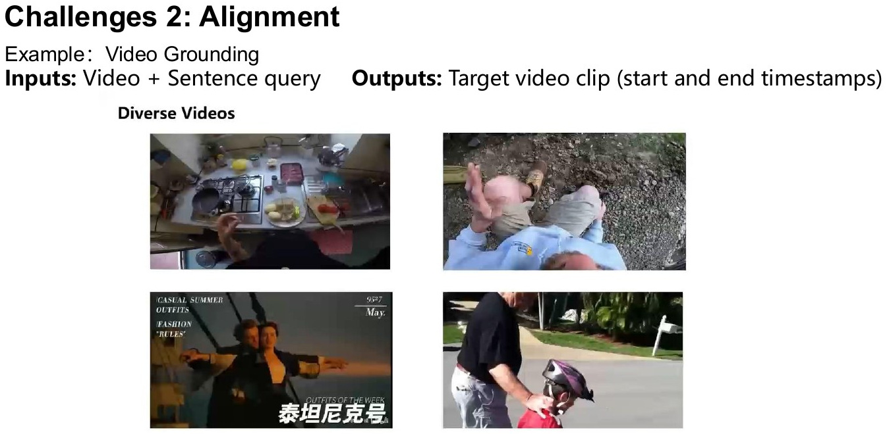

### 5.3 转换 Translation（第 64–68 页）

把一个模态的数据转换为另一个模态；这种对应关系通常具有开放性或主观性，一段文字可能对应许多合理图像或动作。

第 64 页的语言到姿态示例（*Language2Pose: Natural Language Grounded Pose Forecasting*，Ahuja 与 Morency，3DV 2019）：

1. 一个人慢跑几步。
2. 一个人向前走，转身，再继续向前走。
3. 一个跪着的人将双臂向两侧抬起，然后站起来。

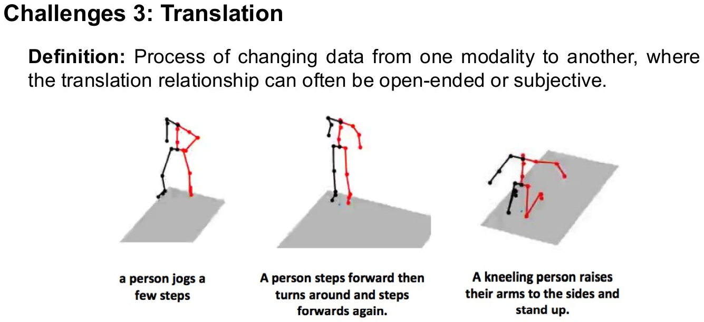

第 65 页的对话人物画面与第 67–68 页的演示用于展示视听／视频转换。第 66 页明确给出 **文本到三维动作**：输入文字描述，输出 3D 动作序列。第 67–68 页给出 **文本到视频**：输入文字，输出视频。

第 67 页对视频内容进行可控描述：黑西装男子与城市背景；黑西装男子拿出苹果咬一口；白羽绒服男子展示衣服；白羽绒服男子查看手表；展示水壶；展示手电筒并点亮。这里涉及人物服装、场景、物体、动作与动作顺序的控制。

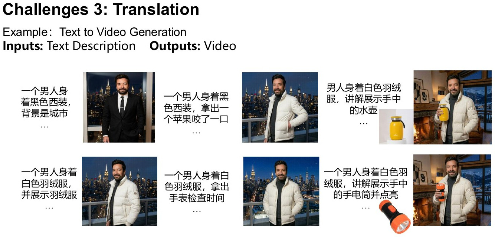

### 5.4 融合 Fusion（第 69 页）

联合两个或更多模态的信息，完成一个预测任务。课件融合图涉及对象、场景、动作、人脸、OCR、语音及其他音频特征，经视觉／文本查询编码进入联合嵌入空间；另一个例子联合文本、视频与声音预测情绪。

**对齐**回答“哪些内容对应”；**融合**回答“怎样联合信息作预测”；两者可以出现在同一模型中。

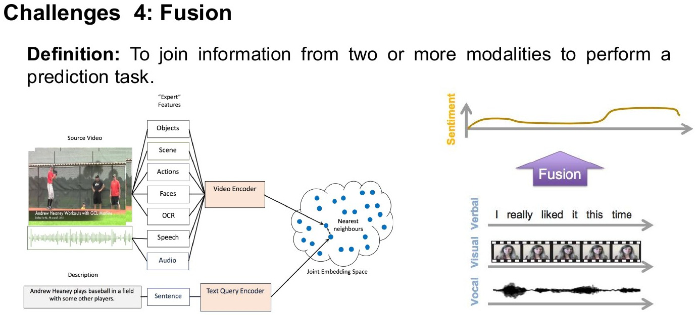

### 5.5 协同学习 Co-Learning（第 70–72 页）

在模态之间迁移知识，包括迁移表征和预测模型。数据可以是 **平行数据**（实例之间有对应关系）或 **非平行数据**（没有直接的实例配对）。

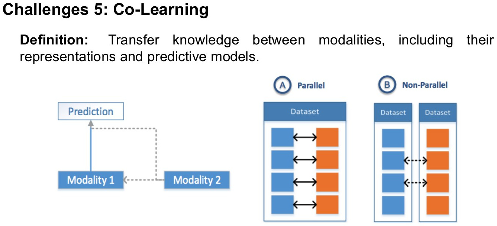

**ViCO：通过视觉共现学习词向量。**课件列出四类共现：对象–属性、属性–属性、上下文、对象–上位概念（hypernym）。视觉区域的对象词与属性词示例：

| 对象及上位词 | 属性 |
| --- | --- |
| 男人、人、成人、哺乳动物 | 肌肉发达、微笑 |
| 女人、人、成人、哺乳动物 | 瘦、微笑 |
| 桌子、桌布、家具 | 条纹、椭圆形 |
| 米饭、碳水化合物、食物 | 白色、粒状、熟的 |
| 沙拉、粗饲料、食物 | 叶状、切碎、健康、红色、绿色 |
| 玻璃杯、玻璃器皿、器具 | 透明、反光、高 |
| 盘子、餐具、器具 | 陶瓷、白色、圆形 |
| 叉子、刀叉餐具、器具 | 金属、闪亮、反光 |
| 勺子、刀叉餐具、器具 | 用于盛取、金属、闪亮、反光 |

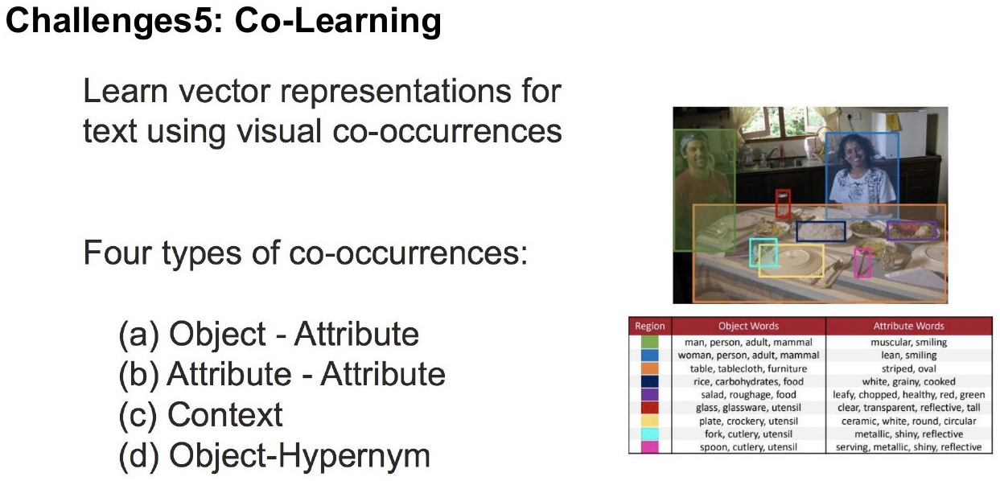

第 72 页以 t-SNE 可视化比较 **GloVe + ViCO（linear，线性融合）** 与 GloVe，展示加入 ViCO 后在该例中形成更同质的语义簇。该图支持对图中分布的观察，不等于所有任务上的性能证明。

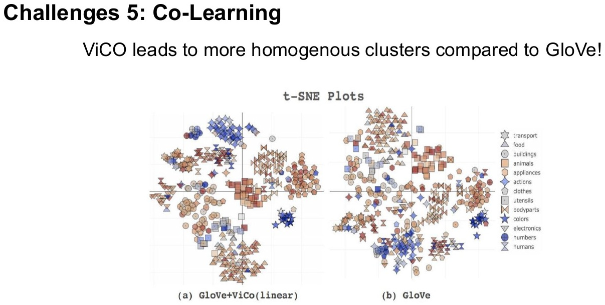

五项挑战之间的联系：

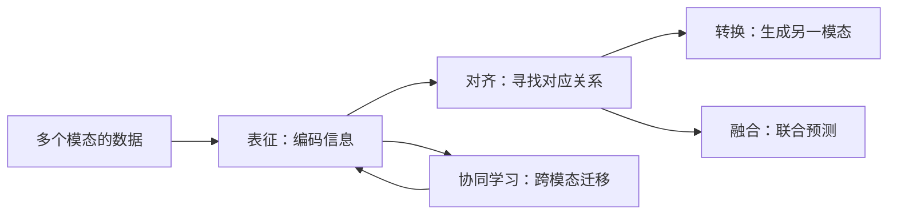
```mermaid
flowchart LR
  D[多个模态的数据] --> R[表征：编码信息]
  R --> AL[对齐：寻找对应关系]
  AL --> T[转换：生成另一模态]
  AL --> F[融合：联合预测]
  R --> C[协同学习：跨模态迁移]
  C --> R
```

## 6. 学习内容与研究方法

### 6.1 课程知识路线（第 75–76、80、114 页）

| 模块 | 内容 |
| --- | --- |
| 视觉单模态表征 | CNN 及变体；图像分类与目标检测；VAE、GAN、扩散等生成模型 |
| 语言单模态表征 | 句子／语言建模；RNN 与 Transformer |
| 多模态表征 | 跨模态表示、对齐、转换与映射；融合与协同表征 |
| 多模态预训练 | 多模态自监督学习、多模态大模型 |
| 跨模态描述与生成 | 图像／视频描述；根据语言或声音生成图像／视频 |
| 视觉自动问答 | 基于常识的问答 |
| 具身智能 | 3D 场景建模、视觉导航与操作 |

学习目标：建立追踪多模态研究所需的基础；能够设计、构建并应用深度学习架构，尤其是视觉与语言模型；理解计算机视觉及机器学习相关研究趋势。课件后续基础模块为深度学习、计算机视觉、自然语言处理、多模态应用。

### 6.2 项目题目与技术报告（第 78–79 页）

项目示例：根据声音或文字生成图像；验证视觉注意力在 VQA 中的作用；为电影剧本生成故事板；在图像中定位语言或声音指向的对象。

技术报告应交代：问题和动机、清楚的问题定义、方法的技术细节及必要背景、与其他方法的关系、方法优缺点、评测优缺点、已发表或潜在扩展。第 77 页的评分比例属于课程管理，已删除。

### 6.3 领域研究趋势（第 39–41 页）

这些统计保留为课件研究背景。第 39 页列出 CVPR 2024 的视觉／语言／推理主题 152 篇、多模态学习主题 110 篇；CVPR 2025 投稿较前一年增加 13%，达到 13,008 篇，作者超过 40,000 人，并突出多视角与传感器 3D、图像视频合成、多模态及视觉语言推理三个方向。第 40 页呈现 CVPR 2026 分主题投稿及决定统计，第 41 页突出 ACL 2023 的视觉语言落地与语音多模态方向。

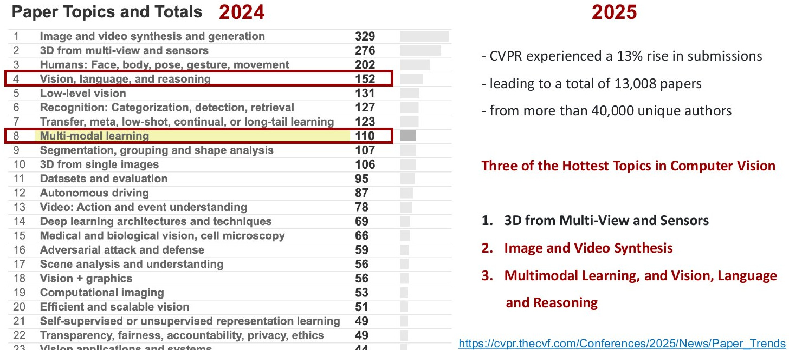

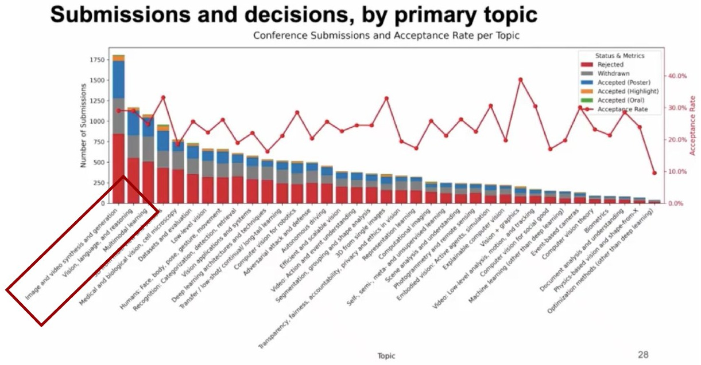

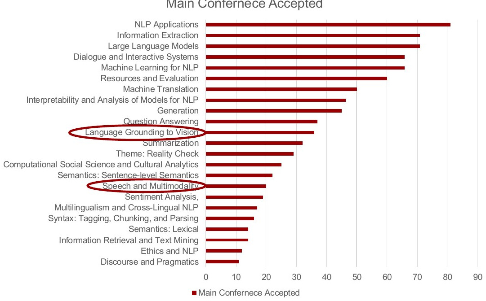

## 7. 应用案例中的技术信息

本节合并第 83–113 页的重复演示。品牌标识、商品封面、歌词、纯黑的视频占位和宣传画面已删除。PDF 中不可播放的视频不据此补写其未显示的内容。涉及参数、时间和产品代际的表格按**课件记录**整理，不作为当前产品规格说明。

### 7.1 实时描述与跨模态创作（第 83–89 页）

- 实时视频描述：把持续输入的视频转成语言描述。
- 小冰示例：图像理解与图像相关文字创作、诗歌、绘画与图像／动画式作品、音乐／歌唱等跨模态创作。
- Suno 示例：根据文字、风格等条件生成音乐或歌曲。

这些页主要展示输出效果，没有给出具体网络架构、训练损失或数据规模，故不推断实现细节。

### 7.2 语言模型能力演进表（第 90、103–104 页）

| 课件模型条目 | 年份 | 课件参数量 | 课件上下文条目 | 训练或能力重点 | 演进含义 |
| --- | --- | --- | --- | --- | --- |
| GPT-1 | 2018 | 117M | 512 | 生成式预训练、任务微调 | 预训练后迁移 |
| GPT-2 | 2019 | 1.5B | 1,024 | 扩大自监督预训练 | 零样本任务能力 |
| GPT-3 | 2020 | 175B | 2,048 | 大规模训练、上下文学习 | 用提示中的示例完成任务，无需参数更新 |
| GPT-4 | 2023 | 未知 | 8K / 32K | 预训练、对齐、多模态学习 | 视觉语言理解与更强推理 |
| GPT-5 | 2025 | 未知 | 最大输入 272K、总上下文 400K | 推理、工具使用、智能体训练 | 多步推理与行动 |
| GPT-6 Astra | 2026 | 未知 | 1.05M 上下文、最大输出 128K | 长上下文、推理、计算机操作、智能体 | 端到端复杂流程执行 |

第 104 页并列的 Google 路线：BERT——表征学习；PaLM——规模与涌现；Gemini 1.0——原生多模态；Gemini 2.5——思考与工具；Gemini 3.x——多模态推理与智能体行动。图中零散的 122、676、367、135、289 没有指标定义，作为无关信息删除。

### 7.3 图像理解与读图解题（第 91–92 页）

第 91 页包含两个例子：从三张包装／手机照片识别 Lightning 转接头及 VGA 接口；理解出租车车顶载有熨衣板、乘客熨衣这一反常场景。重点是把物体、用途与关系结合起来。

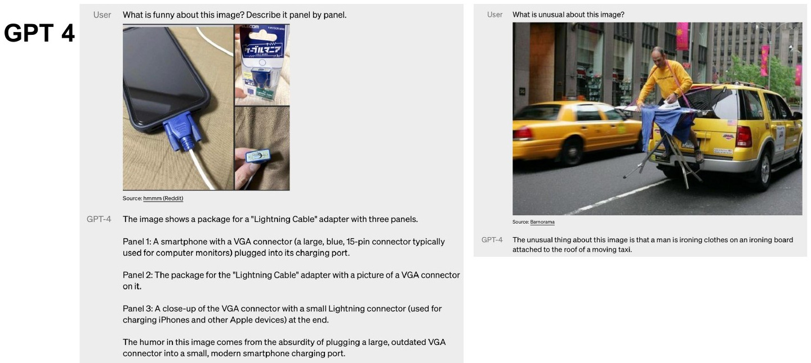

**例题：测辐射热计的导热杆温度分布。**输入包含法文题目、结构图和文字指令，模型需要联合读图与推导。

题目背景：吸收器接受辐射功率 $`P_r`$；温度由电阻 $`R(T)`$ 测量，电阻温度系数为

```math
\alpha=\frac{1}{R}\frac{dR}{dT}.
```

系统热容为 $`C_{th}`$；均匀导热杆长 $`L`$、截面积 $`S`$、导热率 $`\lambda`$，无侧向热交换，连接吸收器与温度固定为 $`T_b`$ 的恒温器。

稳态下，导热杆温度满足

```math
\frac{d^2T}{dx^2}=0,
\qquad T(0)=T_0,\quad T(L)=T_b.
```

积分两次得 $`T(x)=C_1x+C_2`$；代入边界条件得到

```math
C_2=T_0,\quad C_1=\frac{T_b-T_0}{L},\qquad
\boxed{T(x)=T_0+\frac{T_b-T_0}{L}x}.
```

因此温度沿杆呈线性变化。课件给出的解答止于此温度分布。

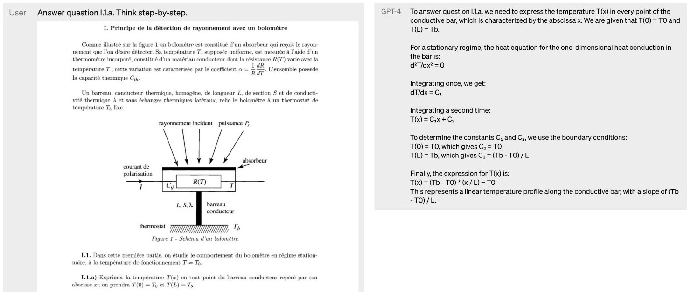

### 7.4 图像、视频与少样本视觉语言模型（第 94–110 页）

第 94–95 页展示 DALL·E 2、DALL·E 3 的文生图应用。第 96–97 页比较专门生成器与原生多模态图像模型：

| 比较维度 | 课件中 DALL·E 3 的描述 | 课件中 GPT Image 的描述 | 技术演进 |
| --- | --- | --- | --- |
| 架构 | 专门的文生图模型 | 联合处理文本与图像并生成图像 | 独立生成器到统一多模态模型 |
| 指令遵循 | 理解提示，但复杂布局／关系可能失败 | 处理更细的属性、空间关系和构图要求 | 语义匹配到细粒度视觉指令 |
| 文字渲染 | 长词、小字、排版容易出问题 | 海报、图表、菜单、UI 等密集文字 | 艺术图像到信息表达 |
| 图像编辑 | 主要用于生成，编辑能力较有限 | 输入图像后增删替换对象及局部编辑 | 生成加编辑 |
| 多轮一致性 | 各次生成较独立 | 对话中迭代、保留角色和构图细节 | 单次生成到交互创作 |
| 知识与推理 | 文字到视觉内容的映射 | 用上下文与知识指导生成 | 知识参与图像生成 |

第 98 页的 GPT Image 2 示例是“花朵头部、穿西装、坐在剧院”的组合图像；第 99 页展示 Sora 的 *Air Head* 视频，PDF 仅保留占位，未给出技术推导。

**Flamingo**（第 100–102 页）：课件注明 80B、Perceiver Resampler，并引用 Alayrac 等 *Flamingo: a Visual Language Model for Few-Shot Learning*，NeurIPS 2022。示例涉及动物、异常场景以及读取 “East 42nd St” 和 “Madison Ave” 路牌；课件未展开 Resampler 的内部计算。

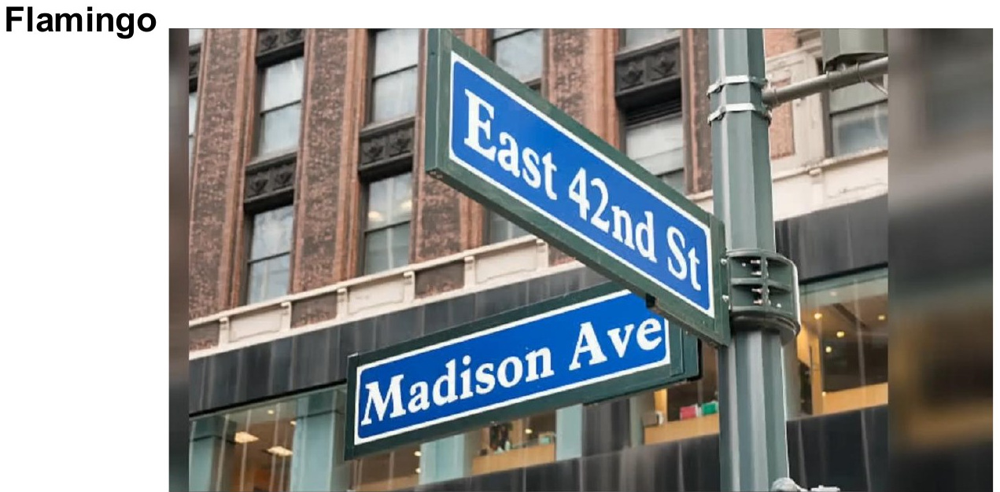

第 105–107 页展示 Gemini、Gemini 3.0、Nano Banana Pro，PDF 没有可提取的演示内容。第 108–110 页用 Veo 演示视频生成的不同要求：

| 课件条目 | 强调的能力维度 |
| --- | --- |
| Veo 1 | 合理运动、自然景观、画面质感 |
| Veo 2 | 画面细节控制、物理规律遵循、人物行为模拟 |
| Veo 3 | 精准人物对话、真实环境声效、物理音效模拟 |

这些维度也可用于分析生成质量：外观、运动、物理一致性以及音视频同步是不同的问题。

### 7.5 机器人与世界模型（第 111–113 页）

| 课件模型条目 | 主要贡献 | 能力关系／演进 |
| --- | --- | --- |
| RT-1 | Transformer 直接预测机器人动作 | 感知加控制；视觉到动作 |
| PaLM-E | 世界知识与具身感知结合 | LLM 到具身语言模型 |
| RT-2 | 将互联网规模视觉语言知识迁移到动作 | 视觉、语言、动作；VLM 到 VLA |
| RT-X | 跨不同机器人形态学习 | 单机器人到多机器人泛化 |
| Gemini Robotics | 多模态模型输出物理动作 | 多模态 VLA 到物理智能 |
| Gemini Robotics 2 | 推理、灵巧操作、全身控制、协作 | 执行动作到推理、规划和行动 |

第 112 页进一步列出全身智能、**22 自由度五指机械手**的灵巧操作、多机器人协作。第 113 页将 Genie 3 归为世界模型；仅给出名称与演示占位，未给出训练或预测机制。

## 8. 课件参考资料

- Goodfellow、Bengio、Courville，*Deep Learning*，MIT Press，2016。
- Szeliski，*Computer Vision: Algorithms and Applications*，2010。
- Blaž Škrlj，*From Unimodal to Multimodal Machine Learning*，2024。
- Saeid Eslamian 等，*Multimodal Learning Using Heterogeneous Data*。
- CVPR、ICCV、ECCV、NeurIPS（旧称 NIPS）、ACL 论文集。
- Baltrušaitis、Ahuja、Morency，*Multimodal Machine Learning: A Survey and Taxonomy*，课件引用 [arXiv:1705.09406](https://arxiv.org/abs/1705.09406)：五项核心挑战、37 个分类、253 篇引用，均为课件统计。
- Liang、Zadeh、Morency，*Foundations and Trends in Multimodal Machine Learning: Principles, Challenges, and Open Questions*，课件引用 [arXiv:2209.03430](https://arxiv.org/abs/2209.03430)：六项核心挑战、50 多个分类、600 多篇引用，均为课件统计。

逐页保留、合并与删除记录见 [内容覆盖核对表](../COVERAGE.md)。继续阅读 [第二章：深度学习导论](02-深度学习导论.md)。
