# 第二章：深度学习导论

来源：刘洋（Yang Liu），`2_Introduction_DeepLearning_26.pdf`，129 页。下文页码均指 **PDF 页序号**。正文与附录的重复内容已合并；图片内的公式、数值例题、曲线解释均纳入对应小节。原课件中有数学简写或概念混用的地方，在相关段落明确说明。

## 1. 神经网络为什么需要非线性

### 1.1 单层与多层网络（第 4–6 页）

全连接层先做加权求和，再经过激活函数。对输入 $\mathbf x\in\mathbb R^d$：

$$
\mathbf z=W\mathbf x+\mathbf b,\qquad
\mathbf h=a(\mathbf z).
$$

若激活为恒等函数 $a(z)=z$，则堆叠多层仍是一个仿射变换。课件的两个隐藏层加输出层可写成

$$
\begin{aligned}
\mathbf y
&=W_o\bigl(W_{h2}(W_{h1}\mathbf x+\mathbf b_{h1})+\mathbf b_{h2}\bigr)+\mathbf b_o\\
&=\underbrace{W_oW_{h2}W_{h1}}_{W'}\mathbf x
+\underbrace{W_oW_{h2}\mathbf b_{h1}+W_o\mathbf b_{h2}+\mathbf b_o}_{\mathbf b'}.
\end{aligned}
$$

所以只有线性／仿射层时，增加深度不会突破线性表达能力。非线性激活使层间组合能够表达更复杂关系，例如

$$
\mathbf y=W_o\,a\bigl(W_{h2}\,a(W_{h1}\mathbf x+\mathbf b_{h1})+\mathbf b_{h2}\bigr)+\mathbf b_o.
$$

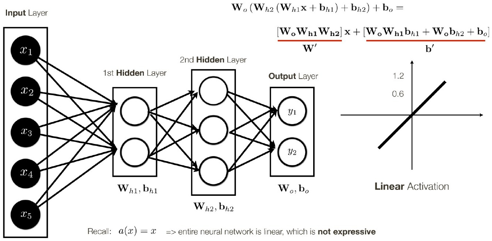

### 1.2 万能逼近的直观构造（第 7–17 页）

课件从“一维输入、一个含两个神经元的隐藏层、一个输出”的网络出发，逐步展示如何用 Sigmoid 构造阶跃、矩形脉冲和分段常数函数。

**第一步：Sigmoid 接近阶跃。**

$$
\sigma(wx+b)=\frac{1}{1+e^{-(wx+b)}}.
$$

权重 $w$ 控制陡峭程度，偏置 $b$ 控制水平位置。第 9 页取 $w=8,b=-4$；第 10 页提高权重说明可接近阶跃，并提到例如 $w=999$；第 10–12 页图示使用 $w=100,b=-40$。过渡位置满足

$$
wx+b=0\quad\Longrightarrow\quad s=-\frac bw.
$$

因此 $w=100,b=-40$ 对应 $s=0.40$。对 $w\to+\infty$，$\sigma(w(x-s))$ 在 $x\ne s$ 处趋近 $H(x-s)$；在跳变点本身取 $1/2$，不能称为处处等同于阶跃。

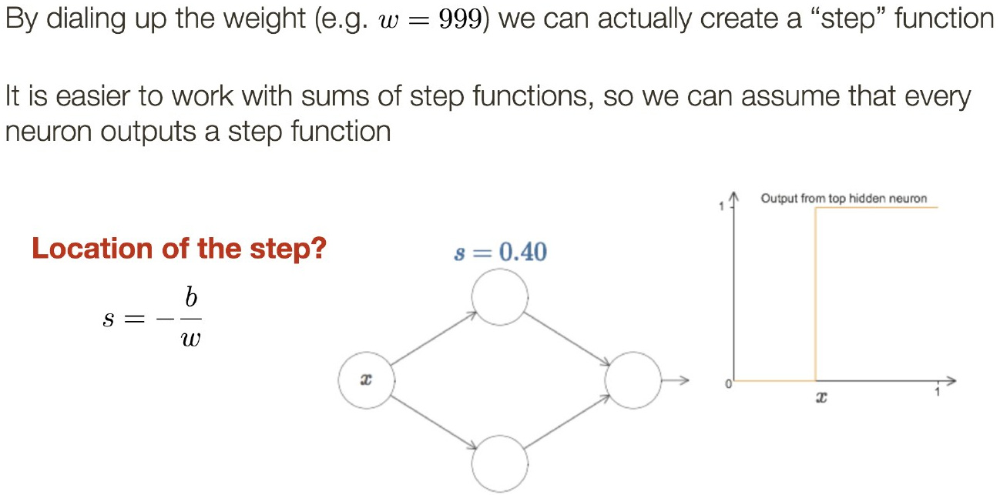

**第二步：输出层做加权组合。**输出层偏置暂设为 0：

$$
g(x)=\sum_j h_j H(x-s_j).
$$

第 14 页例：$s_1=0.40,s_2=0.60,h_1=0.6,h_2=1.2$，对应函数依次为 0、0.6、1.8。

第 15 页例：$s_1=0.40,s_2=0.60,h_1=0.8,h_2=-0.8$，得到高度为 0.8、区间为 $[0.4,0.6)$ 的矩形脉冲：

$$
g(x)\approx0.8\bigl[H(x-0.4)-H(x-0.6)\bigr].
$$

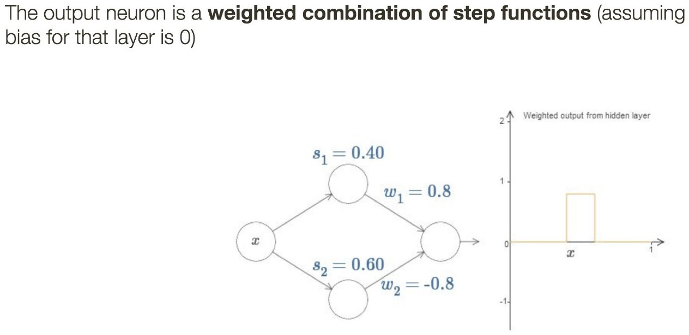

**第三步：用许多小区间逼近曲线。**将每段的左、右端点各设置一个阶跃，通过输出权重控制区间高度；把矩形脉冲相加，形成分段常数近似。课件称为 Riemann sum approximation（黎曼和近似）。

第 16 页示例区间为 $[0,0.2)$、$[0.2,0.4)$、$[0.4,0.6)$、$[0.6,0.8)$、$[0.8,1.0)$，高度依次为 **−1.3、−1.6、−0.4、−1.2、1.0**，每段由一对端点神经元构成，图示平均偏差为 **0.39**。细分区间并调整高度可以提高精度。

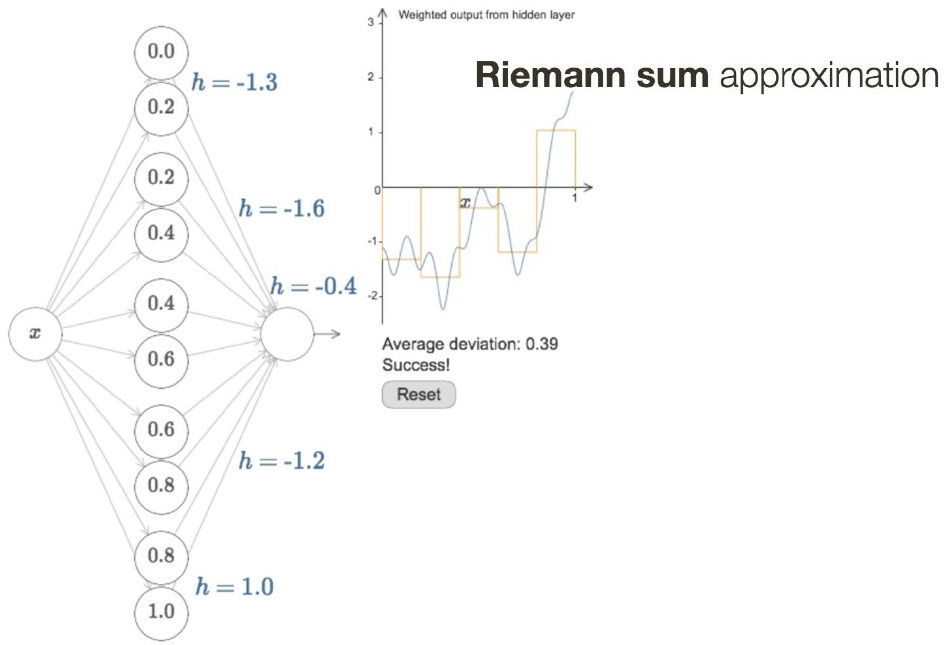

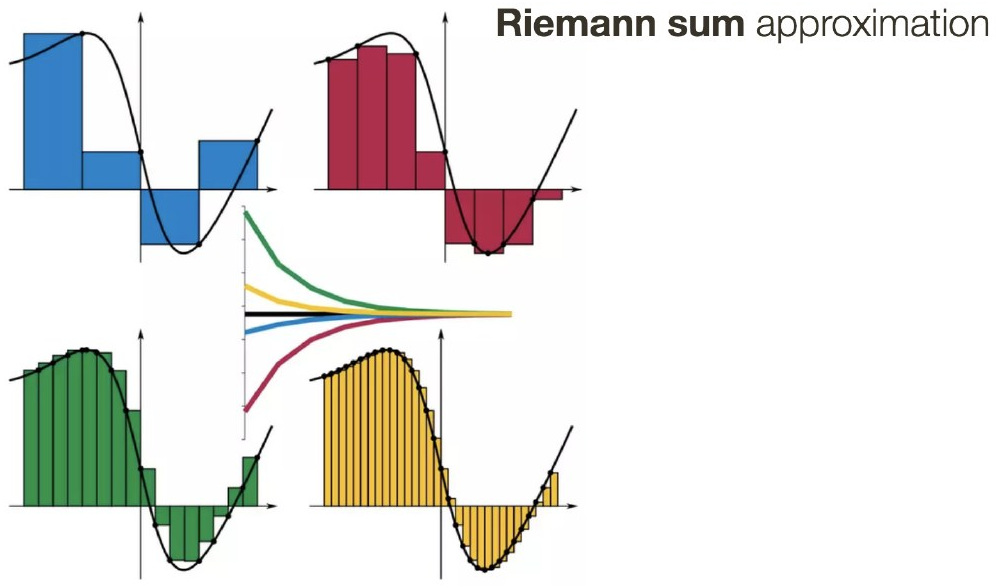

### 1.3 万能逼近定理的条件（第 18–20 页）

经典结论：在合适的非线性激活条件下，对紧致域 $K$ 上的连续目标函数 $f$ 和任意 $\epsilon>0$，存在具有有限但足够多隐藏神经元的单隐藏层网络 $g$，使

$$
\sup_{x\in K}|g(x)-f(x)|<\epsilon.
$$

课件引用 Hornik 等（1989）。这里的“宽度趋向无穷”表示为了追求任意精度允许不断增加宽度；对一个给定的误差容限，可使用有限网络。该结论不保证优化算法一定找到参数，也不保证样本效率或泛化性能。

**深度与宽度的补充结论。**课件第 19 页写“输入维数 $d$、隐藏层宽度 $d+1$、深度增加”，并引用 Lu 等，NIPS 2017。此引用与宽度数字不一致：Lu 等该论文证明的是 **宽度 $d+4$ 的 ReLU 网络的万能逼近结果**；不能直接把课件的 $d+1$ 当成该论文结论。[原论文](https://arxiv.org/abs/1709.02540)

第 20 页引用 Lin 与 Jegelka，NeurIPS 2018，说明带单神经元隐藏模块的深层 ResNet 的逼近能力。论文中的残差结构保留 $d$ 维状态，并交替使用 1 维与 $d$ 维结构；它并非“所有层都只有一个标量的普通全连接网络”。其定理以 $L^1$ 误差表示：对可积函数 $f$ 与任意 $\epsilon>0$，存在有限深度残差网络 $R$，使

$$
\int_{\mathbb R^d}|f(x)-R(x)|\,dx\le\epsilon.
$$

这是不同于前述紧致域上最大误差的逼近意义。[原论文定理 3.1](https://proceedings.neurips.cc/paper/2018/file/03bfc1d4783966c69cc6aef8247e0103-Paper.pdf)

## 2. 激活函数

### 2.1 Sigmoid、Tanh、ReLU 与 PReLU（第 22–28、77–87、89 页）

| 函数 | 定义 | 输出范围 | 课件优点 | 课件不足或条件 |
| --- | --- | --- | --- | --- |
| Sigmoid | $\sigma(x)=1/(1+e^{-x})$ | $(0,1)$ | 平滑且处处可导；可用于二分类概率输出 | 饱和导致梯度很小；非零中心；指数计算有开销 |
| Tanh | $\tanh(x)=2\sigma(2x)-1$ | $(-1,1)$ | 零中心；平滑且处处可导 | 两端饱和，梯度趋近 0 |
| ReLU | $\max(0,x)$ | $[0,+\infty)$ | 正半轴不饱和；计算便宜；课件给出某些实践中约 6 倍的收敛速度示例 | 非零中心；负半轴梯度为 0 |
| Leaky ReLU | $x$（$x\ge0$），$\alpha x$（$x<0$） | 若 $\alpha>0$，可正可负 | 负半轴保留梯度；计算便宜 | $\alpha$ 是固定的小常数，如 0.01 |
| PReLU | 与 Leaky ReLU 同形式 | 取决于 $\alpha$ | 通过反向传播学习负半轴斜率 | $\alpha$ 属于模型参数 |

课件图中用闭区间标注 Sigmoid 与 Tanh 范围；有限输入并不会取到端点。ReLU 在 $x=0$ 处的经典导数不存在，实际实现选取一个约定值；课件写 $x\ge0$ 时导数为 1 是一种简写。

主要导数：

$$
\sigma'(x)=\sigma(x)\bigl(1-\sigma(x)\bigr),\qquad
\tanh'(x)=1-\tanh^2(x),
$$

$$
\operatorname{ReLU}'(x)=
\begin{cases}1&x>0,\\0&x<0,\end{cases}
\qquad
\operatorname{PReLU}'(x)=
\begin{cases}1&x>0,\\\alpha&x<0.\end{cases}
$$

Sigmoid 的链式反向传播为

$$
\frac{\partial\mathcal L}{\partial x}
=\frac{\partial\mathcal L}{\partial a}\,a(1-a).
$$

当输入绝对值很大时，$a$ 接近 0 或 1，梯度趋近 0。课件第 39、79–81 页用正负饱和区域反复展示这一现象，合并于此。

### 2.2 非零中心为何可能拖慢优化（第 24–25、82–83 页）

对一个神经元，令

$$
z=\sum_iw_ix_i+b,\qquad f(\mathbf x;\mathbf w,b)=a(z).
$$

链式法则给出

$$
\frac{\partial\mathcal L}{\partial w_i}
=\frac{\partial\mathcal L}{\partial a}
\frac{\partial a}{\partial z}
\frac{\partial z}{\partial w_i}
=\underbrace{\frac{\partial\mathcal L}{\partial a}a'(z)}_{\delta}\,x_i,
$$

$$
w_i\leftarrow w_i-\eta\,\delta x_i.
$$

对同一个样本，如果所有 $x_i>0$（如前一层 Sigmoid 的输出），则这些权重梯度的符号相同，因为共享 $\delta$。因此某次更新难以同时增加一个权重、减小另一个权重。

课件二维例题的当前位置满足 $w_0<w_0^*$、$w_1\ge w_1^*$，理想方向是增大 $w_0$ 并减小 $w_1$；同号输入限制了单次更新的方向，图中呈现之字形路径。

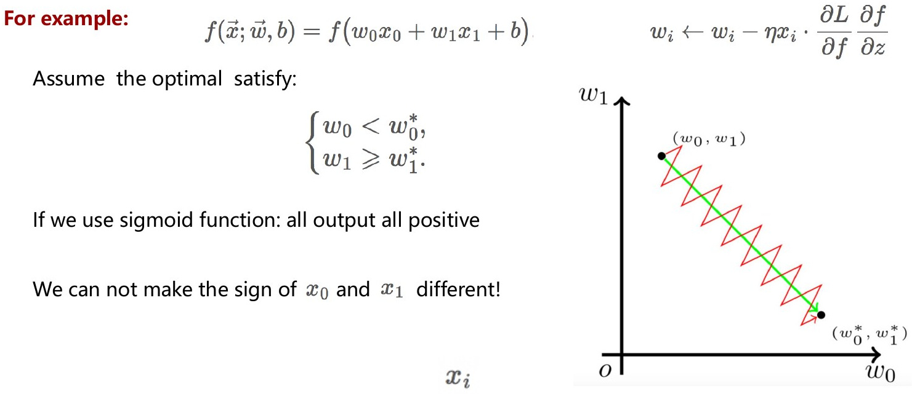

精确地说，更新方向取决于 $x_i$ 与公共因子 $\delta$；课件“仅取决于 $x_i$ 的符号”的说法省略了这个公共因子。对多个样本平均后，梯度不必仍全部同号，也不能由此推出 Sigmoid 网络无法学到异号权重。

### 2.3 GELU（第 30、32 页）

Gaussian Error Linear Unit 的定义：

$$
\operatorname{GELU}(x)=x\Phi(x),\qquad
\Phi(x)=P(X\le x),\quad X\sim\mathcal N(0,1).
$$

课件给出的两个近似：

$$
\operatorname{GELU}(x)
\approx\frac{x}{2}\left[1+\tanh\left(\sqrt{\frac2\pi}(x+0.044715x^3)\right)\right],
$$

$$
\operatorname{GELU}(x)\approx x\sigma(1.702x).
$$

课件第一式用等号连接，应为近似号；第二式也是近似。GELU 可从 $m\sim\operatorname{Bernoulli}(\Phi(x))$ 的门控期望 $\mathbb E[mx]=x\Phi(x)$ 理解，但通常实际执行的是**确定性函数**，并非每次随机采样 0 或 1。[GELU 原论文](https://arxiv.org/abs/1606.08415)、[作者给出的近似实现](https://github.com/hendrycks/GELUs/blob/master/README.md)

课件应用例：BERT、RoBERTa、ALBERT、GPT-1／2／3、DiT、Flux。此处记录课件列举，不把某个模型系列的所有版本当成同一种实现。

### 2.4 Swish／SiLU（第 31 页）

课件采用

$$
\operatorname{Swish}(x)=x\sigma(x).
$$

更一般可写为 $x\sigma(\beta x)$；$\beta=1$ 时常称 SiLU。它是平滑函数，在负半轴允许少量负输出，且并非处处单调。课件举例 DDPM 和 Stable Diffusion。

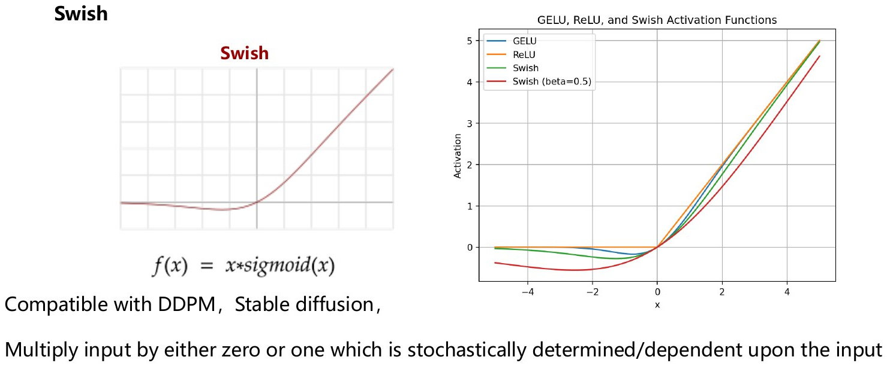

第 31 页沿用了“随机乘 0 或 1”的描述，实际 Swish 的输出也是确定性连续门控，不需要抽取二值随机变量。

### 2.5 GLU 与 SwiGLU（第 33 页）

**GLU（Gated Linear Unit）**把一支变换作为内容，另一支经 Sigmoid 作为门控：

$$
\operatorname{GLU}(\mathbf x)
=(\mathbf xW+\mathbf b)\odot\sigma(\mathbf xV+\mathbf c).
$$

**SwiGLU**将门控激活换为 Swish。课件的无偏置形式为

$$
\operatorname{SwiGLU}(\mathbf x)
=\operatorname{Swish}(\mathbf xW)\odot(\mathbf xV),
$$

其中 $W,V$ 是可训练权重矩阵，$\odot$ 表示逐元素相乘。常见前馈模块还在乘积后接输出投影，此输出投影不在课件上式中。[GLU 变体原论文](https://arxiv.org/abs/2002.05202)

课件举例 LLaMA 1／2／3、Mistral、Qwen、GLM、DeepSeek。

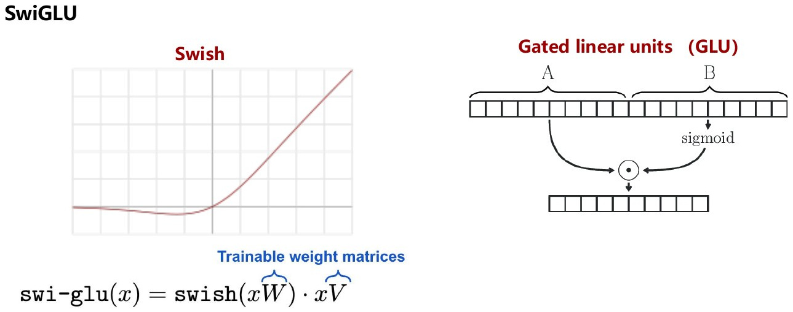

### 2.6 单层 PReLU 的计算图（第 88 页）

$$
\mathbf o=W\mathbf x+\mathbf b,\qquad
\mathbf a=\operatorname{PReLU}(\mathbf o;\alpha),\qquad
\ell=\operatorname{MSE}(\mathbf a,\mathbf y).
$$

输入 $\mathbf x$ 和标签 $\mathbf y$ 来自数据；$W,\mathbf b,\alpha$ 是可训练参数。计算图记录各操作的依赖关系，反向传播沿依赖关系求梯度，包括激活参数 $\alpha$ 的梯度。

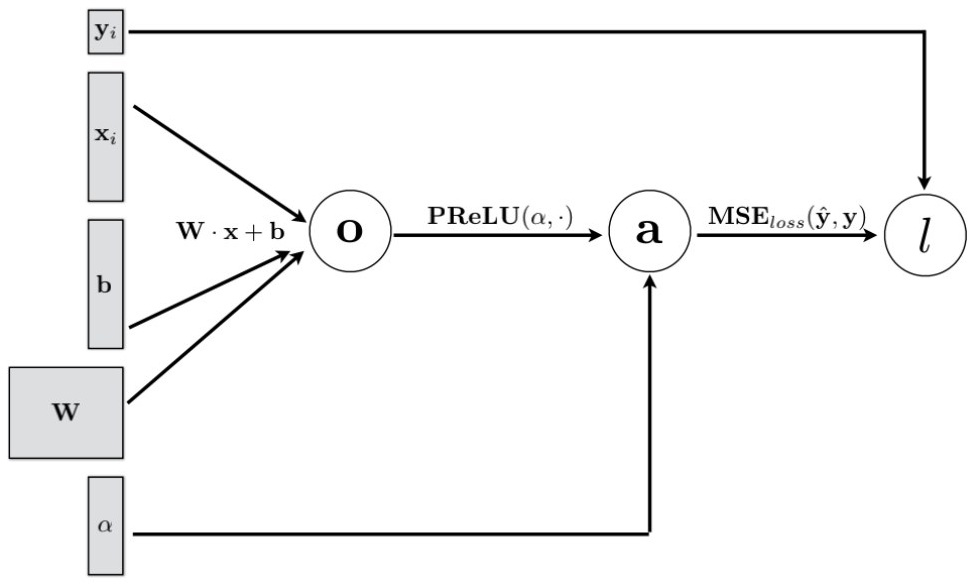

## 3. 术语与训练目标

### 3.1 四类容易混淆的概念（第 90–91 页）

| 概念 | 含义 | 课件例子与选择方式 |
| --- | --- | --- |
| 网络结构 | 层数、层类型、激活形式、每层维数、连接方式，决定计算图 | 一般训练时固定，需要结合问题选择 |
| 损失函数 | 被优化的目标，取决于任务性质 | 平方误差、交叉熵；课件将 Softmax 也列在此，严格说 Softmax 是概率变换，通常配合交叉熵 |
| 参数 | 在训练中直接优化的数值 | 线性层权重／偏置、PReLU 斜率；由 SGD 或其变体学习 |
| 超参数 | 不直接作为本次模型参数优化的配置 | 学习率、批大小、Dropout 率；可用网格搜索等方法选择 |

### 3.2 多变量回归（第 93–94 页）

输入 $\mathbf x\in\mathbb R^n$，目标 $\mathbf y\in\mathbb R^m$。隐藏网络产生 $\mathbf h=f(\mathbf x;\Theta)\in\mathbb R^k$，输出层为线性映射：

$$
\hat{\mathbf y}=Wf(\mathbf x;\Theta)+\mathbf b,
\quad W\in\mathbb R^{m\times k},\quad\mathbf b\in\mathbb R^m.
$$

课件给出的单样本平方误差是

$$
\mathcal L(\mathbf y,\hat{\mathbf y})
=\|\mathbf y-\hat{\mathbf y}\|_2^2
=\sum_{j=1}^m(y_j-\hat y_j)^2.
$$

按维数或样本数取平均得到 MSE；平方误差的和与均值相差一个常数因子。隐藏层若用 Sigmoid，输出分量在 $(0,1)$；Tanh 在 $(-1,1)$；ReLU 非负。但**最后的线性层**使回归预测可以输出任意实数，隐藏层范围不限制最终输出必须非负。

### 3.3 二分类与交叉熵（第 95–101 页）

二分类标签 $y\in\{0,1\}$。若网络输出概率 $p=f(\mathbf x;\Theta)\in(0,1)$，推断时可采用

$$
\hat y=\mathbf1[p>0.5].
$$

硬阈值不可微，训练时通常保留概率并最小化可微损失。常见结构为“任意隐藏网络 → 单个线性输出 → Sigmoid”：

$$
z=\mathbf w^T\mathbf h+b,\qquad
p=P(y=1\mid\mathbf x)=\sigma(z).
$$

Sigmoid **之前的 $z$** 才是 logit／对数几率：

$$
z=\log\frac p{1-p}.
$$

第 97、100 页的“score 为 log-odds”需作这一限定，不能把 Sigmoid 后的概率 $p$ 称为 logit。

交叉熵的一般定义（第 98 页）：

$$
H(P,Q)=-\mathbb E_{x\sim P}\log Q(x)
=-\sum_xP(x)\log Q(x).
$$

用于二分类得到

$$
\boxed{\mathcal L(y,p)=-y\log p-(1-y)\log(1-p)}
=\begin{cases}-\log(1-p)&y=0,\\-\log p&y=1.\end{cases}
$$

正类预测概率越低，损失越大；负类预测概率越高，损失越大。隐藏层可以用 ReLU，最后仍用 Sigmoid 表示二分类概率，无需让所有隐藏层都使用 Sigmoid。

### 3.4 多分类与 Softmax（第 102–104 页）

设有 $C$ 个互斥类别，标签 $\mathbf y\in\{0,1\}^C$ 为 one-hot 向量，且 $\sum_k y_k=1$。输出层先产生 $C$ 个实数分数 $z_k$，再用 Softmax 转成概率：

$$
\hat y_k=P(y=k\mid\mathbf x)
=\frac{e^{z_k}}{\sum_{j=1}^{C}e^{z_j}},\qquad
\sum_k\hat y_k=1.
$$

指数项把分数变为正值，分母将各类概率归一化。即使隐藏层 ReLU 非负，最后线性输出的 logits 仍可以为负。

多分类交叉熵：

$$
\mathcal L(\mathbf y,\hat{\mathbf y})
=-\sum_{k=1}^{C}y_k\log\hat y_k
=-\log\hat y_{\mathrm{真实类别}}.
$$

与多变量回归的区别是：多分类输出是概率分布，回归输出是数值；选择损失和输出激活时应遵循这一任务定义。

## 4. 梯度下降与优化器

### 4.1 梯度下降步骤（第 106–110 页）

课件用下面的 Sigmoid 平方误差演示优化过程。这里保留其目标形式，不将它与前述二分类交叉熵混淆：

$$
\mathcal L(\mathbf W,b)
=\sum_{d=1}^{|\mathcal D_{train}|}
\left[\sigma(\mathbf W^T\mathbf x^{(d)}+b)-y^{(d)}\right]^2.
$$

1. 随机初始化 $\mathbf W_0,b_0$。
2. 第 $k$ 轮在当前参数处计算 $\nabla\mathcal L(\mathbf W_k,b_k)$。
3. 沿负梯度方向更新：

$$
\mathbf W_{k+1}=\mathbf W_k-\eta
\left.\frac{\partial\mathcal L}{\partial\mathbf W}\right|_{\mathbf W_k,b_k},\qquad
b_{k+1}=b_k-\eta
\left.\frac{\partial\mathcal L}{\partial b}\right|_{\mathbf W_k,b_k}.
$$

课件用 $\lambda$ 表示学习率；为与正则化系数区分，本笔记统一写成 $\eta$。损失曲线可能有多个局部极小值，梯度下降不保证获得全局最优。

### 4.2 随机／小批量梯度下降（第 111 页）

全量梯度需要遍历全部训练数据，在大数据集上代价高。对小批量 $B_k$：

$$
g_k=\frac1{|B_k|}\sum_{i\in B_k}\nabla_\theta\ell_i(\theta_k),
\qquad\theta_{k+1}=\theta_k-\eta g_k.
$$

批大小甚至可以为 1。使用小批量得到全量梯度的近似，更新速度更快但存在采样波动；训练损失的抖动不必意味着错误。

### 4.3 优化器的比较（第 112 页）

课件按是否记录一阶统计、二阶统计、二阶指数衰减、偏差修正和权重衰减比较：

| 优化器 | 一阶统计／动量 | 二阶统计 | 二阶指数衰减 | 偏差修正 | 课件标出的权重衰减 |
| --- | --- | --- | --- | --- | --- |
| SGD | 否 | 否 | 否 | 否 | 是 |
| SGD + Momentum | 是 | 否 | 否 | 否 | 是 |
| Nesterov | 是 | 否 | 否 | 否 | 是 |
| AdaGrad | 否 | 是 | 否 | 否 | 否 |
| RMSProp | 否 | 是 | 是 | 否 | 否 |
| Adam | 是 | 是 | 是 | 是 | 否 |
| AdamW | 是 | 是 | 是 | 是 | 是 |

“一阶”表示利用梯度的动量／滑动平均；“二阶”表示利用梯度平方；“二阶指数衰减”区分 RMSProp／Adam 与 AdaGrad 的累积方式。

该表最后一列不能理解为 AdaGrad、RMSProp 或 Adam 的实现无法设置正则化或 `weight_decay`。关键区别是 **AdamW 把权重衰减与梯度自适应缩放解耦**。对于普通 SGD，L2 梯度项与相应权重衰减更新可等价；对于自适应优化器，一般不等价。[AdamW 原论文](https://arxiv.org/abs/1711.05101)

## 5. 归一化层

### 5.1 Batch Normalization（第 38–42 页）

对一个 mini-batch 的各特征维分别计算均值与方差，再进行标准化，并学习缩放与平移：

$$
\hat x^{(k)}=\frac{x^{(k)}-\mu_B^{(k)}}{\sqrt{(\sigma_B^{(k)})^2+\epsilon}},
\qquad y^{(k)}=\gamma^{(k)}\hat x^{(k)}+\beta^{(k)}.
$$

$\epsilon>0$ 防止分母为零；$\gamma,\beta$ 是可训练参数。BN 经常放在线性／卷积层之后、激活层之前。课件强调更好的梯度、可以使用较高学习率，并用 Sigmoid 饱和作为直观动机。

**校正两处简写：**标准化除以标准差（方差的平方根），并非直接除以方差；标准化均值和方差并不能保证得到高斯分布。第 38、40 页的 “approximately unit Gaussian” 应理解为尺度标准化的直观描述。BN 论文发表于 **ICML 2015**，课件标注 NIPS 2015 有误。[原论文](https://proceedings.mlr.press/v37/ioffe15.html)

**全连接层的轴与形状。**对 $x\in\mathbb R^{N\times D}$，沿 batch 轴 $N$ 计算每个特征 $j$ 的统计量：

$$
\mu_j=\frac1N\sum_{i=1}^N x_{ij},\qquad
\sigma_j^2=\frac1N\sum_{i=1}^N(x_{ij}-\mu_j)^2,
$$

$$
\hat x_{ij}=\frac{x_{ij}-\mu_j}{\sqrt{\sigma_j^2+\epsilon}}.
$$

$\mu,\sigma,\gamma,\beta$ 的可广播形状为 $1\times D$，输出保持 $N\times D$。图中文字把标准差与方差符号混用时，应以平方根公式为准。

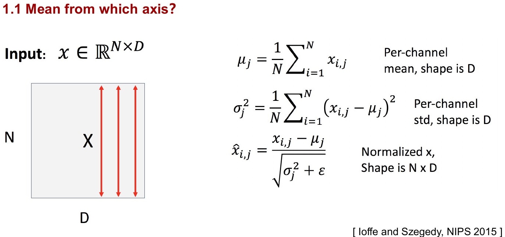

**卷积层的轴与形状。**对 $x\in\mathbb R^{N\times C\times H\times W}$，每个通道分别沿 $N,H,W$ 计算统计量：

$$
\mu_c=\frac1{NHW}\sum_{n,h,w}x_{nchw},\qquad
\sigma_c^2=\frac1{NHW}\sum_{n,h,w}(x_{nchw}-\mu_c)^2.
$$

统计量与仿射参数的形状均可写为 $1\times C\times1\times1$。第 42 页提及 Spatial BatchNorm、BatchNorm2D、BatchNorm3D，均应依据实际张量轴理解。

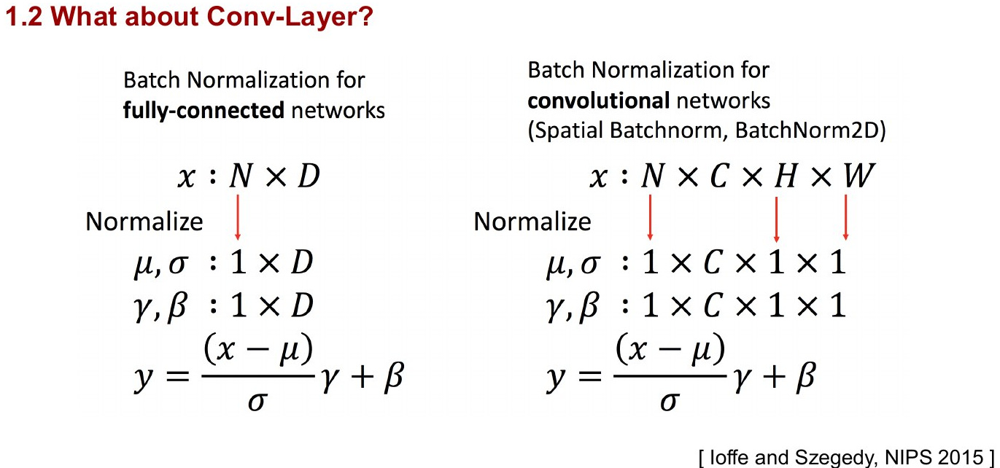

**训练与推断的补充说明：**常规 BN 在训练时用当前批次统计量，并维护运行均值／方差；推断时使用运行统计量，因此行为与 LN 不同。小批量或训练／推断分布差异会影响 BN 的使用。

### 5.2 LN、IN、GN 的统计范围（第 43–47 页）

它们都可以写成

$$
y=\gamma\odot\frac{x-\mu}{\sqrt{\sigma^2+\epsilon}}+\beta,
$$

主要区别是：**用哪些元素共同计算 $\mu$ 和 $\sigma^2$**。

| 方法 | 输入及统计范围 | 统计量可广播形状 | 课件应用／性质 |
| --- | --- | --- | --- |
| 全连接 BN | $N\times D$；对每个特征沿 $N$ | $1\times D$ | 依赖批次统计 |
| 全连接 LN | $N\times D$；对每个样本沿 $D$ | $N\times1$ | 训练与推断计算方式相同，可用于 RNN |
| 卷积 BN | $N\times C\times H\times W$；每通道沿 $N,H,W$ | $1\times C\times1\times1$ | 通道内跨样本、空间共享统计 |
| 课件图示卷积 LN | 每样本沿 $C,H,W$ | $N\times1\times1\times1$ | 不使用其他样本的统计量 |
| IN | 每样本、每通道沿 $H,W$ | $N\times C\times1\times1$ | 常用于风格迁移 |
| GN | 将通道分成 $G$ 组，每样本在组内沿 $C/G,H,W$ | 以 $N\times G\times(C/G)\times H\times W$ 表示时，为 $N\times G\times1\times1\times1$ | 统计不跨 batch，介于 LN 与 IN 的分组方式之间 |

LN 的归一化维度由配置决定：在语言 Transformer 的 $B\times T\times D$ 张量中，通常对每个 token 的最后一维 $D$ 归一化，不能直接套用卷积图中的全部 $C,H,W$ 轴。IN 的“训练／测试一致”指通常不追踪运行统计的形式；配置改变时应查看具体实现。

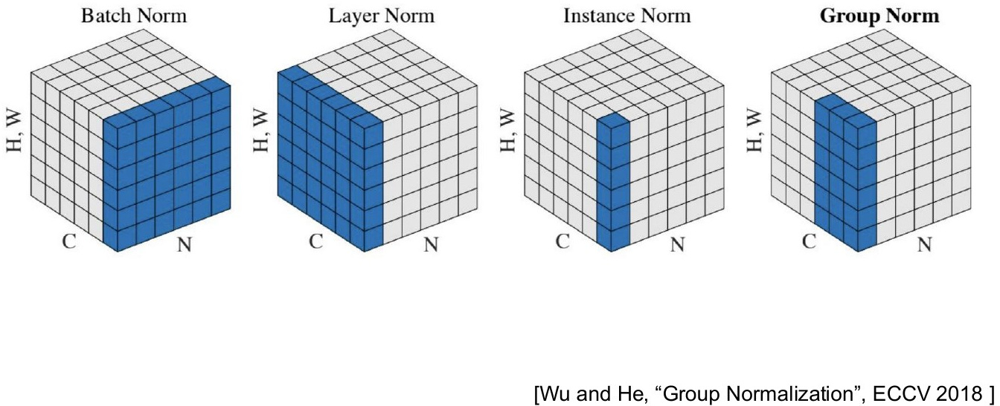

课件引用：Ba、Kiros、Hinton，*Layer Normalization*（2016）；Ulyanov 等，*Improved Texture Networks: Maximizing Quality and Diversity in Feed-forward Stylization and Texture Synthesis*（CVPR 2017）；Wu、He，*Group Normalization*（ECCV 2018）。[LN 原论文](https://arxiv.org/abs/1607.06450)

### 5.3 RMSNorm 与归一化的非线性（第 48–49 页）

课件对 token 向量 $\mathbf a\in\mathbb R^d$ 定义

$$
\operatorname{RMS}(\mathbf a)=\sqrt{\frac1d\sum_{i=1}^d a_i^2},\qquad
\bar a_i=\frac{a_i}{\operatorname{RMS}(\mathbf a)}.
$$

加入数值稳定项和可学习缩放时，常用写法为

$$
\operatorname{RMSNorm}(\mathbf a)_i
=\gamma_i\frac{a_i}{\sqrt{\frac1d\sum_{j=1}^d a_j^2+\epsilon}}.
$$

与 LN 相比，关键是**不减去均值**，通常也不使用可学习平移 $\beta$。课件还提及低精度归一化及去掉偏置，但 RMSNorm 并非“低精度 LN”的同义词。[RMSNorm 原论文](https://arxiv.org/abs/1910.07467)

第 49 页展示 **XOR 分类的几何构造**：

1. 从不能直接线性分开的两类点出发。
2. 旋转 45°。
3. 垂直投影到直线 $y=0.5$。
4. 球面投影到单位圆 $x^2+y^2=1$。
5. 水平投影到 $x=0$，使两类可区分。

球面投影依赖输入的范数，是非线性变换。该图说明归一化本身也能引入非线性，而非所有归一化都只是一组固定线性变换。课件引用 *On the Nonlinearity of Layer Normalization*，ICML 2024。[原论文](https://arxiv.org/abs/2406.01255)

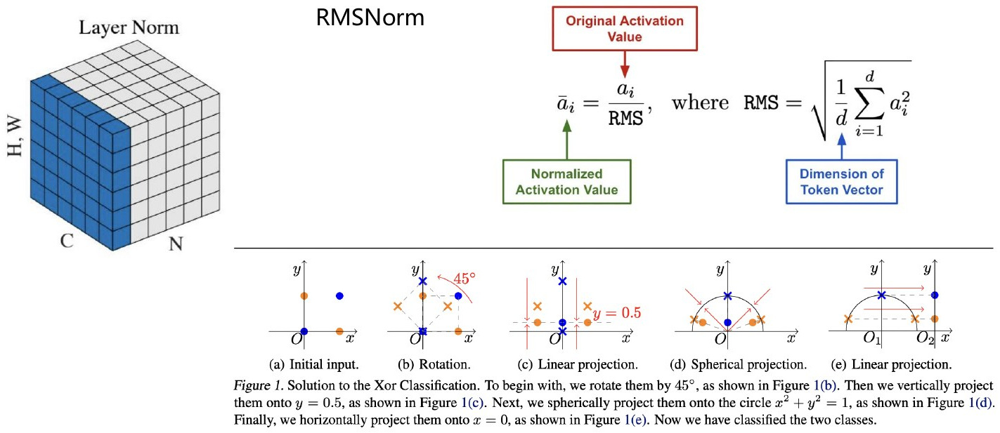

### 5.4 多模态模型中的归一化配置（第 50 页）

以下表格完整保留课件的模型配置例。模型系列可能有不同版本，表中条目应与其具体实现对应。

| 课件模型条目 | 视觉编码器 | 语言模型 |
| --- | --- | --- |
| CLIP-ResNet | BatchNorm | LayerNorm |
| CLIP-ViT | LayerNorm | LayerNorm |
| LLaVA 系列 | LayerNorm | RMSNorm |
| Llama 3.2 Vision | LayerNorm | RMSNorm |
| Llama 4 | LayerNorm | RMSNorm |
| Qwen2-VL | LayerNorm | RMSNorm |
| Qwen2.5-VL | RMSNorm | RMSNorm |
| Gemma 3 | LayerNorm（SigLIP 视觉分支） | RMSNorm |
| BLIP-2 / InstructBLIP | LayerNorm | 取决于连接的 LLM |
| MiniGPT-4 | LayerNorm | RMSNorm |

课件指出，GN、IN 在这一组理解型多模态模型中较少出现。

### 5.5 生成模型中的归一化配置（第 51 页）

| 课件模型条目 | 骨干结构 | 课件归一化条目 |
| --- | --- | --- |
| VQ-VAE | CNN + Codebook | 未指定（不等于确定没有归一化） |
| VQGAN | CNN + Transformer | GroupNorm |
| StyleGAN | CNN | PixelNorm + AdaIN |
| DDPM | U-Net | GroupNorm |
| Stable Diffusion 1.x / 2.x | U-Net + Transformer | GroupNorm + LayerNorm |
| SDXL | U-Net + Transformer | GroupNorm + LayerNorm |
| DiT | Transformer | AdaLN-Zero |
| Stable Diffusion 3 / SD3.5 | MMDiT | AdaLN-Zero + LayerNorm |
| FLUX.1 | Flow Transformer | AdaLN-Zero + LayerNorm + QK-RMSNorm |
| FLUX.2 | Flow Transformer | AdaLN + RMSNorm / QK-Norm |

表中 PixelNorm、AdaIN、QK-Norm 是课件提及的技术名词，课件没有进一步给出其完整公式；不根据这张表补写各模型完整架构。

### 5.6 AdaLN 与 AdaLN-Zero（第 51–52 页）

为区分无仿射归一化与后续调制，令

$$
\operatorname{LN}_0(x)=\frac{x-\mu}{\sqrt{\sigma^2+\epsilon}}.
$$

普通 LN 的仿射参数不依赖当前条件：

$$
y=\gamma\odot\operatorname{LN}_0(x)+\beta.
$$

**Adaptive Layer Normalization（AdaLN）**用条件 $c$ 生成缩放与平移：

$$
[\gamma(c),\beta(c)]=\operatorname{MLP}(c),\qquad
y=\gamma(c)\odot\operatorname{LN}_0(x)+\beta(c).
$$

课件条件包括扩散时间步 $t$、类别标签、文本嵌入。

**AdaLN-Zero**进一步为注意力分支和 MLP 分支生成各自的调制参数与残差门控：

$$
[\gamma_1,\beta_1,\alpha_1,\gamma_2,\beta_2,\alpha_2]
=\operatorname{MLP}(c),
$$

$$
\begin{aligned}
x'&=x+\alpha_1(c)\odot\operatorname{Attention}
\bigl(\gamma_1(c)\odot\operatorname{LN}_0(x)+\beta_1(c)\bigr),\\
x''&=x'+\alpha_2(c)\odot\operatorname{MLP}
\bigl(\gamma_2(c)\odot\operatorname{LN}_0(x')+\beta_2(c)\bigr).
\end{aligned}
$$

课件两个式子逐次使用 $x=x+\cdots$，上式改用 $x',x''$ 显示更新顺序。Zero 表示部分调制／门控权重采用零初始化；若残差门控初始为 0，模块初始接近恒等映射。实现中也可能以 $1+\gamma(c)$ 表示尺度，不能把“全部实际缩放系数为 0”当成统一定义。

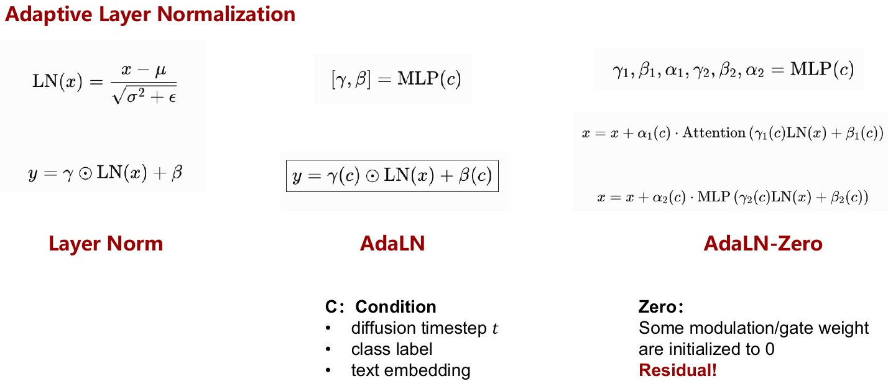

## 6. 正则化与泛化

### 6.1 为什么需要正则化（第 35–37、114–117 页）

随着模型复杂度增加，训练误差通常下降，但测试误差可能先降后升。模型过于简单会欠拟合，过于复杂或训练过度可能拟合噪声而过拟合；希望选择泛化更好的模型，而非仅追求最低训练误差。

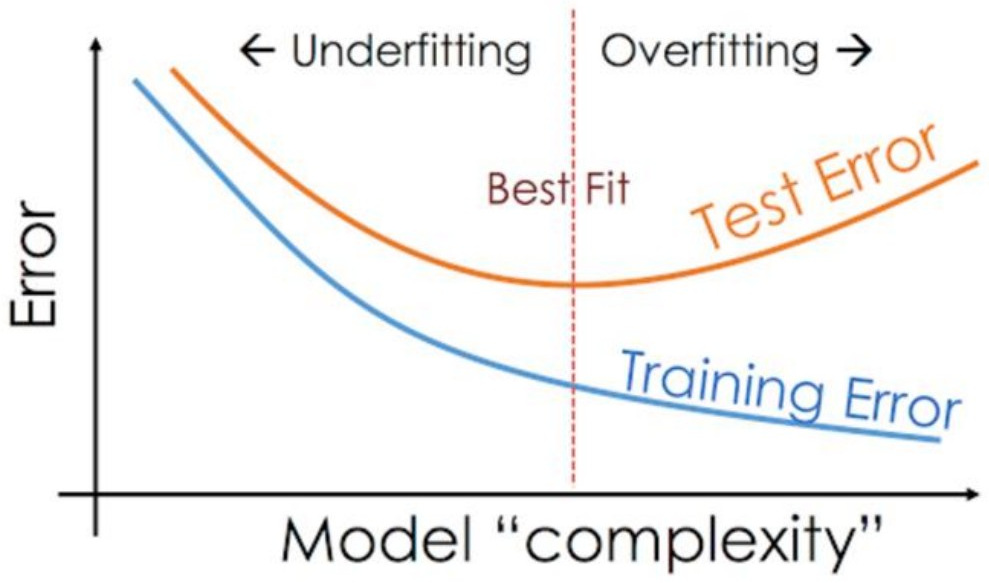

第 115–116 页的散点拟合例中，复杂曲线 $f_1$ 贴近样本但波动明显，简单趋势 $f_2$ 更平稳。正则化通过对参数或模型施加偏好，抵抗对噪声的过度拟合。

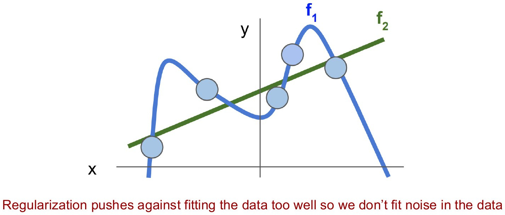

课件将相关手段分为三组：

| 分组 | 课件方法 | 作用或关注点 |
| --- | --- | --- |
| 模型／架构侧 | Dropout、DropPath、Weight Decay／L2、归一化层 | 限制模型依赖、约束参数、改善训练 |
| 数据侧 | 大规模高质量数据、数据增强、新数据生成（课件举 BLIP-2） | 增加覆盖与变化；图像增强细节留待 CNN |
| 训练策略 | 多任务学习；对比、生成、匹配损失；梯度裁剪；渐进训练 | 联合目标、稳定训练、分阶段学习 |

这些方法不全是同一种数学意义上的“正则项”。对于多模态模型，课件特别提出灾难性遗忘问题，以及冻结部分模块、渐进训练的应对方式。

### 6.2 L2 与 L1（第 114、117–118 页）

整体目标：

$$
\mathcal J(W)=\underbrace{\frac1N\sum_{i=1}^{N}\ell_i(f(\mathbf x_i;W),y_i)}_{\text{数据项}}
+\lambda\underbrace{R(W)}_{\text{正则项}},\qquad\lambda\ge0.
$$

数据项要求预测符合样本，正则项表达对参数的偏好，从而改善测试时的表现。$\lambda$ 越大，对正则项的重视越强，但过强会导致欠拟合。

**L2 平方惩罚：**

$$
R_2(W)=\|W\|_F^2=\sum_i\sum_jW_{ij}^2.
$$

课件把该式左边记为 $\|W\|_2$，但右边是平方和。对于矩阵，准确记号是 Frobenius 范数的平方；向量情形是 $\|w\|_2^2$。它倾向于较小、分散的权重，通常形成稠密的分布式表征。

**L1 惩罚：**

$$
R_1(W)=\sum_i\sum_j|W_{ij}|.
$$

它倾向于稀疏表示，可使一部分权重为 0。课件还指出存在其他正则化形式。

### 6.3 L1／L2 数值例题与几何解释（第 119–122 页）

给定

$$
x=[1,1,1,1]^T,\quad
w_1=[1,0,0,0]^T,\quad
w_2=[0.25,0.25,0.25,0.25]^T.
$$

两者数据预测相同：$w_1^Tx=w_2^Tx=1$。

| 正则项 | $w_1$ | $w_2$ | 结论 |
| --- | --- | --- | --- |
| L2 平方和 | $1$ | $4(0.25)^2=0.25$ | 更偏好分散的 $w_2$ |
| L1 绝对值和 | $1$ | $4(0.25)=1$ | 在这两个候选之间打平 |

课件第 121 页由此讨论 L1 的稀疏偏好，但**本例单独计算并不能得出 L1 严格偏好 $w_1$**。稀疏现象需要结合数据损失及约束的几何结构解释：L2 等值约束是圆／球，L1 是带尖角的菱形／交叉多胞体，损失等高线更容易在坐标轴尖角处接触 L1 约束，使某些参数为 0。

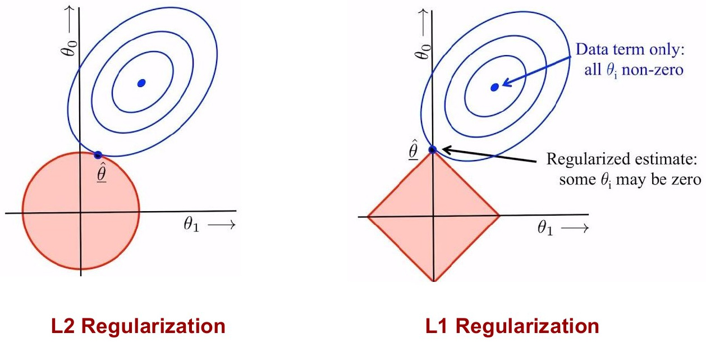

### 6.4 Dropout：定义、实现与集成解释（第 123–127 页）

训练时随机将一些神经元输出置零，减少对特定神经元组合的依赖。为避免混淆，统一记：

$$
p_{drop}=\text{丢弃概率},\qquad q=1-p_{drop}=\text{保留概率}.
$$

标准的未缩放 Dropout 操作：

$$
o_i=W_i\mathbf x+b_i,\quad
m_i\sim\operatorname{Bernoulli}(q),\quad
\tilde o_i=o_i m_i.
$$

等价地，采样 $u_i\sim U(0,1)$，令 $m_i=\mathbf1[u_i<q]$。课件第 124 页的 `rand < dropout_rate` 后又将输出乘此 mask，实际上把变量当成了**保留率**；若变量确为丢弃率，应使用 `rand >= p_drop`。

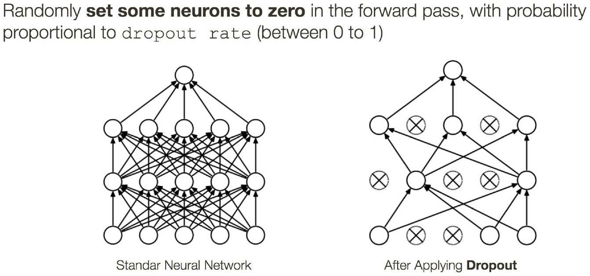

第 125 页的猫分类例列出“有耳朵、有尾巴、毛茸茸、有爪子、淘气的样子”等特征。部分特征被置零，分类仍须依靠剩余信息，避免仅依赖固定的特征搭配。

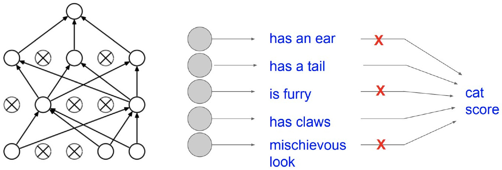

从集成角度，每个二值 mask 对应一个共享参数的子网络；每次前向传播相当于采样一个子网络训练。课件把这一点描述为“许多共享参数模型的集成”。

推断时希望平均掉 mask 的随机性：

$$
\bar f(x)=\mathbb E_m[f(x,m)]
=\sum_mP(m)f(x,m)
\approx\frac1K\sum_{k=1}^{K}f(x,m^{(k)}).
$$

课件第 128 页使用通用积分形式 $\mathbb E_z[f(x,z)]=\int p(z)f(x,z)\,dz$；对离散二值 mask，写成求和更准确。蒙特卡洛方法需要多次前向传播再平均。通过完整网络加尺度修正得到的是一种近似，一般非线性网络并不严格满足“平均随机网络等于平均 mask 的网络”。

### 6.5 Dropout 期望例题与推断缩放（第 127–128 页）

线性神经元的两个输入分别为 $x,y$，完整输出为 $a=w_1x+w_2y$。若两输入各以 $q=1/2$ 保留，四个 mask 等概率：

$$
\begin{aligned}
\mathbb E[a_{train}]
&=\tfrac14(w_1x+w_2y)+\tfrac14(w_1x)
+\tfrac14(0)+\tfrac14(w_2y)\\
&=\tfrac12(w_1x+w_2y).
\end{aligned}
$$

一般情形为 $\mathbb E[a_{train}]=q(w_1x+w_2y)$。因此传统未缩放 Dropout 在推断时用完整网络并乘以**保留概率 $q$**；课件写“乘 Dropout 概率”需要作这一修正。[Dropout 作者论文](https://www.cs.toronto.edu/~hinton/absps/JMLRdropout.pdf)

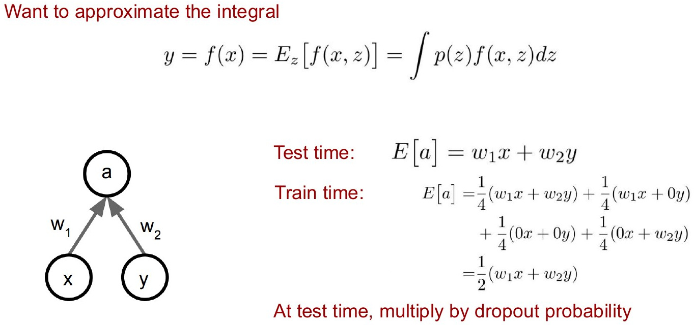

常用 **inverted dropout（反向缩放 Dropout）**在训练时先除以保留率：

$$
\tilde o_i=\frac{m_i}{q}o_i,\qquad
\mathbb E[\tilde o_i]=o_i\quad(q>0).
$$

这样推断时关闭 Dropout，不再额外缩放。偏置与激活位置、Dropout 的作用对象应依据实际模块确定；本节数值例题沿用课件的两输入线性求和。

## 7. 训练流程、学习率与曲线诊断

### 7.1 六步训练检查（第 54–59 页）

1. **检查初始损失。**关闭权重衰减，核对损失尺度。例如 $C$ 类 Softmax 若初始概率近似均匀，则交叉熵约为 $-\log(1/C)=\log C$。
2. **在极小样本上过拟合。**只用几个 mini-batch，尝试训练到接近 100% 的训练准确率，检查架构、学习率、初始化。损失不下降，课件首先考虑学习率太低或初始化问题；损失变 Inf／NaN，首先考虑学习率太高或初始化问题。这些是排查线索，还需检查数据、标签与数值实现。
3. **找到能使损失下降的学习率。**使用上一步的架构与全部训练数据，开启较小权重衰减，寻找约 100 次迭代内能明显降低损失的学习率。
4. **粗搜索。**围绕上一步有效的学习率与权重衰减取多个值，每个模型训练约 1–5 个 epoch。
5. **细搜索并延长训练。**选择较好的配置，在暂不衰减学习率的情况下训练约 10–20 个 epoch。
6. **查看损失与准确率曲线。**根据训练／验证变化进一步调参。

epoch 表示完整遍历训练集一次；iteration 表示一次参数更新。选择超参数应使用验证集，最终测试集不参与反复调参。

```mermaid
flowchart LR
  A[初始损失正确] --> B[小样本能过拟合]
  B --> C[寻找有效学习率]
  C --> D[粗搜索 1–5 epoch]
  D --> E[细搜索 10–20 epoch]
  E --> F[训练与验证曲线诊断]
  F --> C
```

### 7.2 从损失判断学习率（第 55、60–67 页）

| 曲线现象 | 课件解释与应对 |
| --- | --- |
| 损失迅速上升或发散 | 学习率可能过大，检查初始化与数值稳定性 |
| 损失缓慢、接近直线下降 | 学习率可能过小 |
| 前期下降较快、之后停在较高位置 | 学习率可能偏高，难以进一步精细优化 |
| 平稳且有效下降 | 学习率相对合适 |
| 长时间平坦后才突然下降 | 初始化是课件提出的主要怀疑因素 |
| 已进入损失平台 | 尝试学习率衰减 |
| 降低学习率后曲线立即停滞，但降低前仍在明显下降 | 可能过早衰减 |

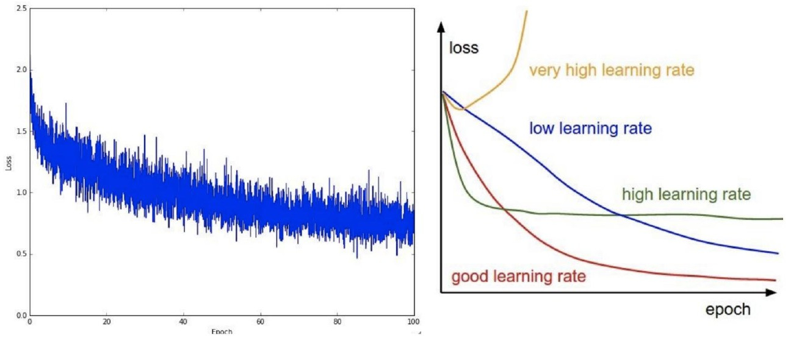

**阶梯衰减例**：课件以 ResNet 为例，在第 30、60、90 个 epoch 后将学习率乘以 0.1：

$$
\eta(e)=\eta_0\,0.1^{k(e)},
$$

其中 $k(e)$ 是已经经过的衰减节点数。这是课件中的调度实例，不是所有网络必须遵守的固定日程。

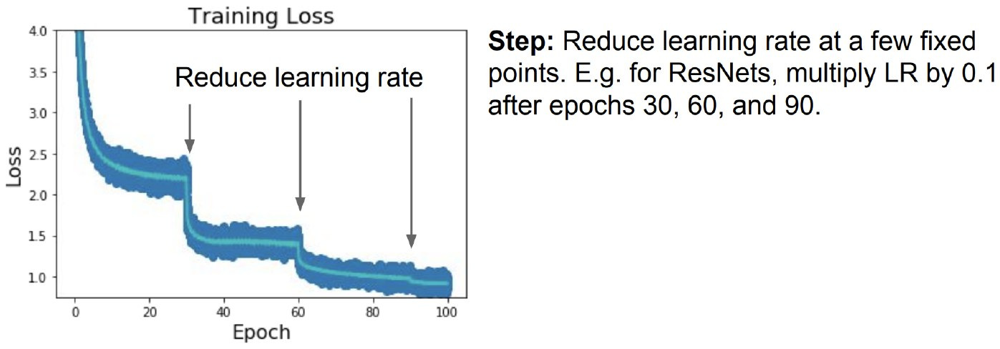

### 7.3 训练／验证准确率与泛化（第 68–74 页）

| 现象 | 课件建议 | 解释条件 |
| --- | --- | --- |
| 训练与验证准确率仍上升 | 继续训练 | 模型尚未充分收敛 |
| 训练准确率上升、验证准确率下降，间隙很大 | 增强正则化，获取更多数据 | 典型过拟合模式 |
| 两条曲线接近且准确率偏低 | 训练更久或增大模型容量 | 可能欠拟合；单凭“没有间隙”不能判断 |
| 存在较小间隙，验证表现较好 | 相对理想 | 还需结合任务、数据与指标 |

课件第 73 页简写“无间隙就是欠拟合”，这里补上“准确率偏低或任务尚未学好”的条件。训练与验证都很高时没有明显间隙并不是坏事。

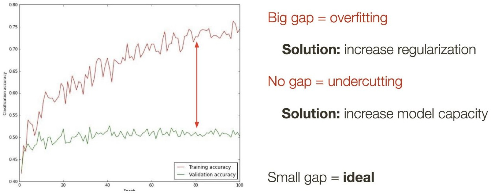

## 8. 易错点与符号约定

| 易错点 | 精确表述 |
| --- | --- |
| 多层线性层等于非线性模型 | 多层仿射变换仍可合并成一个仿射变换 |
| 万能逼近等于一定能训练好 | 定理讨论存在性，并不保证优化、数据效率或泛化 |
| GELU 近似式使用等号 | Tanh 与 $x\sigma(1.702x)$ 写法均为近似 |
| Sigmoid 输出就是 logit | Sigmoid 前的分数是 logit，之后是概率 |
| BN 得到高斯分布 | BN 调整均值与方差，不保证高斯性 |
| 所有 Norm 共享统计轴 | BN 跨样本；LN、IN、GN 按各自配置取统计范围 |
| RMSNorm 只是去掉偏置的 LN | 关键是取消减均值，按均方根归一化 |
| L2 就是未平方的范数 | 课件正则项实际使用平方和 |
| L1 在给出的两个向量间严格偏好稀疏向量 | 两向量 L1 值相同；稀疏性需结合优化几何 |
| Dropout 推断乘丢弃概率 | 传统形式乘保留率；反向缩放形式推断不额外缩放 |
| 平均 mask 网络等于子网络输出的严格平均 | 一般非线性网络中仅为近似 |
| 无训练／验证间隙一定是欠拟合 | 需同时看准确率、损失和任务难度 |

本章用 $\eta$ 表示学习率，$\lambda$ 表示正则化强度，$\epsilon$ 表示误差容限或数值稳定常数（按上下文），$\odot$ 表示逐元素乘法，$p_{drop}$ 表示丢弃率，$q=1-p_{drop}$ 表示保留率。

课件给出的万能逼近扩展资料为 Michael Nielsen 的 *Neural Networks and Deep Learning* 第 4 章，历史网址 `http://neuralnetworksanddeeplearning.com/chap4.html`；本次访问未成功，因此不将它列为已验证的可用链接。正文已经保留课件的阶跃、矩形脉冲、分段逼近推导与原图。传统激活函数部分标注来自 Stanford CS231n 的 Li、Karpathy、Johnson 课件。

逐页保留、合并与删除记录见 [内容覆盖核对表](../COVERAGE.md)。返回 [第一章：多模态学习导论](01-多模态学习导论.md) 或 [笔记目录](../README.md)。

