# 第三章：计算机视觉导论——卷积与视觉骨干

来源：刘洋（Yang Liu），`3_Introduction_ComputerVision_part1-26.pdf`，共 167 页，封面未注明日期。本文页码均为 **PDF 页序号**；课件附录的页脚编号有偏移。整理日期：2026-10-08。

本章将主讲与附录的重复部分合并：先理解卷积、池化和资源计算，再比较 AlexNet、VGG、GoogLeNet、ResNet、SE、轻量网络、大核及动态卷积，最后整理数据增强与架构搜索。密集实验表保留完整原图，正文说明指标、条件和结论；原图中的英文专名与数值便于对照。下一章接续目标检测和分割。

## 1. 计算机视觉与卷积的动机

### 1.1 从像素到理解

来源：第 2–4 页。

计算机视觉（Computer Vision）从图像或视频获取信息，理解场景、物体及其关系，并支持后续决策。课件以湖面场景、自动驾驶感知与应用流程说明：输入是像素，输出可以是类别、位置、像素标签或更高层语义。David Marr 的视觉研究是该领域的重要历史背景；课件提及 20 世纪 70 年代的研究思想，不把书籍封面当作技术内容。

视觉骨干（backbone）把图像转换成层次化特征，分类、检测和分割再使用不同输出头。所谓“层次化”，通常指低层提取边缘纹理，中层组合局部模式，高层形成较抽象的语义表征，而不是每个通道都有固定的人类可读含义。

### 1.2 全连接、局部连接与参数共享

来源：第 6–11、32–33 页。

设单通道图像为 200×200，共 40,000 个输入，隐藏层也有 40,000 个单元。全连接需要：

```math
40{,}000\times40{,}000=1.6\times10^9
```

个权重，另有隐藏层偏置。课件写“约 2 billion”，是粗略量级；精确权重数为 16 亿。若每个隐藏单元仅连接 10×10 的局部区域，则是：

```math
40{,}000\times100=4{,}000{,}000
```

个权重。进一步让不同位置使用同一组 10×10 权重，只需 100 个权重；使用 20 种局部滤波器则是 2,000 个权重。以上例子不计偏置，并假定单通道输入。

局部连接利用视觉结构的局部性；共享参数利用不同位置可能出现相似模式的统计假设（课件称 stationarity）。同一种边缘或纹理不必在每个位置重新学习一套参数。共享卷积通常带来**平移等变性**：输入移动，特征响应相应移动；不能把它直接等同于对任意平移完全不变，边界填充、步幅和后续操作也会影响这一性质。

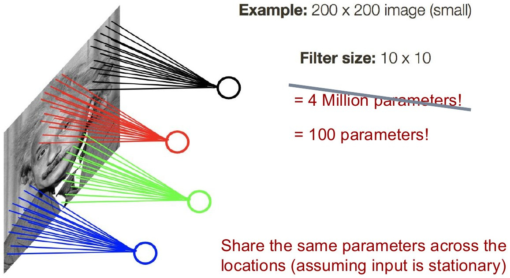

*原图：第 11 页。每种颜色代表一种共享滤波器；同种滤波器在多个位置复用。*

## 2. 卷积层：运算、形状与参数

### 2.1 一个输出值怎样产生

来源：第 12–27、34–40 页。

滤波器覆盖输入的局部区域，对对应元素做乘积求和，加偏置，再经过激活；把滤波器沿空间滑动，得到一张特征图。第 12–27 页的连续移动展示合并为下图。

```math
Y_{o,i,j}
=b_o+\sum_{c=1}^{C_{\mathrm{in}}}
\sum_{u=0}^{F_h-1}\sum_{v=0}^{F_w-1}
W_{o,c,u,v}X_{c,iS_h+u-P_h,jS_w+v-P_w}.
```

越界输入按填充规则处理。深度学习框架中通常实现的是不翻转核的互相关，习惯上仍称“卷积”。一个输出通道拥有一个覆盖**全部输入通道**的核，核的“深度”与输入通道数相同。

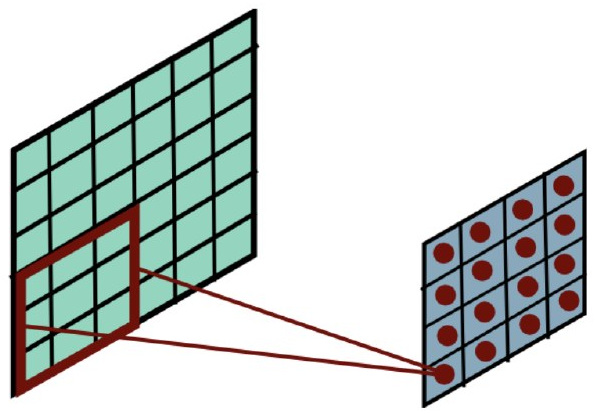

*原图：第 27 页。合并前面的逐位置动画，保留输入、核及完成的输出。*

例：32×32×3 的 RGB 输入，5×5×3 的一个核，共 75 个权重，加 1 个偏置，共 76 个参数。步幅 1、不填充时，输出 28×28×1；使用 6 个不同核则输出 28×28×6，参数为 6×76=456。卷积核覆盖三个颜色通道，不是把三个颜色独立算完后保持三个输出通道。

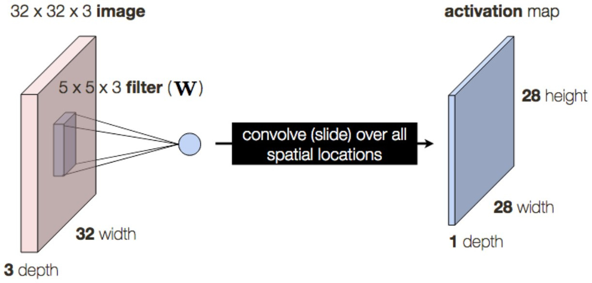

*原图：第 38 页。32×32×3 经多个 5×5×3 核生成 28×28 的输出通道。*

### 2.2 固定滤波器例题：平滑与边缘

来源：第 28–31 页。

均值滤波器：

```math
K_{\mathrm{mean}}=\frac19
\begin{bmatrix}1&1&1\\1&1&1\\1&1&1\end{bmatrix}.
```

它以邻域平均替换局部像素，平滑高频变化，产生模糊效果。课件把每个系数写作 0.11，是 1/9 的近似，九项和为 0.99；精确平均应使用 1/9。

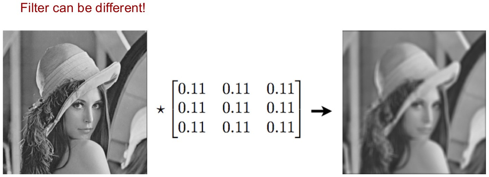

*原图：第 29 页。*

边缘滤波器：

```math
K_{\mathrm{edge}}=
\begin{bmatrix}-1&0&1\\-1&0&1\\-1&0&1\end{bmatrix}.
```

这是 Prewitt 型水平梯度核，比较左、右邻域，因而突出**竖直边缘**。响应符号取决于亮暗方向，显示成图片还涉及归一化或取绝对值等可视化步骤。CNN 的区别在于核权重通常从任务数据中学习。

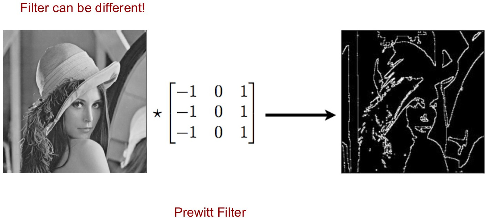

*原图：第 31 页。*

### 2.3 输出尺寸、步幅与填充

来源：第 41–49 页。

普通二维卷积的空间尺寸应分别计算高度和宽度。无膨胀、对称填充时：

```math
H_{\mathrm{out}}=\left\lfloor\frac{H_{\mathrm{in}}+2P_h-F_h}{S_h}\right\rfloor+1,\qquad
W_{\mathrm{out}}=\left\lfloor\frac{W_{\mathrm{in}}+2P_w-F_w}{S_w}\right\rfloor+1.
```

输出通道数等于核数。必要补充：膨胀率 D 下有效核尺寸为 $`D(F-1)+1`$，相应把上式的 F 替换为有效核尺寸。框架依据可对照 [PyTorch Conv2d 官方说明](https://docs.pytorch.org/docs/stable/generated/torch.nn.Conv2d.html)。

课件 7×7 输入、3×3 核的例子：

| 填充 P | 步幅 S | 输出大小 | 含义 |
| --- | --- | --- | --- |
| 0 | 1 | 5×5 | 每次移动一个位置 |
| 0 | 2 | 3×3 | 更稀疏地取局部窗口 |
| 0 | 3 | 2×2 | 向下取整后合法，但窗口不能恰好铺满最后边界 |
| 1 | 1 | 7×7 | 空间大小保持 |
| 1 | 2 | 4×4 | 有填充并下采样 |
| 1 | 3 | 3×3 | 同时由填充与步幅决定 |

课件第 43 页把 S=3 的情况称为“不能应用”，对应“窗口须恰好铺满”的教学约定；一般框架允许丢弃不完整尾部窗口，不能据此断言卷积无效。

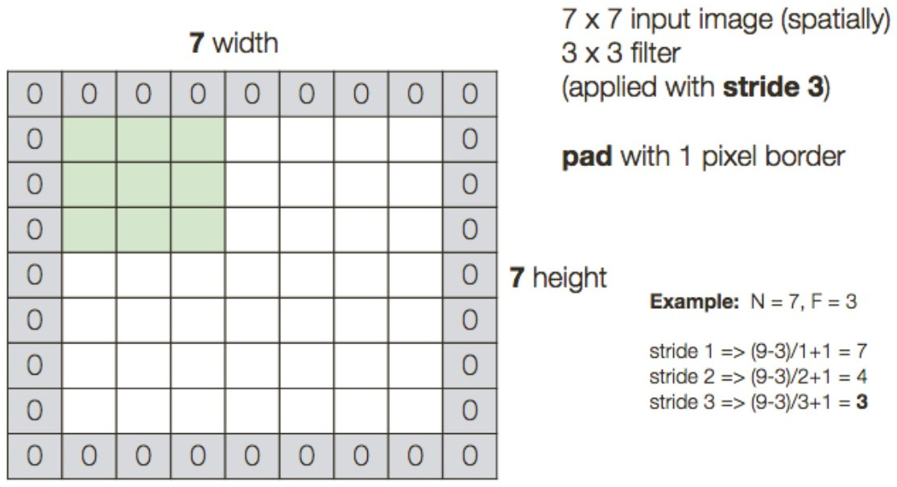

*原图：第 45 页。*

无填充的连续 5×5 卷积会使空间大小 32→28→24；第一层输出 6 通道，第二层可使用 5×5×6 的 10 个核，输出 24×24×10。较深网络通常通过合适填充控制尺寸，避免分辨率下降过快。

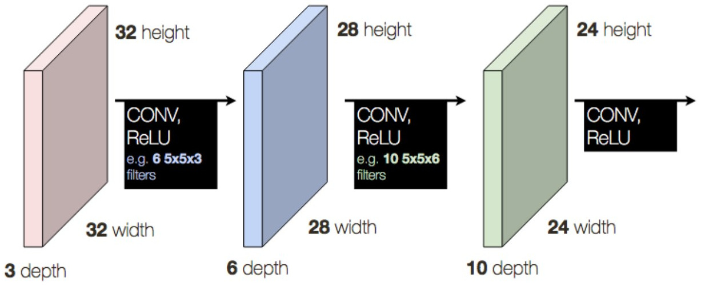

*原图：第 41 页。*

### 2.4 参数量与 1×1 卷积

普通卷积（不分组）的参数量为：

```math
N_{\mathrm{param}}=C_{\mathrm{out}}\left(F_hF_wC_{\mathrm{in}}+1\right).
```

括号中的 1 是每个输出通道的偏置；没有偏置则去掉。空间位置共享权重，所以参数量不随输入高宽直接增长。

1×1 卷积在每个位置混合通道。例：56×56×64 输入，用 32 个 1×1×64 核得到 56×56×32，权重 2,048 个，含偏置参数 2,080 个。它可降维或升维、减少后续大核开销，并在接非线性后增加表达能力；单个 1×1 核本身不扩大空间感受野。

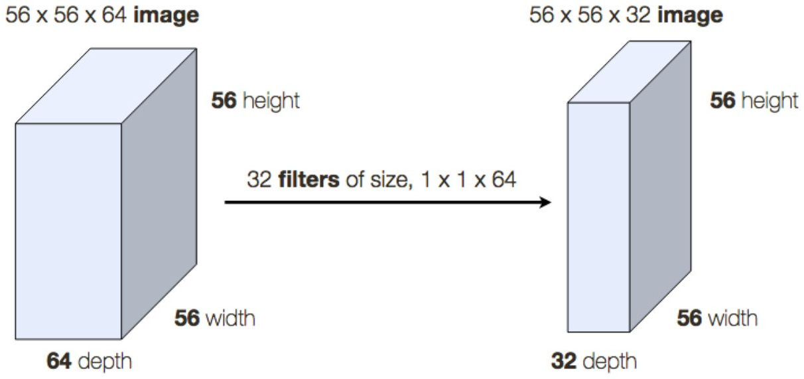

*原图：第 46 页。*

## 3. 池化、全连接与 CNN 组织

### 3.1 最大池化与平均池化

来源：第 50–61 页。

池化在每个通道内独立聚合局部区域，通常缩小高宽而保留通道数，没有可学习参数。最大池化取最大值，平均池化取均值；局部聚合有助于对小幅位移更稳健，但不保证严格平移不变。例：224×224×64 经 2×2、S=2 池化，输出 112×112×64。

课件数值例题，输入：

```math
X=\begin{bmatrix}
1&1&2&4\\5&6&7&8\\3&2&1&0\\1&2&3&4
\end{bmatrix}.
```

核 2×2、步幅 2、不填充：

```math
\mathrm{MaxPool}(X)=
\begin{bmatrix}6&8\\3&4\end{bmatrix},\qquad
\mathrm{AvgPool}(X)=
\begin{bmatrix}3.25&5.25\\2&2\end{bmatrix}.
```

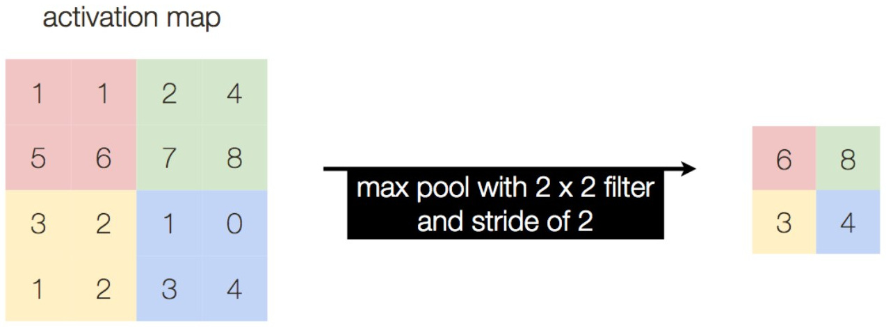

*原图：第 59 页。*


*原图：第 60 页。*

无填充池化的输出高宽同样用 $`\lfloor(N-F)/S\rfloor+1`$；具体实现也可能提供 ceil 模式，应查看设置。

### 3.2 全连接层的代价

来源：第 51、53 页。

展平后，每个输出单元连接所有输入。32×32×3 展平为 3,072 维，映射到 10 类的全连接层有：

```math
3072\times10+10=30{,}730
```

个参数。VGG 中 7×7×512=25,088 维映射到 4,096 维，有：

```math
25{,}088\times4096+4096=102{,}764{,}544
```

个参数。课件第53页的102,760,448实际只计权重，等于25,088×4,096；加上4,096个偏置才是上述总数。因此较大的展平特征接大型 FC 会占用大量权重。

### 3.3 通用组织方式

卷积提取局部特征，激活提供非线性，池化或有步幅卷积降采样，分类头输出类别得分。主干并非必须使用全连接；现代设计也常用全局平均池化。

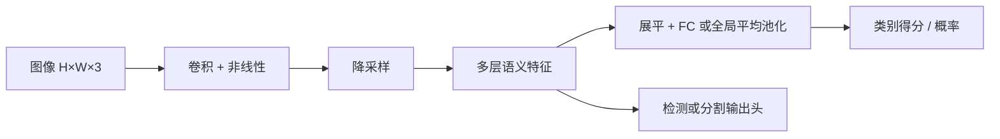
```mermaid
flowchart LR
 A["图像 H×W×3"] --> B["卷积 + 非线性"]
 B --> C["降采样"]
 C --> D["多层语义特征"]
 D --> E["展平 + FC 或全局平均池化"]
 E --> F["类别得分 / 概率"]
 D --> G["检测或分割输出头"]
```

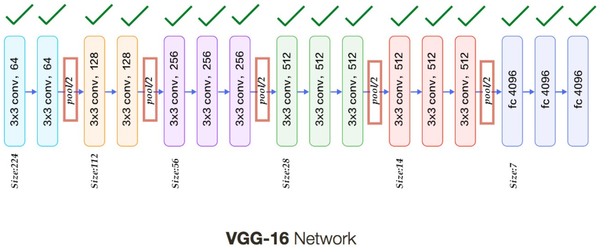

*原图：第 54 页。网络的层数、通道和各类算子位置保留用于对照。*

## 4. 分类数据、指标与资源口径

### 4.1 ImageNet 与 ILSVRC

来源：第 62–65、91、99、101–102、152、164 页。

图像分类把整张输入映射到预先定义的类别集合，如猫、狗、沙发、花或豹。ImageNet 大型数据库的课件历史规模约为 1,400 万图像、22,000 类（同义词集），使用 Amazon Mechanical Turk 等进行标注；不能把它与 ILSVRC 的 1,000 类分类子集混为一谈。

Top-1 要求得分最高的类别正确；Top-5 只要求真实类别位于前五个预测中。错误率等于 1−对应准确率。课件多次重复的历史图合并如下：

| 年份 | 课件代表方法 | Top-5 错误率 | 图中层数 |
| --- | --- | --- | --- |
| 2010 | 传统浅层方法 | 28.2% | — |
| 2011 | 传统浅层方法 | 25.8% | — |
| 2012 | AlexNet | 16.4% | 8 |
| 2013 | ZFNet | 11.7% | 8 |
| 2014 | VGG / GoogLeNet | 7.3% / 6.7% | 19 / 22 |
| 2015 | ResNet | 3.6% | 152 |
| 2016 | ResNet 系列竞赛结果 | 3.0% | 152 |
| 2017 | SE 系列 | 2.3% | 152 |

图中“人类 5.1%”是特定 ImageNet 实验的参考值，不能推导为所有视觉任务中模型普遍超过人类；竞赛、单模型、集成与评测协议也会影响结果。

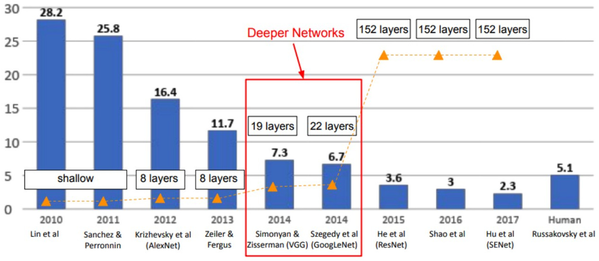

*原图：第 91 页。后续重复历史图不再复写。*

### 4.2 参数、激活内存、MAC 与 FLOPs

来源：第 67–87、98、151 页。

需要分清四种量：

| 量 | 计算与含义 | 不能直接推出什么 |
| --- | --- | --- |
| 参数量 | 所有可学习权重和偏置数量 | 不等于中间激活规模 |
| 激活内存 | 元素数×每元素字节数 | 不等于完整训练峰值显存 |
| MAC | 一次乘法及累加视作一个乘加 | 不等于统一口径的 FLOPs |
| 实测延迟/吞吐 | 特定硬件、精度、批量、实现下测量 | 不能仅由 MAC 线性推算 |

FP32 每元素 4 字节。课件的 KB 实际按 1,024 字节计算，应理解为 KiB；MB 图是课程近似量。卷积的主要乘加数：

```math
N_{\mathrm{MAC}}=
H_{\mathrm{out}}W_{\mathrm{out}}C_{\mathrm{out}}
F_hF_wC_{\mathrm{in}}.
```

FC 的主要 MAC 为 $`C_{\mathrm{in}}C_{\mathrm{out}}`$。若乘法和加法各计一个 FLOP，则约为 2×MAC，通常另行忽略偏置、激活、池化等开销。课件表把一乘一加计作一个“flop”，笔记统一注明其实际为 MAC 口径。池化主要执行比较或加法，不能按卷积乘加来解释其运算。

训练还需梯度、优化器状态、保存的激活和临时工作区，不能把一层输出内存或各层简单加和当作真实峰值。

## 5. AlexNet：逐层资源例题

来源：第 66–87 页。

AlexNet 用五个卷积层和三个全连接层，采用 ReLU、最大池化，原始设计还使用局部响应归一化（LRN），并为两张 GTX 580（各 3 GB）划分计算。

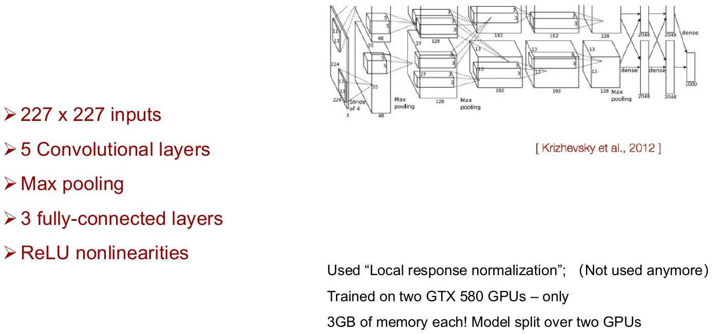

*原图：第 66 页。该结构图与后面课堂计算表的通道配置不同。*

### 5.1 课堂计算配置

课件资源表采用卷积通道 64、192、384、256、256，输入 227×227；它是课堂使用的 AlexNet 风格配置，不是原论文 96、256 等通道和分组设置的逐项复刻。以下按表中尺寸计算，全部卷积按不分组处理。

| 层 | 输入 C×H×W | 输出 C×H×W | F / S / P | 含偏置参数量 | 主要 MAC |
| --- | --- | --- | --- | --- | --- |
| conv1 | 3×227×227 | 64×56×56 | 11 / 4 / 2 | 23,296 | 72,855,552 |
| pool1 | 64×56×56 | 64×27×27 | 3 / 2 / 0 | 0 | 非卷积乘加 |
| conv2 | 64×27×27 | 192×27×27 | 5 / 1 / 2 | 307,392 | 223,948,800 |
| pool2 | 192×27×27 | 192×13×13 | 3 / 2 / 0 | 0 | 非卷积乘加 |
| conv3 | 192×13×13 | 384×13×13 | 3 / 1 / 1 | 663,936 | 112,140,288 |
| conv4 | 384×13×13 | 256×13×13 | 3 / 1 / 1 | 884,992 | 149,520,384 |
| conv5 | 256×13×13 | 256×13×13 | 3 / 1 / 1 | 590,080 | 99,680,256 |
| pool5 | 256×13×13 | 256×6×6 | 3 / 2 / 0 | 0 | 非卷积乘加 |
| flatten | 256×6×6 | 9,216 维 | 展平 | 0 | 不算新增乘加 |
| fc6 | 9,216 维 | 4,096 维 | FC | 37,752,832 | 37,748,736 |
| fc7 | 4,096 维 | 4,096 维 | FC | 16,781,312 | 16,777,216 |
| fc8 | 4,096 维 | 1,000 维 | FC | 4,097,000 | 4,096,000 |

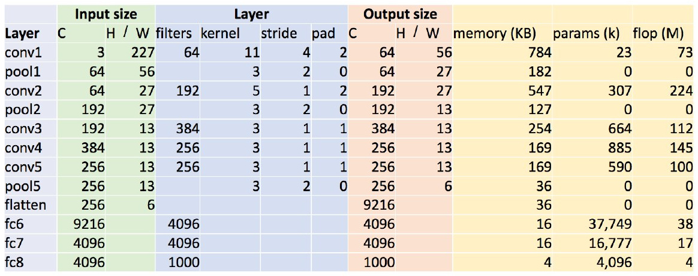

*原图：第 84 页。保留原表便于定位；精确值、偏置与错误修正以正文计算表为准。原表 conv4 的“145M”应约为 149.52M MAC；第 83 页 FC6 写成 37,725,832，正确结果是 37,752,832。表内整数 k/M 是近似或省偏置口径，不应当作精确数。*

### 5.2 第一层完整推导

```math
H_{\mathrm{out}}=
\left\lfloor\frac{227+2\times2-11}{4}\right\rfloor+1
=56.
```

```math
N_{\mathrm{activation}}=64\times56^2=200{,}704,\qquad
M_{\mathrm{activation}}=
\frac{200{,}704\times4}{1024}=784\ \mathrm{KiB}.
```

```math
N_{\mathrm{param}}=64(3\times11^2+1)=23{,}296,\qquad
N_{\mathrm{MAC}}=64\times56^2\times3\times11^2=72{,}855{,}552.
```

pool1 输出高宽为 $`\lfloor(56-3)/2\rfloor+1=27`$，FP32 输出 182.25 KiB。课件以 64×27²×9=419,904 估计扫描窗口工作量；真正的 9 元素最大值通常需要 8 次比较，不能把该数叫作乘加 FLOPs。

FC6 验算：

```math
9216\times4096=37{,}748{,}736,\qquad
37{,}748{,}736+4096=37{,}752{,}832.
```

### 5.3 资源分布的意义

前部卷积保留较大的高宽，激活内存通常较高；大型 FC 占据大部分参数；卷积的空间重复计算又可能占据多数 MAC。压缩参数、降低激活显存和提高吞吐是不同目标。

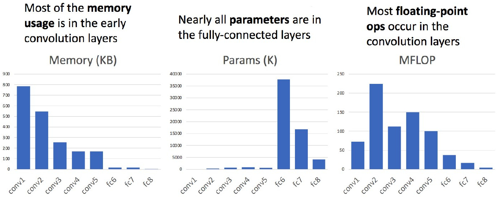

*原图：第 86 页。第87页完全相同的三个柱状图合并，三种资源分布都保留。*

## 6. VGG：小核堆叠与感受野

来源：第 116–120、144–151 页；与前面的 CNN 结构说明合并。

### 6.1 五个阶段与层数校正

VGG 使用 3×3、S=1、P=1 卷积，2×2、S=2 最大池化。五个阶段的通道通常为 64、128、256、512、512，之后接 4,096、4,096、1,000 三个 FC。

| 阶段 | VGG16 卷积数 | VGG19 卷积数 | 池化后空间大小，输入224×224 |
| --- | --- | --- | --- |
| 1 | 2 | 2 | 112×112 |
| 2 | 2 | 2 | 56×56 |
| 3 | 3 | 4 | 28×28 |
| 4 | 3 | 4 | 14×14 |
| 5 | 3 | 4 | 7×7 |
| 总计含 FC | 13+3=16 | 16+3=19 | 展平为25,088维 |

课件第 144 页文字把 stage 3 简写为 conv-conv-pool，并称 VGG19 仅 stage 4、5 有四个卷积。标准 VGG16/19 的 stage 3 应分别为 3/4 个卷积；已按 [VGG 原论文 Table 1](https://arxiv.org/html/1409.1556v6) 校正。层数指有权重的卷积及 FC，不把池化、ReLU、Softmax 都算进去。

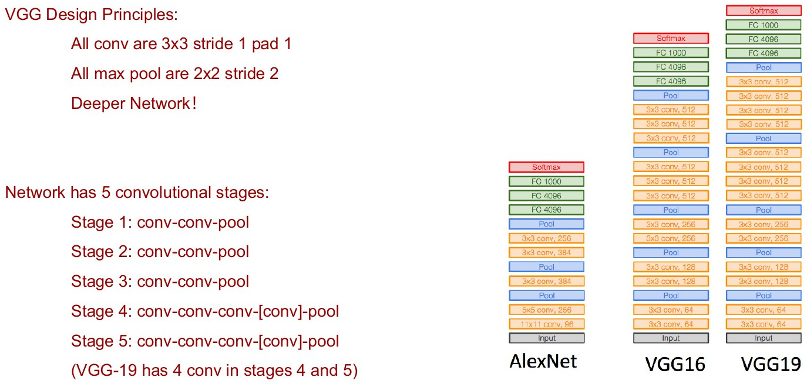

*原图：第 144 页。原页文字简写问题见上述校正。*

### 6.2 感受野递推

连续、无下采样的 3×3 卷积，一层的理论感受野是 3×3，两层 5×5，三层 7×7。一般递推（必要数学说明）：

```math
r_\ell=r_{\ell-1}+(k_\ell-1)j_{\ell-1},\qquad
j_\ell=j_{\ell-1}s_\ell,\qquad r_0=j_0=1.
```

r 是理论感受野边长，j 是相邻特征位置在原输入中的间距。课件把堆叠可覆盖的区域称“effective receptive field”，这里应理解为**理论覆盖范围**；研究中的有效感受野通常还讨论实际梯度贡献，不必均匀覆盖整个理论区域。

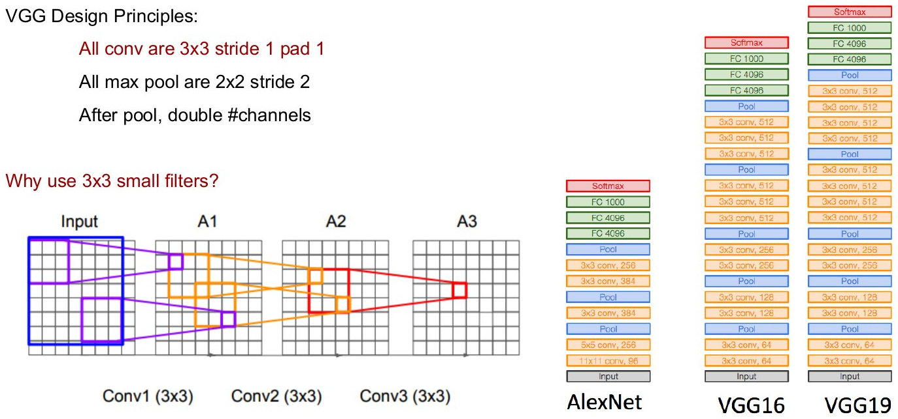

*原图：第 149 页；与第 116–120 页动画合并。*

同输入、输出及中间通道 C，两个 3×3 与一个 5×5 的理论感受野相同，不计偏置：

```math
N_{\mathrm{param}}^{2\times3\times3}=18C^2,\qquad
N_{\mathrm{param}}^{5\times5}=25C^2.
```

在相同空间大小下，MAC 也分别为 18HWC² 与 25HWC²；两层还可多插入一次非线性。不能把这个同通道条件下的比较推广为所有深层结构必然更便宜。

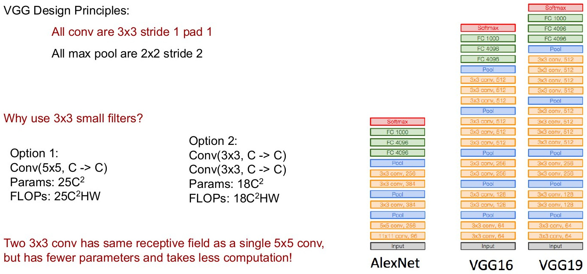

*原图：第 150 页。*

### 6.3 VGG 的代价

课件图中的近似比较：AlexNet 激活 1.9 MB、参数 61M、运算 0.7G；VGG16 为 48.6 MB、138M、13.6G，分别约 25、2.3、19.4 倍。这是图中历史配置和计数口径，不能与上一节 64/192 通道课堂变体逐项拼接计算。

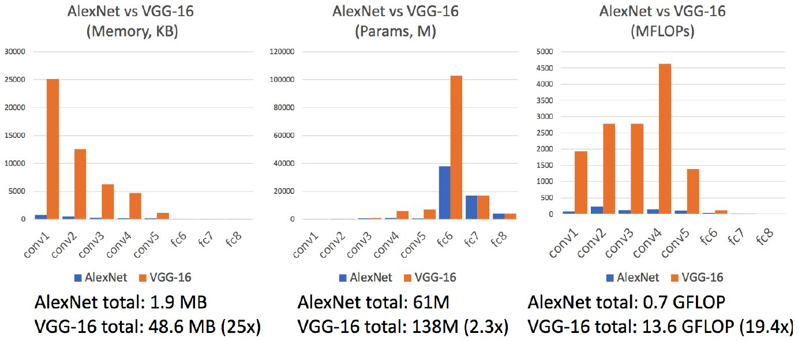

*原图：第 151 页。*

## 7. GoogLeNet / Inception：多尺度与瓶颈

来源：第 88–90、152–163 页。

GoogLeNet 通过前部较快降采样（224→约28），再堆叠 Inception 模块，在控制计算的同时增加深度。课件称约 5M 参数，约为 AlexNet 的 1/12、VGG 的 1/27，是历史近似口径；是否包含辅助分类头等会影响参数统计。

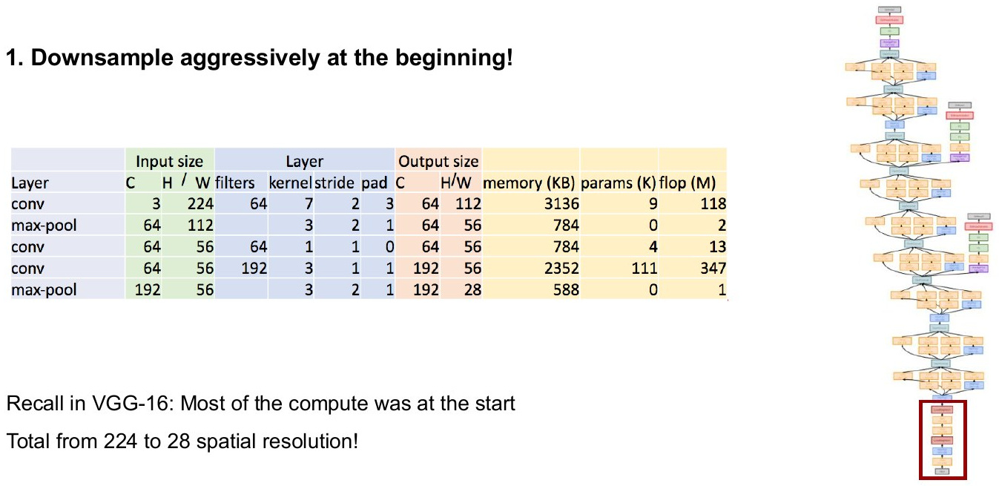

*原图：第 153 页。*

### 7.1 朴素 Inception 例题

同一输入并行经过 1×1、3×3、5×5 卷积和 3×3 池化，再沿通道拼接。空间大小必须对齐，一般通过合适的填充和步幅实现。

输入 28×28×256，三个卷积分支分别输出 128、192、96 通道，池化分支保留 256 通道：

```math
C_{\mathrm{out}}=128+192+96+256=672.
```

忽略池化、偏置与激活，卷积 MAC：

```math
28^2\times256(128+9\times192+25\times96)
=854{,}196{,}224.
```

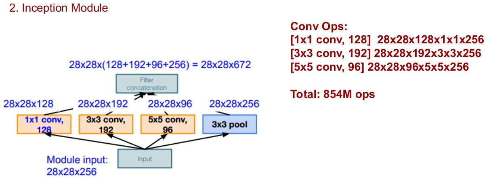

*原图：第 157 页。约 854M MAC，高通道输入上的大核开销较高。*

### 7.2 加入 1×1 降维瓶颈

在 3×3、5×5 前各用 1×1 把 256 通道降为 64；池化后用 1×1 输出 64；直接 1×1 分支仍输出 128。拼接后：

```math
C_{\mathrm{out}}=128+192+96+64=480.
```

六个卷积的主要 MAC：

```math
28^2[
256\times128+
256\times64+
64\times192\times9+
256\times64+
64\times96\times25+
256\times64]
=271{,}351{,}808.
```

约为朴素版本的 31.8%。课件第160页列出的六个乘积相加实际是约271M MAC，原页“358M”总数与这些表达式不一致；已独立复算校正。输出通道也发生了变化，不能把两者当作完全相同输出下的等价运算。

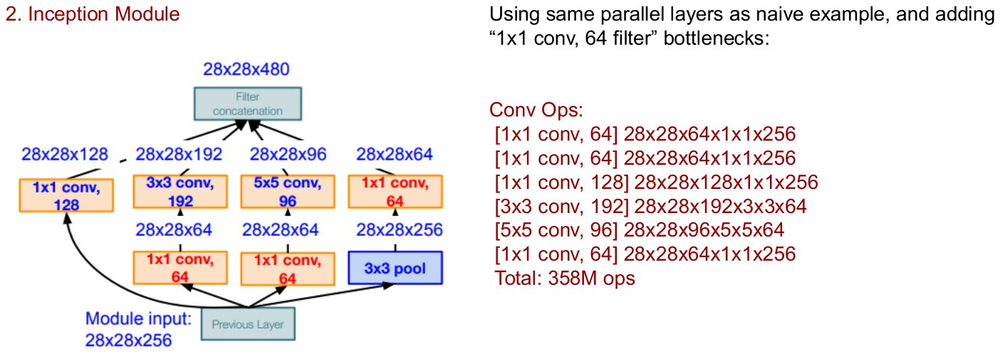

*原图：第 160 页。每条分支的空间尺寸、通道与运算式保留；原图358M总数的校正见上文。*

### 7.3 全局平均池化与辅助分类器

对 7×7×1024 特征逐通道平均，得到 1×1×1024：

```math
z_c=\frac1{HW}\sum_{i=1}^{H}\sum_{j=1}^{W}X_{c,i,j}.
```

GAP 本身无可学习参数；之后 1,024→1,000 分类器含偏置为 1,025,000 参数、主要 MAC 为 1,024,000，避免先展平 7×7 空间再接巨大 FC。

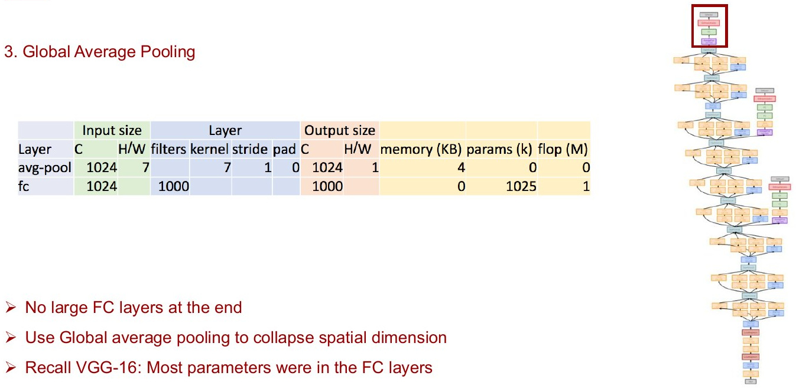

*原图：第 162 页。*

中间层接辅助分类器，训练时给较早层额外监督、帮助梯度传播；它们是训练辅助路径，推断通常使用最终分类头，不应误读为三次独立检测。

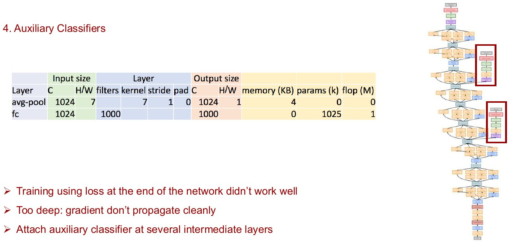

*原图：第 163 页。*

## 8. ResNet 与 SE：优化与通道重标定

### 8.1 更深不一定更容易训练

来源：第 92–98 页。

课件比较 20 层和 56 层普通网络：更深网络不仅测试误差更高，**训练误差也更高**。这说明存在优化退化，不能仅解释成过拟合。理论上，新加的层若实现恒等映射，可保留浅网络功能，但普通参数化和优化过程不一定容易找到该解。

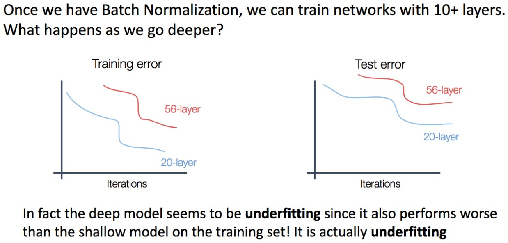

*原图：第 94 页，包含训练和测试两条对照。第93页初始“过拟合猜测”在此被训练误差证据修正。*

残差块把目标映射写成：

```math
H(x)=F(x)+x.
```

学习 F 而不是直接学习整个 H；当 F≈0 时保留输入。梯度也可通过恒等捷径传播。若空间尺寸或通道数不一致，应通过投影/降采样捷径匹配：

```math
y=F(x)+W_sx.
```

残差并不使每个梯度都恒定为 1，也不保证任意深网络训练必然成功；它改善了可优化的参数化与信息路径。

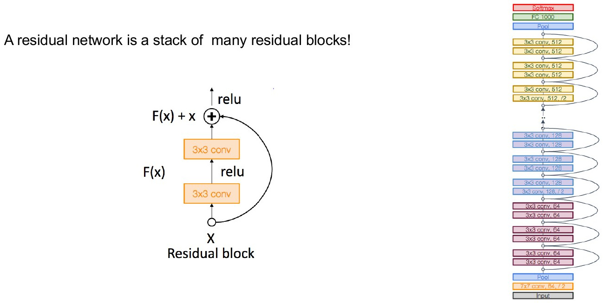

*原图：第 97 页。*

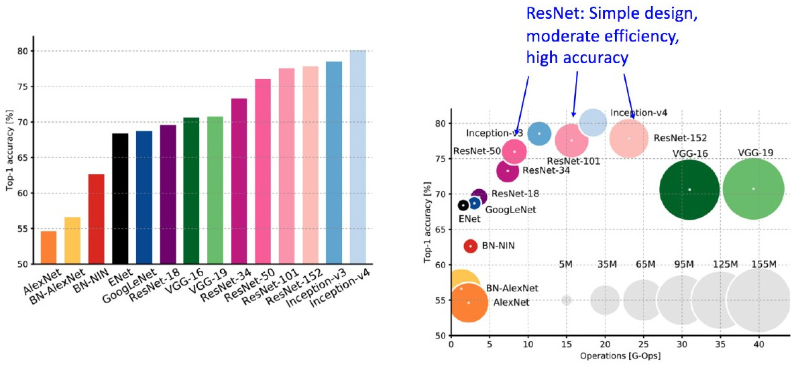

*原图：第 98 页。比较时同时读取准确率、参数、计算等维度；单一“层数”不足以评价代价。*

### 8.2 Squeeze-and-Excitation

来源：第 100–102 页。

SE 通过全局信息给通道分配权重，课件称 feature recalibration（特征重标定）。先全局平均池化，后经降维 FC、ReLU、升维 FC、Sigmoid，再与原通道逐元素相乘：

```math
z_c=\frac1{HW}\sum_{i,j}X_{c,i,j},\qquad
s=\sigma(W_2\,\mathrm{ReLU}(W_1z)),\qquad
\widetilde X_{c,i,j}=s_cX_{c,i,j}.
```

W₁ 常把 C 降至 C/r，W₂ 再升回 C，r 为压缩比例。它建模通道间依赖，补充普通局部卷积的全局统计。课件提及 SE-ResNeXt-152 与 ILSVRC 2017 历史成绩。

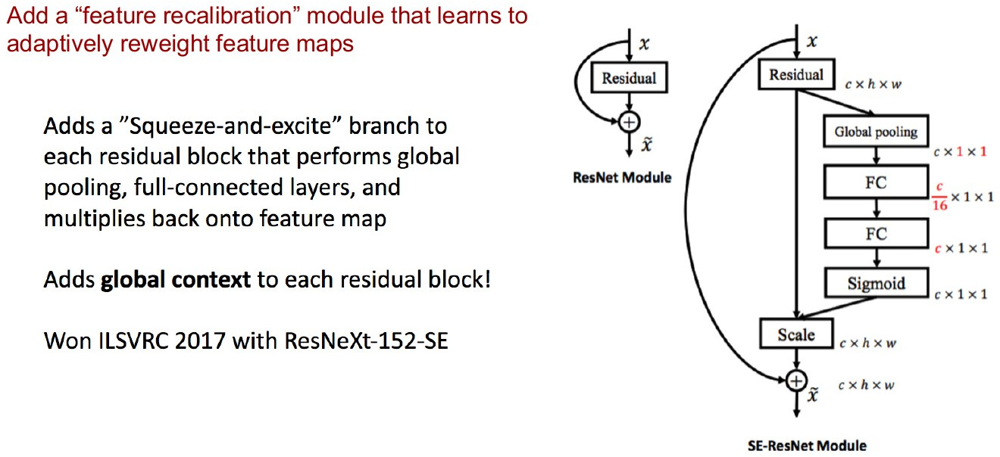

*原图：第 100 页。*

## 9. 高效网络与深度可分离卷积

来源：第 103–111 页。

### 9.1 为什么做小模型

嵌入式设备对存储、内存、计算、带宽和功耗有限制；较小模型便于传输及 OTA 更新。在分布式训练中，参数或通信减少有时也能提高效率，但实际收益取决于系统瓶颈。不能把“小参数”自动等同于“低延迟”。

课件给出的思路：移除大型 FC；使用更小卷积核、较少通道；设计高效卷积模块；用知识蒸馏、量化等压缩。方法分类：

| 层面 | 课件列出的方法 |
| --- | --- |
| 架构设计 | 深度卷积、分组卷积、Ghost 模块、高效架构 |
| 模型压缩 | 剪枝、量化、蒸馏、低秩分解 |
| 动态推断 | 提前退出、token 剪枝、混合专家 MoE、动态路由 |

这些方法改变的对象不同：剪枝减少连接或通道，量化减少数值位宽，蒸馏让学生学习教师，低秩分解以因子近似权重，动态推断按样本分配计算。这里只补充类别含义，课件未展示的具体算法不冒充已讲推导。

### 9.2 标准卷积与 depthwise + pointwise

设输入 M 通道，输出 N 通道，核边长 Dₖ，输出空间边长 D𝒻，忽略偏置：

```math
\mathrm{Cost}_{\mathrm{standard}}=D_k^2MND_f^2.
```

深度卷积分别处理每个输入通道，每个核只有一个通道深度；随后 1×1 pointwise 卷积融合 M 个通道并输出 N 个通道：

```math
\mathrm{Cost}_{\mathrm{separable}}
=D_k^2MD_f^2+MND_f^2.
```

```math
\frac{\mathrm{Cost}_{\mathrm{separable}}}{\mathrm{Cost}_{\mathrm{standard}}}
=\frac1N+\frac1{D_k^2}.
```

3×3 核且 N 较大时，约少 8–9 倍乘加；代价减少伴随结构表达约束，硬件上也可能受内存访问和算子调度限制。

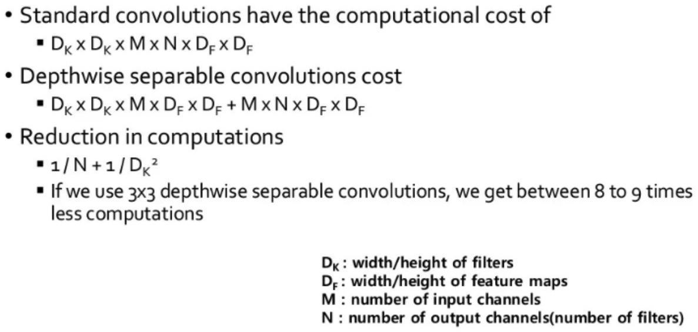

*原图：第 109 页。*

### 9.3 代表架构与优化目标

| 架构 | 课件年份/出处 | 核心思想 |
| --- | --- | --- |
| MobileNet | 2017 | depthwise + pointwise |
| MobileNetV2 | Sandler 等，2018 | 轻量骨干；名称与出处保留，主讲详细推导是可分离卷积 |
| ShuffleNet | Zhang 等，CVPR 2018 | 分组卷积减少连接，channel shuffle 交换组间信息 |
| SqueezeNet | 2016 | Fire 模块，1×1 squeeze 后用1×1/3×3 expand；重点压缩参数 |
| EfficientNet | 2019 | 协调缩放网络深度、宽度、输入分辨率 |
| GhostNet | 2020 | 从部分主要特征用较便宜操作生成额外特征 |

SqueezeNet 的目标主要是模型体积；小体积不必对应最少 FLOPs 或最快推断。架构比较应注明输入尺寸和硬件。

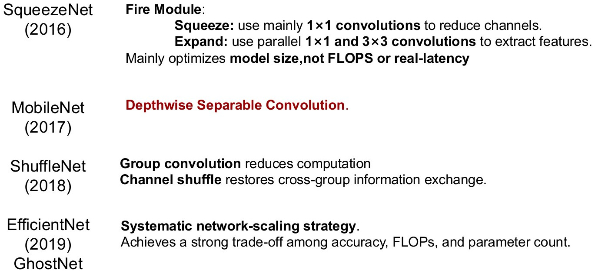

*原图：第 111 页。保留模型名、优化目标及Fire模块的文字说明。*

## 10. RepLKNet：重新讨论大卷积核

来源：第 112–124 页。课件引用 RepLKNet（CVPR 2022），并提及 PeLK（CVPR 2024）。

小核堆叠曾是主流，但大核结合 depthwise、残差、重参数化和高效实现，也能形成有效视觉骨干。课件的五项原则及实验条件整理如下；这是论文条件下的经验结论，不是“大核总是更好”的定理。

### 10.1 原则一：大深度卷积可以高效实现

参数与理论运算随核面积增加，但延迟还受访存、算术强度和实现影响。Roofline 的必要解释：

```math
\mathrm{Attainable\ FLOP/s}\leq\min(TP,B I),\qquad I_M=\frac{TP}{B}.
```

TP 是峰值运算吞吐，B 是内存带宽，I 是 FLOP/Byte。较低 I 受带宽限制，较高 I 可能受计算峰值限制。优化 CUDA 实现可能显著降低大核延迟，理论 FLOPs 相同也可能运行不同快。

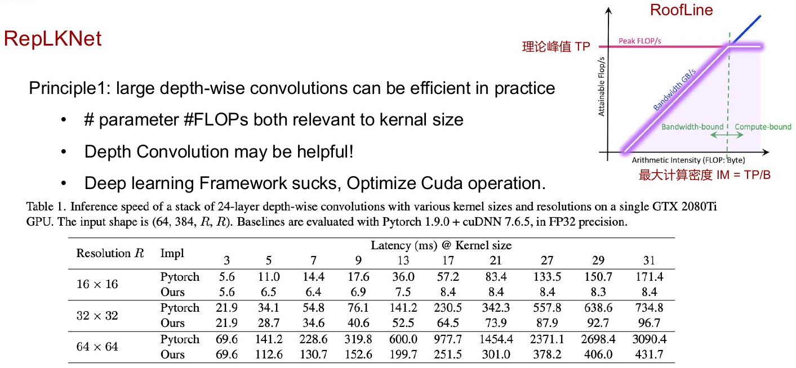

*原图：第 112 页。完整表保留 R=16/32/64、核3/5/7/9/13/17/21/27/29/31、两种实现的全部数据。条件为24层DW堆叠，输入(64,384,R,R)，单GTX 2080 Ti、FP32，基线PyTorch1.9/cuDNN7.6.5。例如 R=16、31核时171.4 ms降至8.4 ms；不可外推为所有设备的固定加速比。*

### 10.2 原则二：大核尤其需要恒等捷径

课件 MobileNetV2 实验：

| 核 | 有捷径的 Top-1 | 无捷径的 Top-1 |
| --- | --- | --- |
| 3×3 | 71.76% | 68.67% |
| 13×13 | 72.53% | 53.98% |

去掉捷径对大核伤害尤其明显，提示优化难度不能仅靠增加感受野解决。

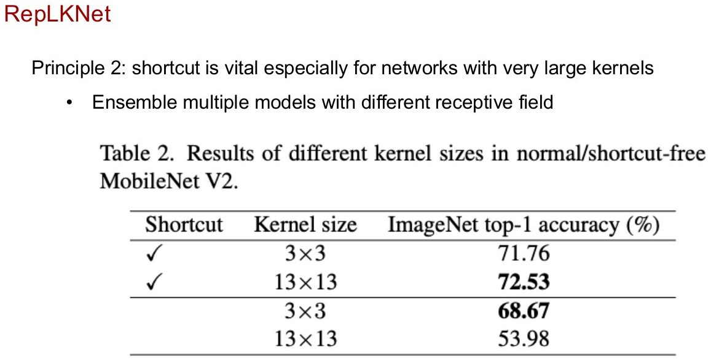

*原图：第 113 页。*

### 10.3 原则三：小核分支重参数化帮助优化

训练时，大核和小核分支各带 BN，再相加；推断时融合 BN，将小核零填充到大核尺寸后相加成单核，减少多分支开销。与 RepVGG（2021）的结构重参数化思路相近。

| 核 | 训练时加入3×3重参数化分支 | ImageNet Top-1 | Cityscapes验证 mIoU |
| --- | --- | --- | --- |
| 3×3 | 不适用 | 71.76% | 72.31% |
| 9×9 | 否 | 72.67% | 76.11% |
| 9×9 | 是 | 73.09% | 76.30% |
| 13×13 | 否 | 72.53% | 75.67% |
| 13×13 | 是 | 73.24% | 76.60% |

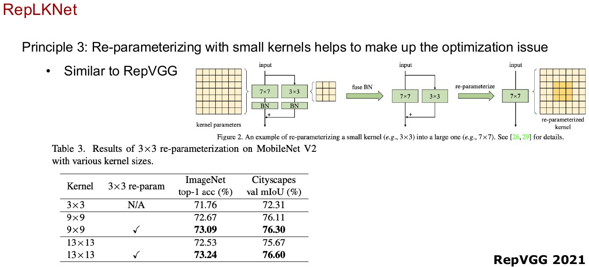

*原图：第 114 页。融合需要分支空间对齐，并按推断统计融合 BN，不能直接把训练态的 BN 当作固定线性层。*

### 10.4 原则四：下游收益可能大于分类收益

第 115 与 121 页重复表合并：

| 四阶段核大小 | ImageNet Top-1 | 分类参数/M | 分类FLOPs/G（原表口径） | ADE20K mIoU | 分割参数/M | 分割FLOPs/G |
| --- | --- | --- | --- | --- | --- | --- |
| 3,3,3,3 | 82.11% | 71.8 | 12.9 | 46.05% | 104.1 | 1119 |
| 7,7,7,7 | 82.73% | 72.2 | 13.1 | 48.05% | 104.6 | 1123 |
| 13,13,13,13 | 83.02% | 73.7 | 13.4 | 48.35% | 106.0 | 1130 |
| 25,25,25,13 | 83.00% | 78.2 | 14.8 | 48.68% | 110.5 | 1159 |
| 31,29,27,13 | 83.07% | 79.3 | 15.3 | 49.17% | 111.7 | 1170 |

这里分类 Top-1 从 83.02 到83.07 增幅小，分割 mIoU 从48.35到49.17更明显，说明只按分类得分筛选骨干可能漏掉密集预测优势。分割 FLOPs 对更大的输入计数，不能与224²分类直接比较。

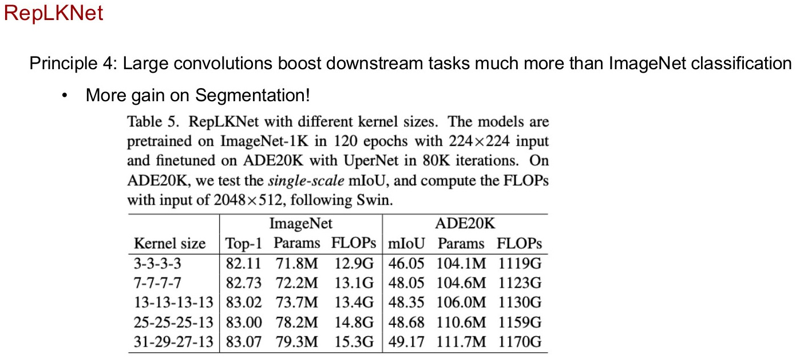

*原图：第 121 页。保留完整表注：分类120 epoch；ADE20K使用UperNet、80K训练、单尺度评测，分割运算以2048×512输入计。*

### 10.5 原则五：核比特征图大也可能有用

在 7×7 小特征图上，使用适当填充的大核仍可学习更广区域的加权关系：

| MobileNetV2所用核 | ImageNet Top-1 | Cityscapes mIoU |
| --- | --- | --- |
| 3×3 | 71.76% | 72.31% |
| 7×7 | 72.00% | 74.30% |
| 13×13 | 71.97% | 74.62% |

许多权重在某些位置乘到填充零，边界影响随位置变化；因此不能把“大于特征图的卷积”直接视为与 GAP 相同的运算。

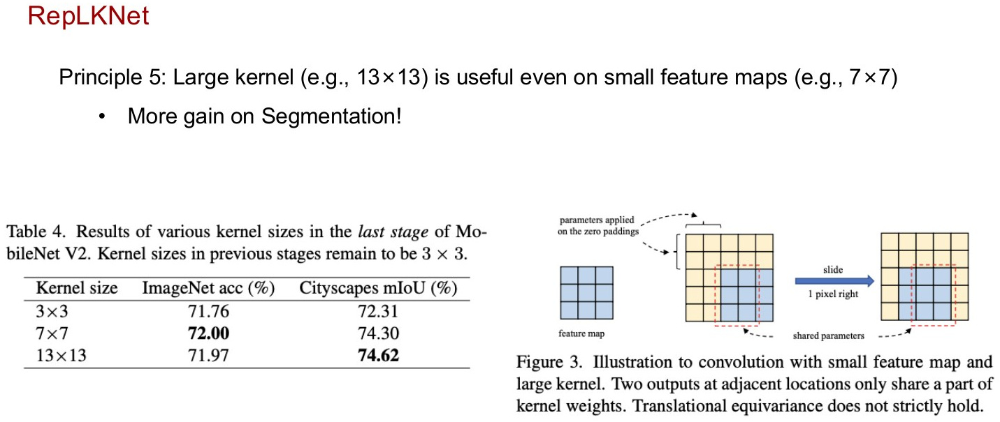

*原图：第 122 页。*

### 10.6 完整结构与下游实验

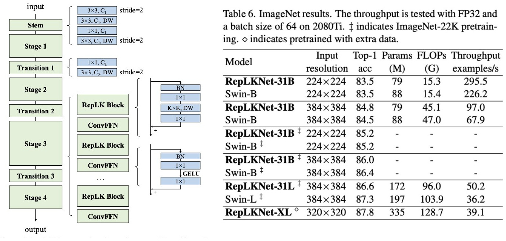

*原图：第 123 页。保留层级结构、通道/核设置、全部ImageNet精度与吞吐数据及预训练符号；吞吐按图中FP32、batch64、2080 Ti条件解释。*

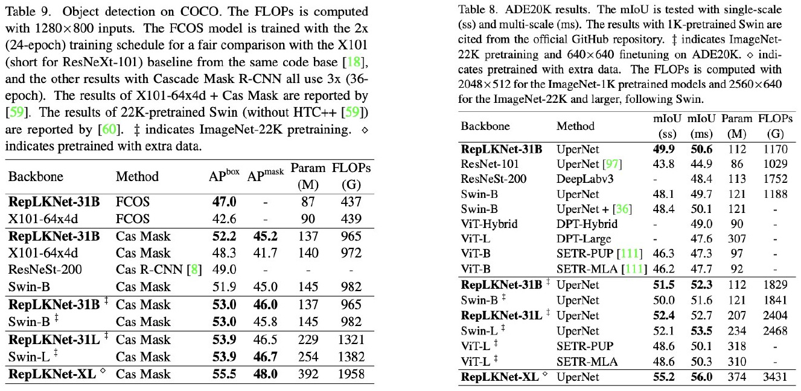

*原图：第 124 页。左表保留框AP、掩码AP、参数和运算；右表保留单/多尺度mIoU、预训练及全部对照模型。COCO运算以1280×800输入计，FCOS为2×即24 epoch，Cascade Mask R-CNN为3×即36 epoch；ADE运算随预训练配置使用2048×512或2560×640。*

代表结果：RepLKNet-31B + FCOS 框 AP 47.0（87M参数、437G）；+ Cascade Mask R-CNN 框/掩码 AP 52.2/45.2（137M、965G）；额外预训练的 XL 为55.5/48.0。ADE20K 的31B+UperNet单/多尺度mIoU49.9/50.6，XL为55.2/56.0。完整对照以原图为准。AP、mIoU、FLOPs的定义及训练设置不同，不能跨任务比较大小。

课件最后列出扩展 **PeLK: Parameter-efficient Large Kernel ConvNets with Peripheral Convolution（CVPR 2024）**，保留研究方向与题名，未展示其内部推导，不补造机制。五原则出处可查 [RepLKNet 原论文](https://arxiv.org/abs/2203.06717)。

## 11. OverLoCK：先总览再细看、动态上下文

来源：第 125–132 页。

### 11.1 从自下而上到上下文引导

课件列出的代表骨干：CNN 的 ResNet、ConvNeXt、RepLKNet；Transformer 的 PVT、Swin；Mamba 的 ViM、VMamba。常见层级主干逐级从局部构建高层语义，而“先总体理解，再回看局部”的机制能用全局上下文帮助消除歧义。鸭/兔图说明，同一局部形状的解释可能依赖全图和先验，并不是算法性能的量化证明。

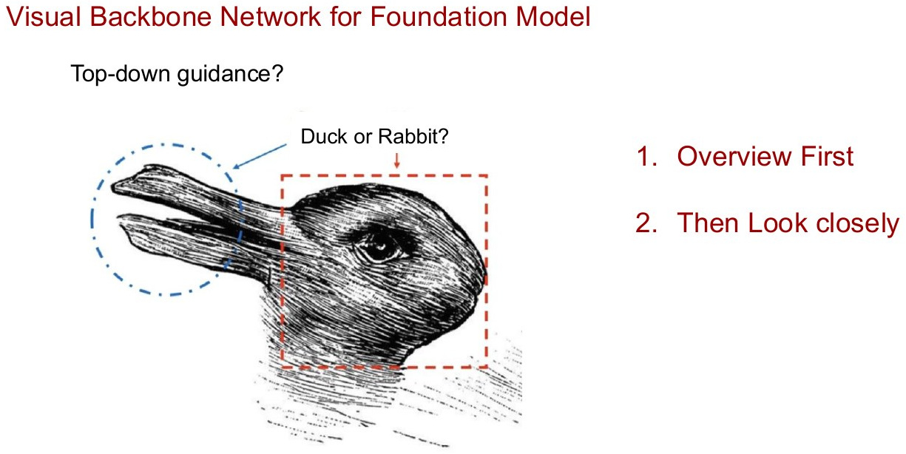

*原图：第 127 页。*

OverLoCK（CVPR2025）的三部分：

1. **Base-Net**：提取底层和中层特征，逐步降到H/4、H/8、H/16。
2. **Overview-Net**：进一步获得H/32的粗粒度语义，产生 context prior（上下文先验）。
3. **Focus-Net**：结合Base-Net特征与先验，在H/16及H/32阶段做更精细的动态聚合。

DDS（Deep-stage Decomposition Strategy）把较深阶段拆分为总览与细看；先验在特征层面和核权重层面提供指导，并随动态块继续更新。下图保存了层数N₁…N₆、通道C₁…C₄和两条流，不能只看成普通单向串联。

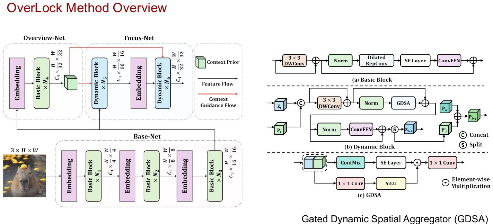

*原图：第 129 页。黑箭头为特征流，红箭头为上下文指导。*

Basic Block：残差3×3 DWConv → Norm → Dilated RepConv → SE → ConvFFN，并含残差路径。Dynamic Block：拼接当前特征Zᵢ与先验Pᵢ，经局部DWConv、Norm、GDSA及ConvFFN，分出新特征与先验；图中C表示concat，S表示split，⊙表示逐元素乘。

GDSA（Gated Dynamic Spatial Aggregator）将 ContMix 的动态空间聚合与 SE、门控支路结合；门控支路是1×1 Conv+SiLU，聚合结果与门控逐元素乘后经1×1投影，用于控制上下文信息。

### 11.2 ContMix 的维度与数据流

输入 X 为 C×H×W。自适应平均池化汇总为 S×S 个区域中心，再用 1×1 投影获得 K；原图中的 K 矩阵与卷积核边长都用同一字母，正文用 k 表示边长避免混淆。

```math
Q\in\mathbb R^{C\times HW},\quad
K\in\mathbb R^{C\times S^2},\quad
A=Q^\top K\in\mathbb R^{HW\times S^2}.
```

实际按 G 组划分通道，每组计算其亲和矩阵。token 与区域中心的关系，经可学习矩阵 $`W_d\in\mathbb R^{S^2\times k^2}`$ 聚合并用 Softmax 归一化：

```math
D^g=\mathrm{softmax}(A^gW_d)\in\mathbb R^{HW\times k^2}.
```

每行重排为该空间位置的 k×k 核，同组通道共享动态核。图中还与k×k RepConv的静态局部分支求和。这样核权重依赖全局上下文，卷积的实际应用仍在局部邻域；“权重依赖远处”与“直接在远处取值”应区别理解。

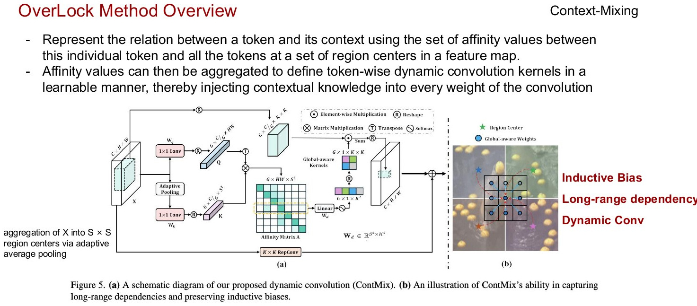

*原图：第 130 页。保留全部reshape、transpose、matrix multiplication、Softmax、求和及局部/远程关系示意。*

这些维度是对课件原图的数学展开，命名和实现细节用 [OverLoCK 原论文](https://arxiv.org/html/2502.20087v1) 核对。

### 11.3 性能、消融与鲁棒性

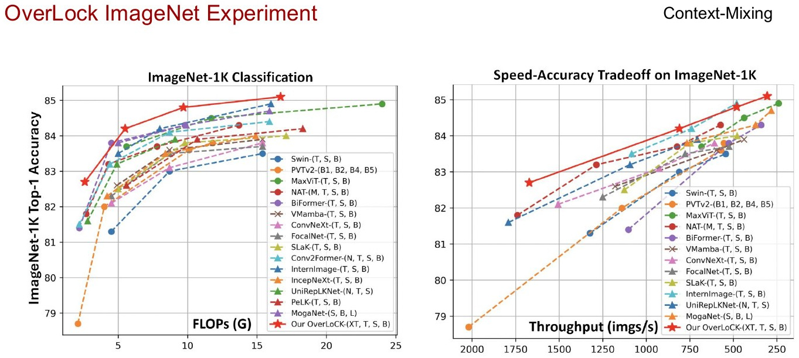

*原图：第 131 页。坐标分别讨论精度与FLOPs、吞吐等；是课件展示的论文条件比较，不当作当前所有模型排行榜。*

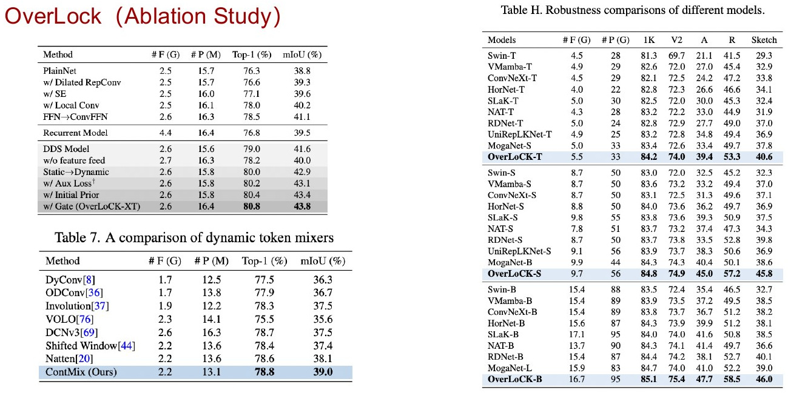

*原图：第 132 页。完整保留每行数字及条件符号。右表“#P(G)”标题应按所列数值和原论文解释为参数百万M，不能把33当作33G参数。*

左上表依次比较：PlainNet、Dilated RepConv、SE、Local Conv、FFN→ConvFFN、Recurrent Model、DDS、去掉特征反馈、静态→动态、辅助损失、初始先验、门控。PlainNet 为76.3% Top-1/38.8% mIoU；完整OverLoCK-XT为80.8%/43.8%，2.6G运算、16.4M参数。各行不必都是同一个因素的单独因果实验，应根据分组和训练设置读取。

左下动态混合器表比较 DyConv、ODConv、Involution、VOLO、DCNv3、Shifted Window、NatNet 与 ContMix；该表 ContMix 为2.2G、13.1M、78.8% Top-1、39.0% mIoU。

右表保留不同容量模型在ImageNet-1K、V2、A、R、Sketch上的准确率。OverLoCK-T依次84.2/74.0/39.4/53.3/40.6（5.5G、33M）；S为84.8/74.9/45.0/57.2/45.8（9.7G、56M）；B为85.1/75.4/47.7/58.5/46.0（16.7G、95M）。这些是分布变化数据集的准确率，不能叫作同一个“Top-1提升百分比”后相加。

## 12. 数据增强：操作、混合与选择

来源：第 135–142 页。

### 12.1 单图增强与训练/测试处理

保持任务语义的变换产生新的训练输入，例如猫图经水平翻转、缩放、裁剪、颜色/对比度/亮度扰动仍标为猫。变换是否保标签依赖任务：镜像可能改变文字或左右方向；检测和分割须同步变换框与掩码。

课件训练例：随机选L∈[256,480]，把短边缩放至L，再随机裁224×224。

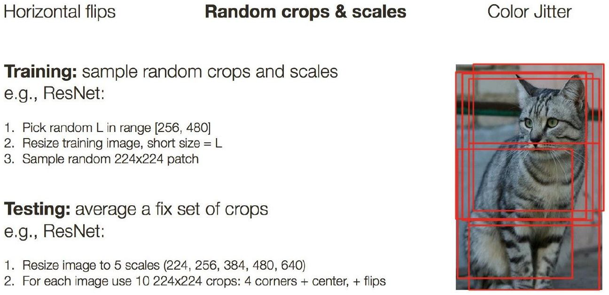

*原图：第 137 页。*

测试例：短边缩放至224、256、384、480、640五个尺度；每尺度取四角+中心五个裁剪及其翻转，共10个视图，再平均预测，共50个视图。这样会增加推断计算，不能与单裁剪结果无条件比较。

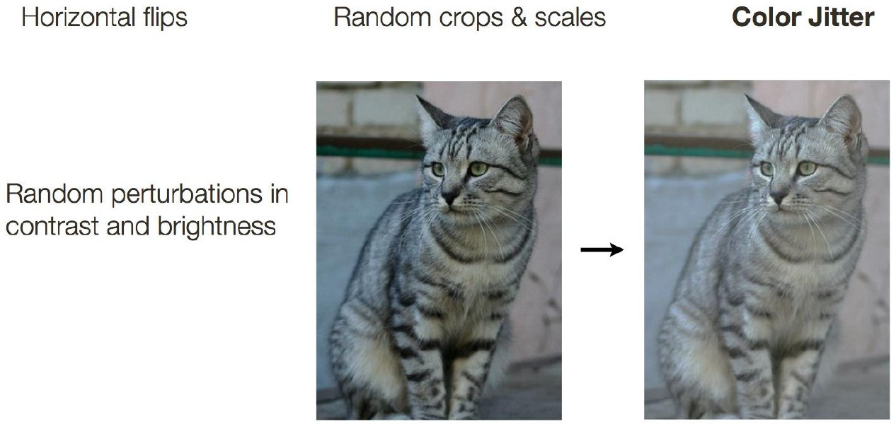

*原图：第 138 页。颜色扰动例图；多尺度与10裁剪测试条件见前一张第137页原图。*

### 12.2 Mixup

把两张图及其标签用相同系数混合：

```math
\widetilde x=\lambda x_i+(1-\lambda)x_j,\qquad
\widetilde y=\lambda y_i+(1-\lambda)y_j,\qquad 0\leq\lambda\leq1.
```

例：λ=0.4混合猫与狗，则软标签为“猫0.4、狗0.6”，不是任选一个硬标签。可在样本间约束模型的插值行为。课件提及在小数据中收益明显；是否有效取决于数据、模型和训练配方，不能理解为大数据时一定无效。

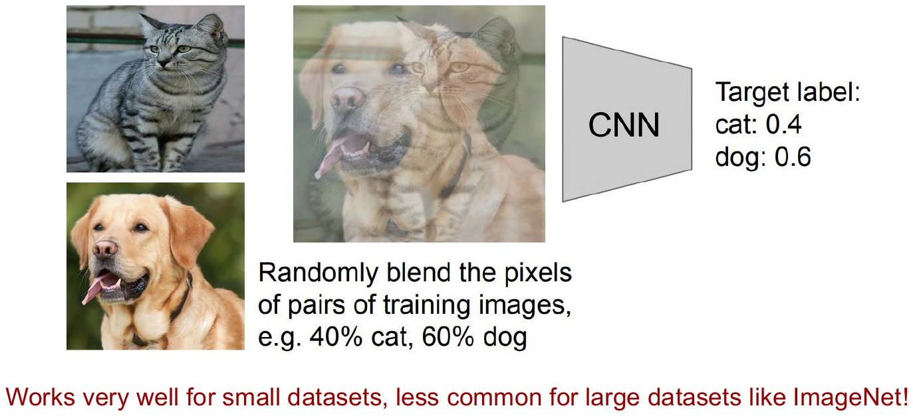

*原图：第 139 页。*

### 12.3 课件列出的各架构增强配方

第140页完整条目：

| 模型 | 课件所列增强 |
| --- | --- |
| AlexNet | 平移、翻转、强度改变 |
| ResNet | 裁剪、翻转 |
| DenseNet | 翻转、裁剪、平移 |
| MobileNet | 裁剪、弹性形变 |
| NASNet | Cutout、裁剪、翻转 |
| ResNeSt | AutoAugment、Mixup、裁剪 |
| DeiT | AutoAugment、RandAugment、Random Erasing、Mixup、CutMix |
| Swin Transformer | RandAugment、Mixup、CutMix、Random Erasing |
| Faster R-CNN | 翻转 |
| YOLO | 缩放、平移、颜色空间扰动 |
| SSD | 裁剪、resize、翻转、颜色空间、形变 |
| YOLOv4 | Mosaic、形变、缩放、颜色空间、裁剪、翻转、旋转、随机擦除、Cutout、Hide-and-Seek、GridMask、Mixup、CutMix、StyleGAN |

这张表是课件汇总，并非每种模型必须同时启用所有方法，或未经消融即可复用的默认配置。

### 12.4 高级增强分类

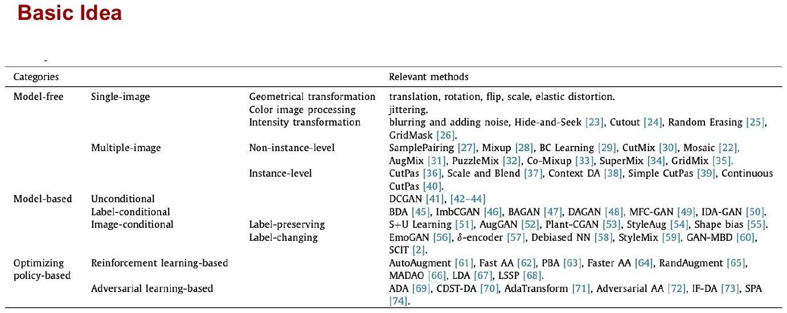

*原图：第 141 页。完整保留英文方法名与分类关系，正文给出中文含义。*

| 类别 | 子类 | 原图完整方法名 |
| --- | --- | --- |
| 无模型、单图 | 几何 | translation、rotation、flip、scale、elastic distortion |
| 无模型、单图 | 颜色 | jittering |
| 无模型、单图 | 强度、遮挡、噪声 | blurring、adding noise、Hide-and-Seek、Cutout、Random Erasing、GridMask |
| 无模型、多图 | 非实例级混合 | SamplePairing、Mixup、BC Learning、CutMix、Mosaic、AugMix、PuzzleMix、Co-Mixup、SuperMix、GridMix |
| 无模型、多图 | 实例级 | CutPas、Scale and Blend、Context DA、Simple CutPas、Continuous CutPas |
| 模型生成 | 无条件 | DCGAN及原图相应引用 |
| 模型生成 | 标签条件 | BDA、ImbCGAN、BAGAN、DAGAN、MFC-GAN、IDA-GAN |
| 模型生成 | 图像条件且保标签 | S+U Learning、AugGAN、Plant-CGAN、StyleAug、Shape bias |
| 模型生成 | 图像条件且改标签 | EmoGAN、δ-encoder、Debiased NN、StyleMix、GAN-MBD、SCIT |
| 策略优化 | 原图归为强化学习类 | AutoAugment、Fast AA、PBA、Faster AA、RandAugment、MADAO、LDA、LSSP |
| 策略优化 | 对抗学习类 | ADA、CDST-DA、AdaTransform、Adversarial AA、IF-DA、SPA |

表内类别按课件综述保持；并非该行每个算法都以完全相同的强化学习机制实现。CutPas 等拼写按原图索引保留，具体实现须查相应原文。

### 12.5 面向问题选择增强

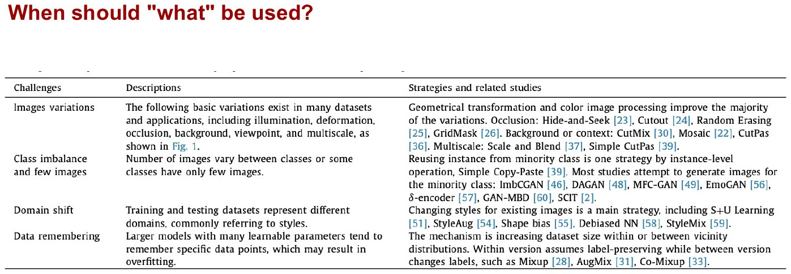

*原图：第 142 页。全部挑战、描述、策略与方法索引保留。*

- **图像变化**：光照、形变、遮挡、背景、视角、多尺度。几何和颜色增强处理常见变化；遮挡可用Hide-and-Seek、Cutout、Random Erasing、GridMask；背景/上下文可用CutMix、Mosaic、CutPas；尺度可用Scale and Blend、Simple CutPas。
- **类别不均衡及少样本**：重用少数类实例，如Simple Copy-Paste；或生成少数类图像，课件列ImbCGAN、DAGAN、MFC-GAN、EmoGAN、δ-encoder、GAN-MBD、SCIT。
- **域偏移**：训练与测试域、风格不同；改变现有图像风格，列S+U Learning、StyleAug、Shape bias、Debiased NN、StyleMix。
- **数据记忆/过拟合**：大模型容易记住样本；增加分布内或邻近分布样本。分布内变换常保持标签，跨样本混合须相应改变软标签；列Mixup、AugMix、Co-Mixup。

增强强度与标签规则应由任务和验证集决定，不能只因为方法名较新就堆叠使用。

## 13. 神经架构搜索与全章设计取舍

来源：第 165–167 页。

NAS 的课件流程：控制器生成网络结构，训练采样到的子网络，用验证性能形成奖励，再用策略梯度更新控制器。子网络训练嵌在搜索循环中，计算成本可非常高；课件记录早期实验使用800个GPU、28天，是历史系统规模，而不是每种NAS的必要成本。


```mermaid
flowchart LR
 A["控制器"] --> B["采样网络结构"]
 B --> C["训练子网络"]
 C --> D["验证性能作为奖励"]
 D --> E["策略梯度更新"]
 E --> A
```

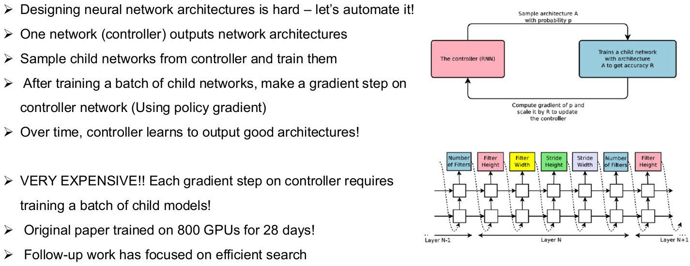

*原图：第 165 页。*

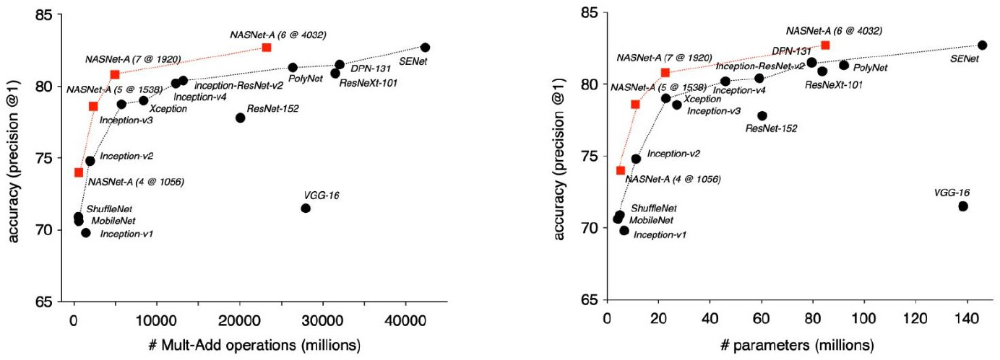

*原图：第 166 页。完整性能曲线与方法名保留。*

设计维度包括网络深度、宽度、分辨率、核大小、分支、残差、通道门控、全局上下文与训练增强。更深或更大可能增加表达能力，也会改变优化、过拟合、显存、延迟和硬件利用率；架构收益需要在明确数据与评测条件下比较。GPU内存只是限制之一。

## 14. 核对与延伸阅读

本章合并了重复ImageNet历史图、VGG感受野动画、GoogLeNet附录重复和大核实验重复。校正：全连接精确权重数、卷积取整、MAC/FLOPs、FC6算术、conv4运算、VGG全连接偏置、Inception瓶颈运算合计、VGG16/19第三阶段、理论/有效感受野、OverLoCK参数单位。完整逐页处理见 [覆盖表](../COVERAGE.md)，原图来源与尺寸见 [图片清单](../assets/manifest.json)。

课件相关论文索引：[VGG](https://arxiv.org/abs/1409.1556)、[RepLKNet](https://arxiv.org/abs/2203.06717)、[OverLoCK](https://arxiv.org/abs/2502.20087)。本章优先还原课件，必要数学解释和错误修正在对应位置注明。

返回 [总目录](../README.md) · 前一章：[深度学习导论](02-深度学习导论.md) · 下一章：[目标检测与分割](04-计算机视觉导论-检测与分割.md)。
