# 第四章：计算机视觉导论——目标检测与分割

来源：刘洋（Yang Liu），`4_Introduction_ComputerVision_part2-26.pdf`，共 103 页，封面未注明日期。页码均为 **PDF 页序号**。整理日期：2026-10-08。

本章整理目标检测、R-CNN 家族、分类与框回归损失、语义分割及 U-Net，并将附录 YOLO 的重复时间线和 Focal Loss 合入正文。架构、例题、性能表与公式图按知识点保留，宣传画面与分隔页删除。历史成绩以课件所用数据、硬件和协议解释。

## 1. 四类视觉任务与检测数据

### 1.1 输出形式的区别

来源：第 2–3、62–63 页。

| 任务 | 输出 | 是否定位 | 是否区分同类实例 |
| --- | --- | --- | --- |
| 图像分类 | 整图类别或类别得分 | 通常不输出位置 | 通常不区分 |
| 目标检测 | 每个目标的类别、框和置信度 | 矩形框 | 区分目标 |
| 语义分割 | 每个像素的类别 | 像素区域 | 不区分同类个体 |
| 实例分割 | 每个实例的类别和像素掩码 | 像素区域 | 区分个体 |

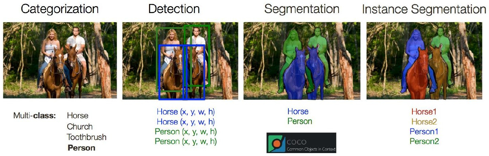

*原图：第 2 页。同一场景以不同输出方式表达。*

检测不仅要判定“有牛、有马”，还要为它们分别输出位置。边界框可以表示为中心(x,y)、宽w、高h，或左上/右下角坐标；训练和解码必须使用一致约定。图像可能没有目标，也可能有多个类别、多个同类目标，因而输出数量可变。

### 1.2 PASCAL VOC

来源：第 4–5、7 页。

VOC 检测有20个前景类别：

| 分组 | 全部类别 |
| --- | --- |
| 人 | person（人） |
| 动物 | bird（鸟）、cat（猫）、cow（牛）、dog（狗）、horse（马）、sheep（羊） |
| 交通工具 | aeroplane（飞机）、bicycle（自行车）、boat（船）、bus（公交车）、car（汽车）、motorbike（摩托车）、train（火车） |
| 室内物品 | bottle（瓶）、chair（椅）、diningtable（餐桌）、pottedplant（盆栽）、sofa（沙发）、tvmonitor（电视/显示器） |

课件标题写20类，但列表漏了bird和sofa；按 [VOC 官方类别表](https://www.robots.ox.ac.uk/~vgg/projects/pascal/VOC/voc2012/) 补全。

课件数值：训练部分10,103图像、23,374目标；测试9,637图像、22,992目标。这是历史版本统计，不能当作当前所有VOC集合共同大小。官方历史记录将10,103/23,374对应到**VOC2010 train/val**，课件“Training”的简写不应误认为只有train子集。

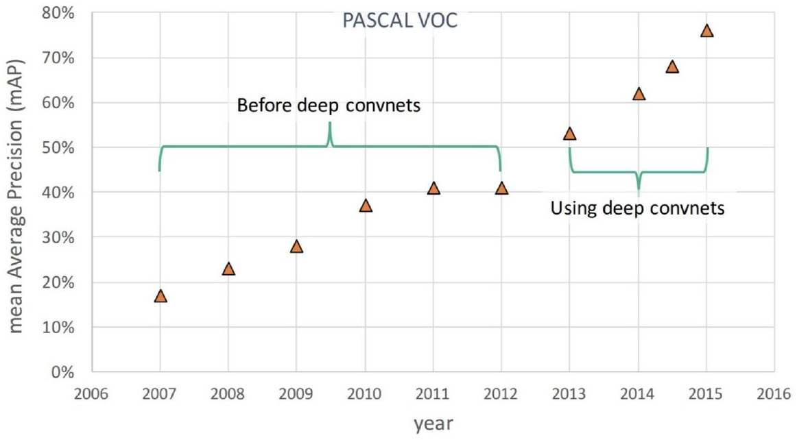

*原图：第 7 页。保留传统方法到深度方法的年份、方法名和成绩曲线；是历史评测，不是当前排行榜。*

### 1.3 COCO

来源：第 6 页。

COCO 强调上下文中的物体，支持检测、实例分割、stuff分割、图像描述和人体关键点等任务。课件列出的历史概况：

- 330K图像，其中超过200K有标注；约1.5M物体实例。
- 80个物体类别、91个stuff类别。
- 每图5条描述。
- 约250,000名人物的关键点标注。
- 包含物体分割、上下文识别、superpixel/stuff相关分割任务。

物体类别数、背景/不可数区域stuff类别数是不同口径，不能相加后称作标准检测类别数；数据规模也随版本和任务拆分而异。

### 1.4 IoU、AP、mAP 与速度

交并比：

```math
\mathrm{IoU}(B,B^{gt})=\frac{|B\cap B^{gt}|}{|B\cup B^{gt}|}.
```

课件 YOLO/VOC 比较采用“类别正确且IoU>0.5”为正确检测的说明。必要评测解释：按置信度排序并与真实目标匹配，重复检测同一目标会成为误检；某类AP汇总精确率—召回率曲线，mAP对类别平均。VOC各年AP采样/积分规则可能不同；COCO常报告多个IoU阈值平均AP，不能与VOC AP50无条件对比。FPS是每秒处理图像/帧数，延迟则通常以ms/图计；批量、预处理和硬件需同时明确。

## 2. 从固定框回归到候选区域

来源：第 8–20 页。

### 2.1 为什么一个固定输出不够

分类骨干接线性回归头，可为“一只猫”输出类别与四个框参数；但固定一个框不能应对多只鸭、成群目标或无目标。直接把输出维度写死为“一类+一个框”，缺少数量建模与重复去除机制。

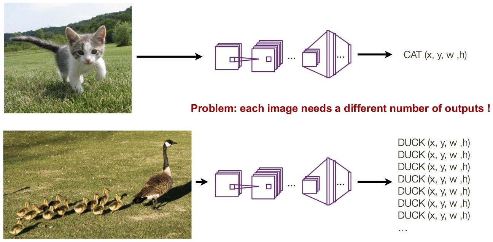

*原图：第 11 页。鸭群展示可变目标数带来的问题。*

### 2.2 滑动窗口检测

对不同位置和尺度裁剪图块，再用CNN分类，类别中加入背景。例如狗所在窗口判为狗，其余窗口可判背景。这样能复用现有分类器，但相邻裁剪高度重叠，若每个图块独立跑完整CNN，重复计算极大。

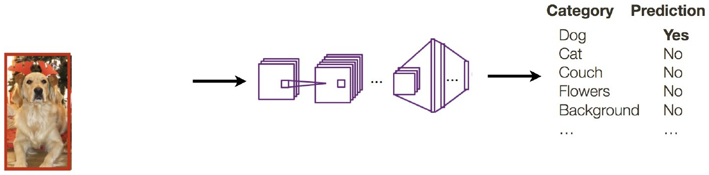

*原图：第 16 页。第12–18页逐步增加窗口的动画合并到此。*

### 2.3 Region Proposal 与 Selective Search

候选区域先找“像物体”的位置，不必先确定类别。可利用颜色一致性、纹理、闭合轮廓、区域大小、长宽比等启发式信息。课件称可在CPU数秒产生约1,000个候选；R-CNN流程通常使用约2,000个，是不同设置下的数量，不构成固定常数。

Selective Search的课件伪代码：

1. 先分割成初始小区域。
2. 对相邻区域计算相似性，把区域对加入集合S。
3. 找到S中相似性最高的区域对rᵢ、rⱼ，合并成新区域rₜ。
4. 移除涉及旧区域的相似性项。
5. 计算rₜ与相邻区域的新相似性，加入S。
6. 把新区域加入区域集合R；反复执行，保存各层级区域的外接框为候选。

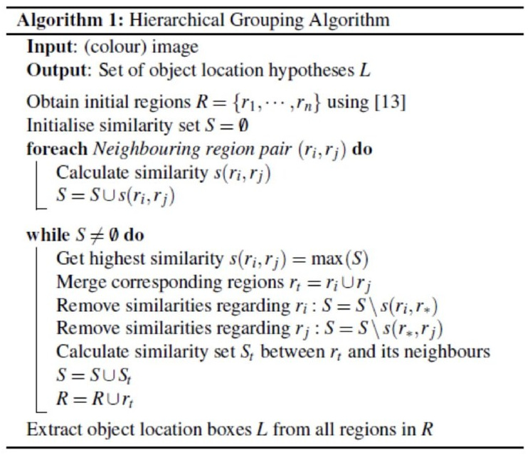

*原图：第 20 页。保留完整区域合并伪代码，最后从全部层级区域提取外接框。它是启发式区域生成，不是CNN预测。*

## 3. R-CNN：每个区域分别提特征

来源：第 21–28 页。

### 3.1 四步流程

输入整图 → Selective Search提候选 → 每个候选warp/resize成CNN需要的固定尺寸 → 各自经过CNN → 按类别使用SVM打分，并用框回归修正候选框。

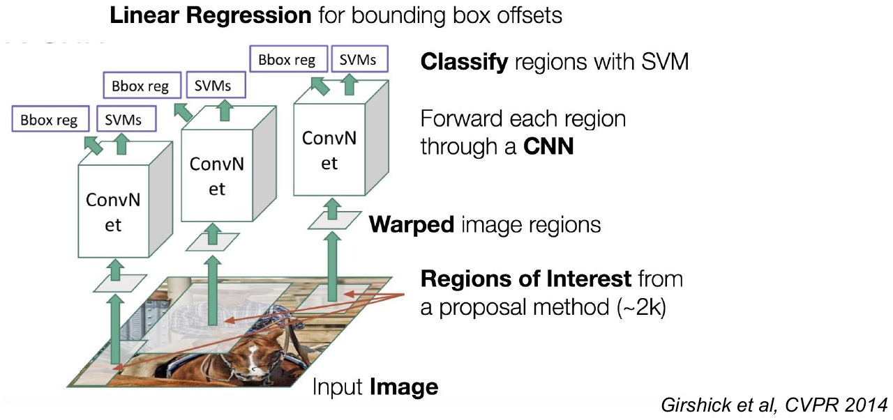

*原图：第 26 页。补齐第21–25页逐步出现的回归分支。*

候选框不必恰好包住目标，因此需要边界框回归，而不只是分类。将任意长宽比区域直接warp为固定形状可能造成形变；相邻候选共享很多像素，却分别提取CNN特征。

### 3.2 微调与三个训练阶段

先用ImageNet分类预训练CNN，再在检测区域上微调。课件微调规则：与某真实框IoU超过约50%的区域为正样本，其他按背景规则取样；128个ROI的批中32正、96负。这里是课程简化的微调描述，不能直接当成后续独立SVM训练的全部正负样本定义。

训练分为：

| 阶段 | 目标 | 课件所列损失 |
| --- | --- | --- |
| CNN检测微调 | 适应检测区域与背景 | Softmax log loss |
| 固定特征训练分类器 | 每类SVM | hinge loss |
| 框回归 | 修正位置和尺寸 | least squares |

多个目标分阶段优化，流程复杂；提取并缓存海量区域特征需要磁盘空间。课件VGG示例训练84小时，纯检测约47秒/图，含候选生成约49秒/图，说明大量独立ROI CNN计算是主要瓶颈。这些是原实验环境的历史数值。

## 4. Fast R-CNN：共享卷积与 ROI 对齐

来源：第 29–40 页。

### 4.1 从逐框CNN到整图CNN

只对整图执行一次卷积，生成共享特征图；把外部候选框映射到特征图，ROI Pooling得到固定大小的区域特征，再经FC输出类别概率和框回归。共享的是昂贵的卷积计算；每个ROI仍需区域提取和输出头，可合批执行。

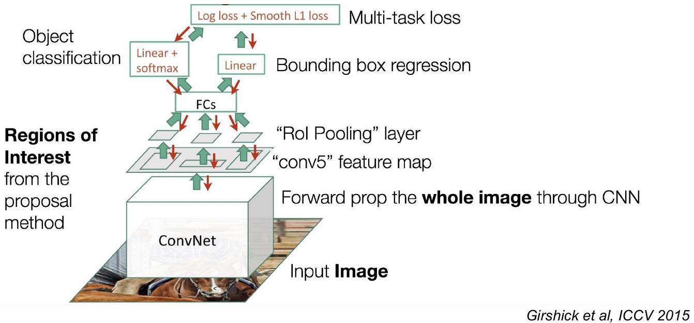

*原图：第 39 页。完整结构补齐第29–32页逐步出现的共享特征、ROI与双头。*

### 4.2 ROI Pooling 数值例题

8×8输入特征，目标输出2×2。候选框为[0,3,7,8]，按课件坐标解释宽7、高5。把区域切成2×2个bin，各bin最大池化；7/2、5/2不是整数，需要量化边界。

```math
Y=\begin{bmatrix}
0.85&0.84\\0.97&0.96
\end{bmatrix}.
```

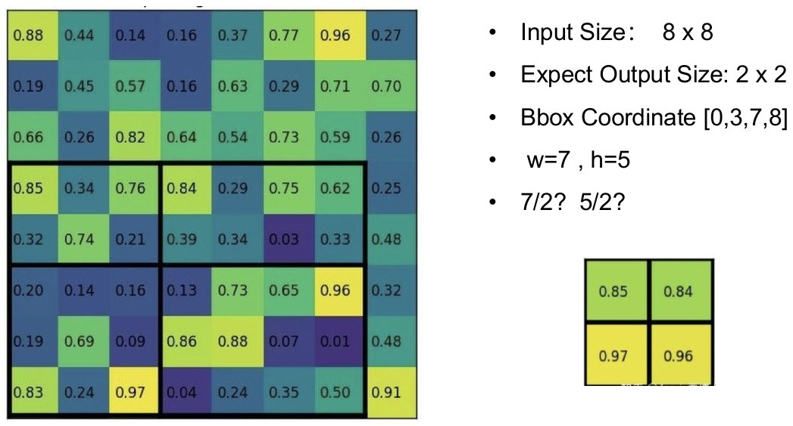

*原图：第 33 页。完整8×8数值、ROI边界及四个bin保留。按照图中划分分别取最大值；不同实现对inclusive/exclusive坐标和floor/ceil的处理可能不同，不能脱离约定照搬索引。*

ROI Pooling把不同大小ROI变成同样的输出高宽，便于接固定维度FC；输出通道数仍是输入特征通道数。

### 4.3 两次量化为何损害定位

例：800×800图像，骨干总步幅32，对应25×25特征图。665像素的ROI边长映射为：

```math
665/32=20.78125.
```

若量化为20，丢失0.78125个特征位置，相当于25个输入像素。再分成7个bin，20/7≈2.86，bin边界还会量化；直接用20.78125/7≈2.97的连续坐标则不同。小目标或掩码任务尤其受错位影响。

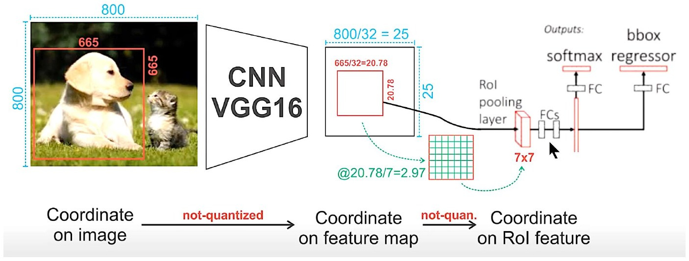

*原图：第 36 页。*

### 4.4 ROI Align

ROI Align保留连续坐标，按固定规则在每个bin采样，用双线性插值计算采样点特征，再聚合。课件示例128×128图像中的15×15 ROI，在25×25特征图上对应约2.93×2.93，而不是先强制取整。

必要插值说明：若点位于四个邻居(x₀,y₀)、(x₁,y₀)、(x₀,y₁)、(x₁,y₁)之间，单位网格中令a=x−x₀、b=y−y₀：

```math
f(x,y)=(1-a)(1-b)f_{00}
+a(1-b)f_{10}+(1-a)bf_{01}+abf_{11}.
```

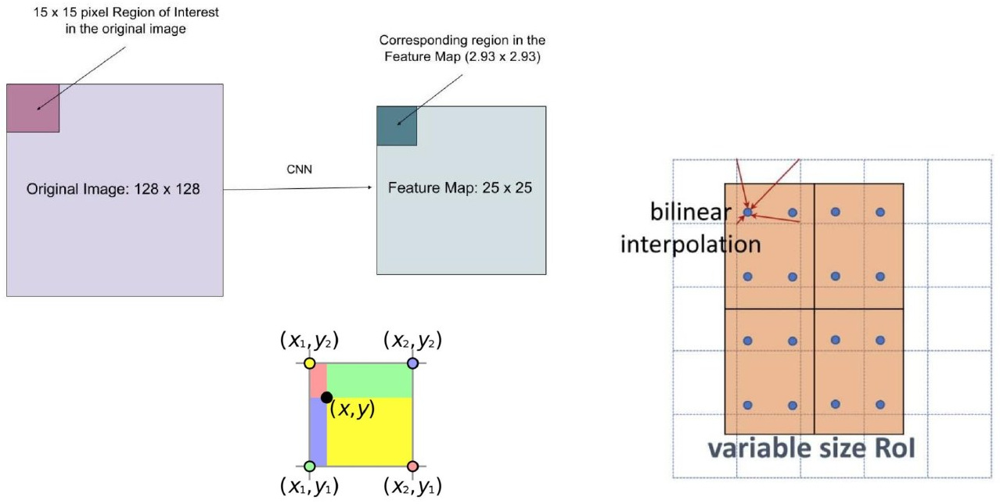

*原图：第 37 页。ROI Align由Mask R-CNN引入，用于减少特征与原图位置错位；参考 [Mask R-CNN 原论文](https://arxiv.org/abs/1703.06870)。Align的具体采样率、半像素约定需与实现一致。*

### 4.5 联合训练与速度

分类使用log loss，回归使用Smooth L1，两头与共享骨干可联合训练。必要公式展开：

```math
L(p,u,t,v)=-\log p_u+
\lambda\,\mathbf1[u\geq1]\sum_k
\mathrm{smooth}_{L_1}(t_k^u-v_k),
```

```math
\mathrm{smooth}_{L_1}(z)=
\begin{cases}
\frac12z^2,&|z|<1,\\
|z|-\frac12,&|z|\geq1.
\end{cases}
```

u=0为背景，前景才计算匹配类别的框回归；p是分类概率，t是预测框变换，v是真实目标变换。小误差用二次项，大误差线性增长，降低极大偏差对梯度的支配。该展开与 [Fast R-CNN 原论文](https://arxiv.org/abs/1504.08083) 对照。

| 方法，课件VGG环境 | 训练时长 | 含候选的测试秒/图 | 不含候选的测试秒/图 |
| --- | --- | --- | --- |
| R-CNN | 84h | 49 | 47 |
| SPPnet | 25.5h | 4.3 | 2.3 |
| Fast R-CNN | 8.75h | 2.3 | 0.32 |

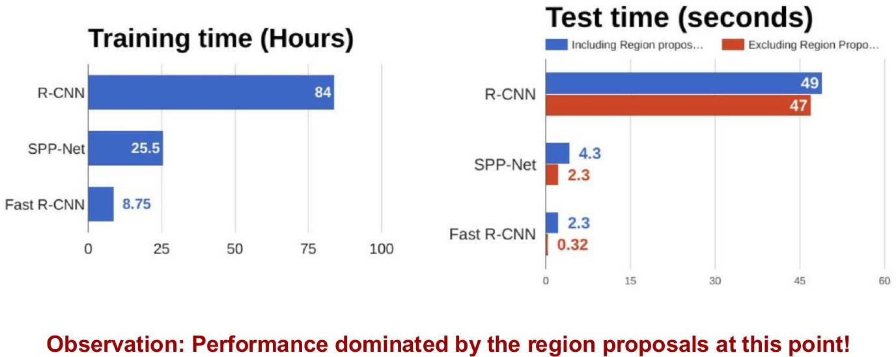

*原图：第 40 页。训练柱状图标注8.75h，测试图明确区分包括/不含候选生成；按本课件记录，不混用其他训练设置的7.5h。共享卷积显著加速，但外部Selective Search开始成为瓶颈。*

## 5. Faster R-CNN：用 RPN 学习候选

来源：第 41–50 页。

### 5.1 特征图上的锚框与两类预测

骨干对整图提特征，RPN（Region Proposal Network）在共享特征上预测“是否物体”和框变换，再把候选送入ROI阶段。课件尺寸例：3×640×480图像 → 512×20×15特征（两空间轴缩小32倍）。

每个位置放K个不同尺度/长宽比的anchor。K不是前景类别数。每个anchor产生物体性得分和4个框调整量，因此课程采用：

```math
\mathrm{objectness}:K\times20\times15,\qquad
\mathrm{box\ offsets}:4K\times20\times15.
```

用二类Softmax实现物体性时也可以输出2K logits；它与课程用一个标量表达物体性的记号不矛盾。共有300K个anchor候选，按得分与框有效性筛选，并进行重叠去除，保留约300个ROI（课程示例数，依设置而变）。

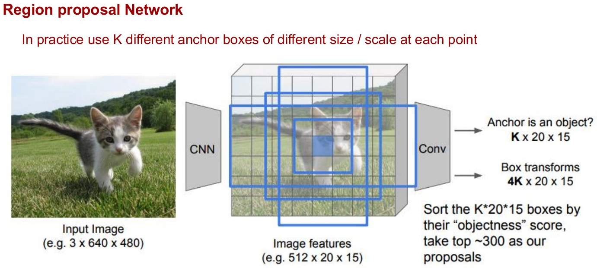

*原图：第 46 页。第43–45页逐步展示合并，保留全部张量形状与候选筛选过程。*

框回归输出的是相对anchor的调整，不应把未经解码的四个数直接当像素坐标。ROI阶段再判定具体类别并进一步修正框。

### 5.2 两阶段系统与四个损失

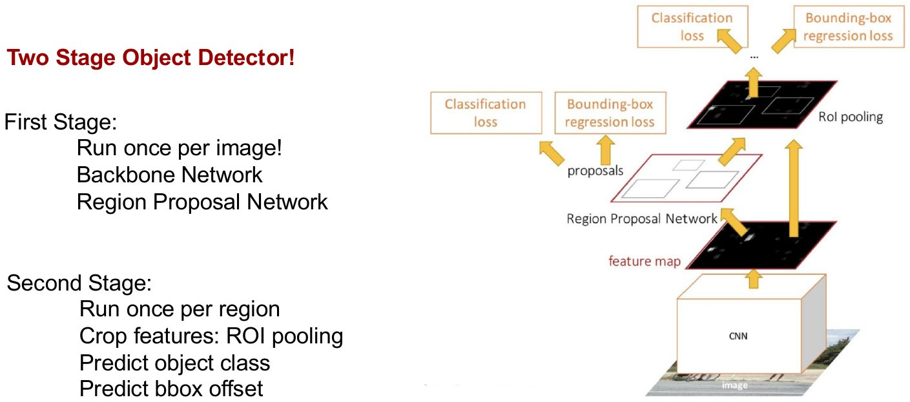

*原图：第 47 页。卷积与RPN按整图执行，ROI池化和类别/回归头按候选执行；可以批处理，不必逐框启动独立CNN。*

训练包括RPN物体性、RPN框回归、最终类别和最终框回归：

```math
L=L_{\mathrm{RPN,cls}}+
\lambda_1 L_{\mathrm{RPN,box}}+
\lambda_2 L_{\mathrm{ROI,cls}}+
\lambda_3 L_{\mathrm{ROI,box}}.
```

权重及归一化依训练实现，式子用于说明四项监督而非指定默认超参数。

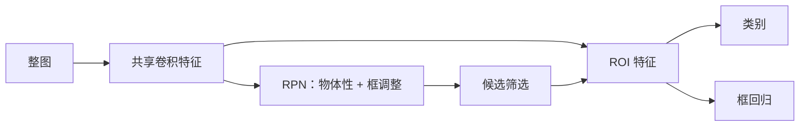
```mermaid
flowchart LR
 A["整图"] --> B["共享卷积特征"]
 B --> C["RPN：物体性 + 框调整"]
 C --> D["候选筛选"]
 B --> E["ROI 特征"]
 D --> E
 E --> F["类别"]
 E --> G["框回归"]
```

### 5.3 家族对照与瓶颈迁移

| 方法 | 候选来源 | 卷积特征 | 分类与回归 | 课件测试时间 |
| --- | --- | --- | --- | --- |
| R-CNN | Selective Search | 每ROI独立CNN | SVM与独立回归，分阶段 | 49s/图 |
| SPPnet | 外部候选 | 整图共享 | 空间金字塔池化等，课件作速度对照 | 4.3s/图 |
| Fast R-CNN | Selective Search | 整图共享 | ROI Pooling + 联合双头 | 2.3s/图 |
| Faster R-CNN | 学习的RPN | 与RPN共享 | RPN + ROI两阶段 | 约0.2s/图 |

上表同名方法也可能有不同骨干、协议和测试实现；不能把这些历史数值当作今日设备性能承诺。

## 6. 检测损失：类别不均衡与框几何

来源：第 51–59、83–85 页。附录重复Focal Loss合并。

### 6.1 Focal Loss

密集检测的候选中，容易分类的背景数量可能远多于前景，使总损失被简单样本支配。令y∈{0,1}，p为前景概率：

```math
p_t=\begin{cases}p,&y=1,\\1-p,&y=0,\end{cases}\qquad
\alpha_t=\begin{cases}\alpha,&y=1,\\1-\alpha,&y=0.\end{cases}
```

普通CE与带类别权重CE：

```math
L_{\mathrm{CE}}=-\log p_t,\qquad
L_{\mathrm{weighted\ CE}}=-\alpha_t\log p_t.
```

Focal Loss：

```math
L_{\mathrm{FL}}=-\alpha_t(1-p_t)^\gamma\log p_t.
```

γ≥0控制对简单样本的抑制，γ=0恢复带权CE。若不设置α权重，便是课件图中 $`-(1-p_t)^\gamma\log p_t`$。当pₜ接近1，调制因子很小；困难样本pₜ低时衰减较少。图示γ为0、0.5、1、2、5。

分段形式：

```math
L_{\mathrm{FL}}=
\begin{cases}
-\alpha(1-p)^\gamma\log p,&y=1,\\
-(1-\alpha)p^\gamma\log(1-p),&y=0.
\end{cases}
```

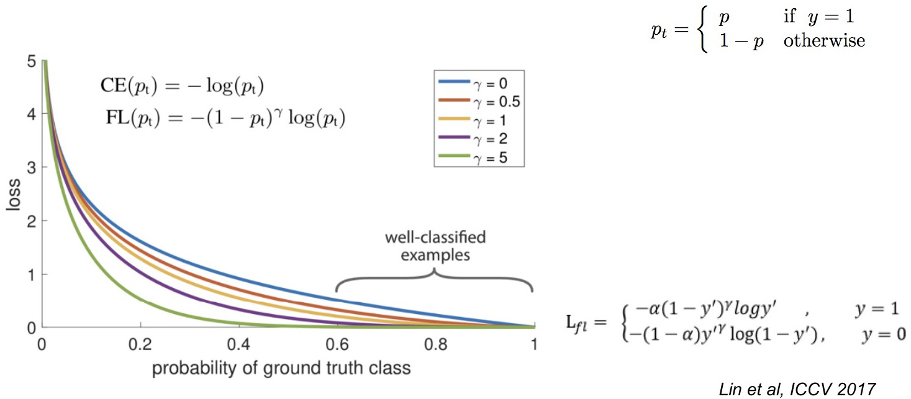

*原图：第 85 页，合并第52–54和83–84页。Lin等，ICCV2017。它属于可选择的检测分类损失，不能因为附录插在YOLO后就说YOLOv1原始目标函数使用了它。*

数值解释：γ=2时，pₜ=0.9的权重因子为0.01，pₜ=0.5为0.25；前者相对被更强抑制。α调整类别权重，γ调整难易权重，两者作用不同。

### 6.2 L2 为什么不直接反映框质量

课件三个框的坐标L2距离均为8.41，但IoU分别0.26、0.49、0.65。相同坐标差不必产生相同几何重叠；IoU与检测评价更直接相关。

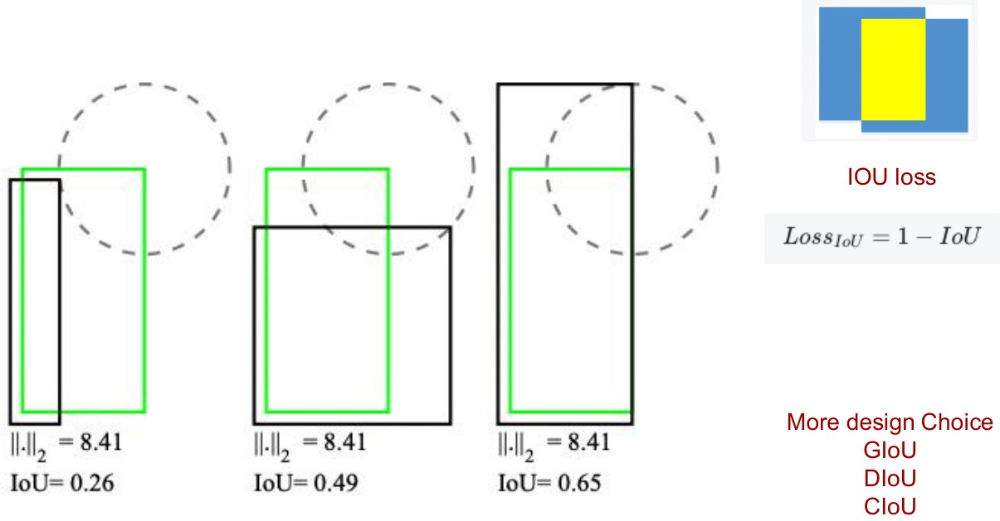

*原图：第 55 页。图中未给出所有精确框坐标，因此8.41及三个IoU按原页记录，不能假装仅由示意图精确复算。*

IoU损失：

```math
L_{\mathrm{IoU}}=1-\mathrm{IoU}.
```

不相交时IoU=0，常规重叠区域内的梯度无法有效指示应往哪里移动，因而引入其他几何项。

### 6.3 GIoU：最小包围区域

令C为同时包住预测框B和真实框Bᵍᵗ的最小轴对齐矩形：

```math
\mathrm{GIoU}=\mathrm{IoU}-
\frac{|C\setminus(B\cup B^{gt})|}{|C|},
\qquad
L_{\mathrm{GIoU}}=1-\mathrm{IoU}+
\frac{|C\setminus(B\cup B^{gt})|}{|C|}.
```

C中不属于两框并集的空白越大，惩罚越大；即使不相交，也能提供几何约束。

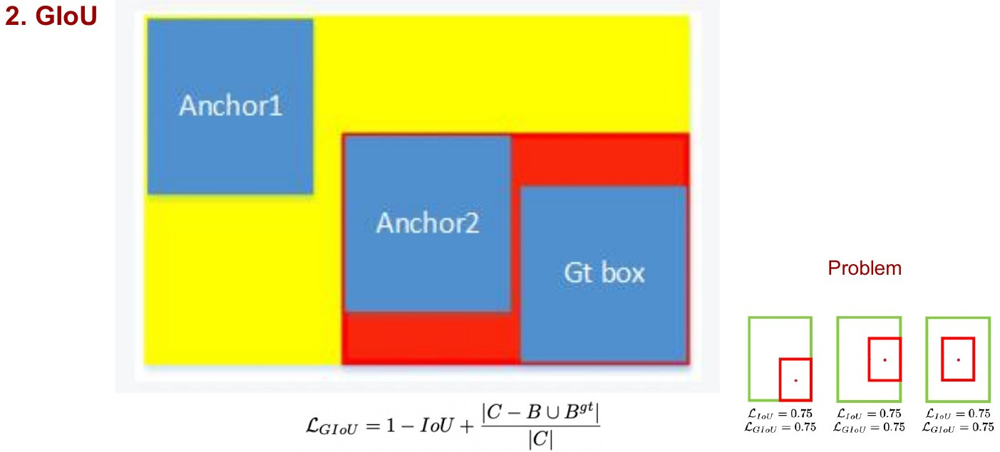

*原图：第 57 页。原页分子简写易有括号歧义，正文使用集合差。右下标注的0.75是 **损失L**，不是IoU值：三个完全包含但位置不同的框可以有相同IoU/GIoU损失0.75，说明GIoU未明确区分中心偏移。*

### 6.4 DIoU：中心距离

令b、bᵍᵗ为两框中心，ρ为欧氏距离，c为最小包围框的对角线长度：

```math
L_{\mathrm{DIoU}}=
1-\mathrm{IoU}+\frac{\rho^2(b,b^{gt})}{c^2}.
```

归一化中心距离让中心对齐也成为优化目标，补充只看重叠或包围区域的不足。课件在此注明YOLOv4相关使用场景，但不同版本具体损失应按实现识别。

### 6.5 CIoU：加入长宽比

```math
v=\frac4{\pi^2}
\left(\arctan\frac{w^{gt}}{h^{gt}}-
\arctan\frac wh\right)^2,\qquad
\alpha=\frac{v}{1-\mathrm{IoU}+v}.
```

```math
L_{\mathrm{CIoU}}
=1-\mathrm{IoU}
+\frac{\rho^2(b,b^{gt})}{c^2}
+\alpha v.
```

CIoU综合重叠面积、中心距离、长宽比。α是这里的几何权重，与Focal Loss中的α无关；实现需对分母、宽高加数值保护，完全相同框导致0/0时应按极限令附加项为0。

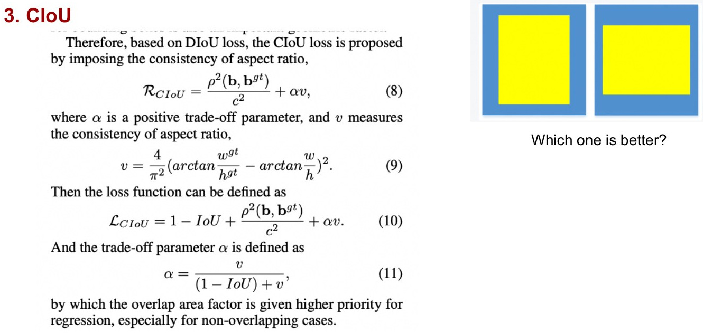

*原图：第 59 页。右图询问“哪一个更好”，必须结合真实框、中心、重叠及长宽比判断，不能只看颜色面积。原论文依据：[DIoU/CIoU](https://arxiv.org/abs/1911.08287)。*

## 7. 语义分割：从逐窗口到全卷积

来源：第 62–69 页。

### 7.1 像素类别与滑动窗口

场景中的天空、草地、猫、牛、树等各像素获得语义标签；同类像素不自动区分不同个体。早期可为每个中心像素裁邻域图块，CNN判中心类别，但重叠窗口重复计算，效率低。

全卷积网络（FCN）直接用卷积输出空间类别得分：输入3×H×W，中间为D×H×W，最终得分C×H×W，其中C是像素类别数；沿类别轴argmax生成H×W标签图。训练通常使用像素级监督，预测概率和最终离散标签是两种对象。

### 7.2 编码器与解码器

始终在原图分辨率计算卷积很昂贵，因而先降采样到H/2、H/4等，再逐层上采样恢复分辨率。编码器扩大感受野、提取语义；解码器恢复空间位置。分辨率恢复不意味着所有降采样丢失的信息都自动被恢复。

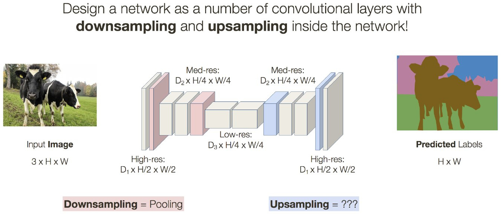

*原图：第 69 页。完整通道、空间尺寸和输出类别图保留。*

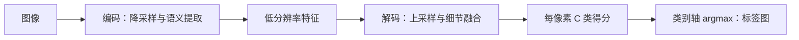
```mermaid
flowchart LR
 A["图像"] --> B["编码：降采样与语义提取"]
 B --> C["低分辨率特征"]
 C --> D["解码：上采样与细节融合"]
 D --> E["每像素 C 类得分"]
 E --> F["类别轴 argmax：标签图"]
```

## 8. 上采样、反池化与转置卷积

来源：第 70–73 页。

### 8.1 最近邻与零插入

输入2×2：

```math
X=\begin{bmatrix}1&2\\3&4\end{bmatrix}.
```

最近邻把每个数复制成2×2区域；bed-of-nails按课件布局只在隔开的格点放值，其余填零：

```math
U_{\mathrm{nearest}}=
\begin{bmatrix}1&1&2&2\\1&1&2&2\\3&3&4&4\\3&3&4&4\end{bmatrix},
\qquad
U_{\mathrm{zeros}}=
\begin{bmatrix}1&0&2&0\\0&0&0&0\\3&0&4&0\\0&0&0&0\end{bmatrix}.
```

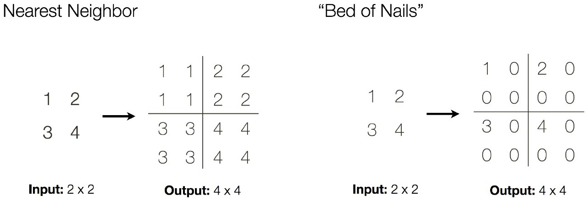

*原图：第 70 页。两者不学习新权重；零插入还需要后续滤波等操作来形成稠密结果。*

### 8.2 Max Unpooling：记住位置，不是还原全部数值

最大池化保存每个窗口最大元素的索引。课件输入：

```math
X=
\begin{bmatrix}
1&2&6&3\\3&5&2&1\\1&2&2&1\\7&3&4&8
\end{bmatrix},
\qquad
\mathrm{MaxPool}(X)=
\begin{bmatrix}5&6\\7&8\end{bmatrix}.
```

经过后续网络，解码端输入成为 $`\begin{bmatrix}1&2\\3&4\end{bmatrix}`$，使用编码端保存的四个位置放回：

```math
\mathrm{Unpool}=
\begin{bmatrix}
0&0&2&0\\0&1&0&0\\0&0&0&0\\3&0&0&4
\end{bmatrix}.
```

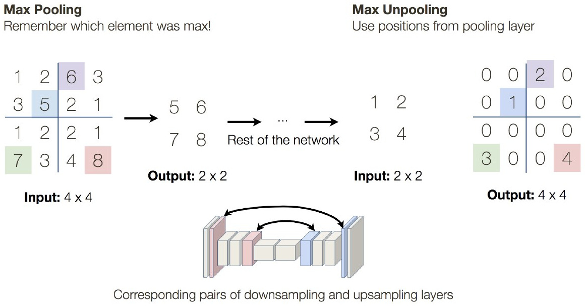

*原图：第 71 页。位置来自5/6/7/8，但放回的是当前解码特征1/2/3/4；不能误写为把原始最大值直接恢复。未保留的非最大元素仍不可恢复。*

### 8.3 转置卷积的含义与形状

转置卷积把输入值作为权重，在输出上“铺开”卷积核；相邻铺开的区域重叠时**求和**。输入移动1格，核在输出移动S格。若普通卷积是线性映射矩阵W，转置卷积对应Wᵀ，不保证是W⁻¹，因而“反卷积”不等于精确还原。

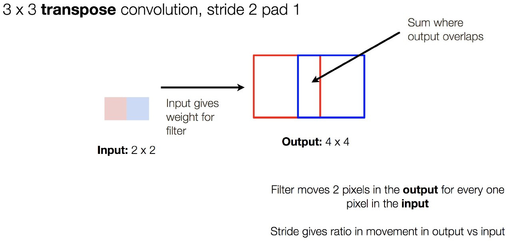

*原图：第 72 页。*

输出边长的必要完整公式：

```math
N_{\mathrm{out}}=
(N_{\mathrm{in}}-1)S-2P+D(F-1)+P_{\mathrm{out}}+1.
```

课件2×2输入、F=3、S=2、P=1，直接写4×4输出。按D=1、output_padding=0其实为3×3；要得到4×4，需要output_padding=1或相应目标输出尺寸约定。output_padding解决形状歧义，并不是向输出数值简单补一圈零。依据：[PyTorch ConvTranspose2d说明](https://docs.pytorch.org/docs/stable/generated/torch.nn.ConvTranspose2d)。

一维例：输入[a,b]，核[x,y,z]，步幅2，将第二份核从第3个位置开始铺开：

```math
[a,b]\longmapsto[ax,\ ay,\ az+bx,\ by,\ bz].
```

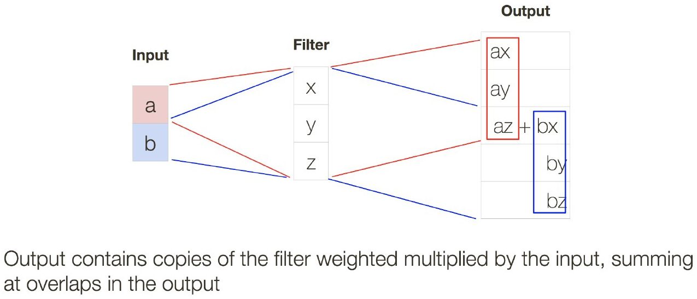

*原图：第 73 页。无裁剪的完整输出长度为(2−1)×2+3=5。*

## 9. U-Net：语义与定位细节融合

来源：第 74 页。

U-Net有收缩路径和对称扩张路径：左侧3×3卷积+ReLU、2×2最大池化提取语义；右侧2×2上卷积增加分辨率，复制并裁剪同尺度编码器特征，与解码特征**沿通道拼接**，再卷积融合；最后1×1卷积映射到像素类别。

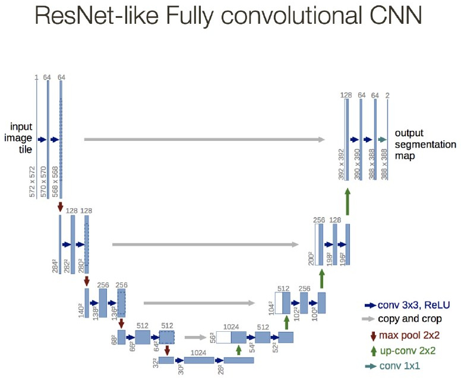

*原图：第 74 页。经典图使用无填充卷积，输入572×572、输出388×388；尺寸收缩使skip特征需要crop。底部方法演进文字已转入正文。*

图中编码通道64→128→256→512→1024，解码再逐级512→256→128→64，最后2类输出。横向skip传递细节，低分辨率主路径传递语义。课件称“ResNet-like”，两者确实都有跨层路径，但经典U-Net用**拼接**，ResNet通常用**相加**，不能混同。

出处：[U-Net原论文](https://arxiv.org/abs/1505.04597)。课件列出的相关发展方向完整保留：U-Net → 3D U-Net → Attention U-Net → U-Net++ → nnU-Net → TransUNet / Swin-UNETR。它们是相关方法谱系，不应视为每个版本严格替代上一个，或把未在课件展开的全部内部机制补写为课程内容。

## 10. YOLOv1：整图一次预测

来源：第 60–61、77–89 页；时间线与演示重复合并。

### 10.1 网格、框和类别张量

将图像分为S×S网格，目标中心落在哪个cell，该cell负责预测。每cell预测B个框，每框5个数：中心x,y、宽w、高h、confidence；另有C个条件类别概率。

```math
\mathrm{Output}\in\mathbb R^{S\times S\times(5B+C)}.
```

课件示意图用S=7、B=3说明可多个框，但右侧最终张量及真正YOLOv1 VOC配置为S=7、B=2、C=20：

```math
7\times7\times(2\times5+20)=7\times7\times30.
```

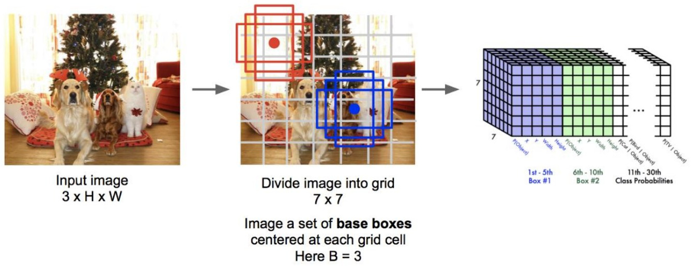

*原图：第 81 页。原图左侧B=3与右侧“两框30维”是不同说明配置，正文明确区分。*

重要校正：YOLOv1的C是20个前景类别，**不把background另列为第21个类别**；无物体由confidence表达。原页把所有版本通用的anchor偏移(dx,dy,dw,dh)写到YOLOv1示意中，也需区分：v1的x,y相对cell边界，w,h相对整图归一化；anchor-based版本有另外的解码规则。依据：[YOLOv1原论文第2节](https://arxiv.org/html/1506.02640v5)。

### 10.2 置信度与推断分数

```math
\mathrm{confidence}=\Pr(\mathrm{Object})\,
\mathrm{IoU}_{\mathrm{pred}}^{\mathrm{truth}}.
```

```math
\mathrm{score}_c
=\Pr(c\mid\mathrm{Object})\,
\Pr(\mathrm{Object})\,
\mathrm{IoU}_{\mathrm{pred}}^{\mathrm{truth}}
=\Pr(c)\,\mathrm{IoU}_{\mathrm{pred}}^{\mathrm{truth}}.
```

推断时没有真实框可用于计算这个IoU；网络**预测**相应置信度，再与条件类别概率相乘。筛低分框、按类别进行非极大值抑制NMS，减少同一物体的重复预测。NMS按分数保留高分框，并移除与之IoU超过阈值的同类框；阈值依任务设置。

### 10.3 骨干结构

输入448×448×3，输出7×7×30。网络由24个卷积层和2个FC构成，1×1用于降通道，3×3提空间特征；最后FC含4096维隐藏和最终预测。

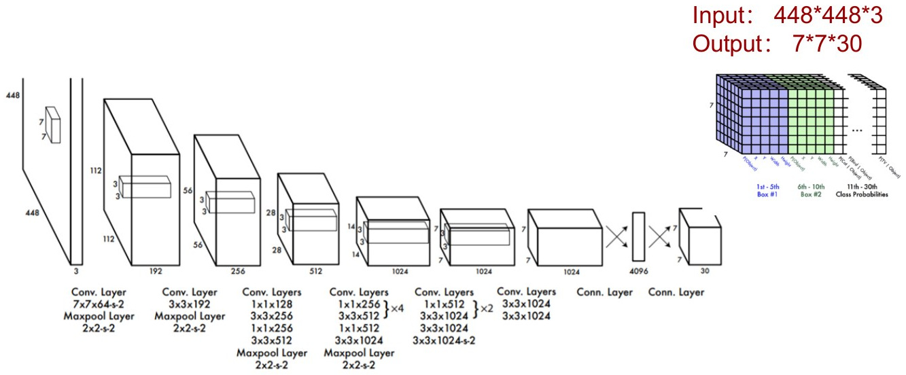

*原图：第 86 页。完整核尺寸、步幅、重复次数、通道、空间尺寸保留。第89页相同结构与问题页合并。*

### 10.4 五项原始目标函数

令ŷ表示对应真实目标，1ᵢⱼᵒᵇʲ表示cell i的第j个框负责该目标，1ᵢᵒᵇʲ表示该cell存在目标；将课件简写的坐标显式带上框索引，求和用1…S²和1…B以避免“从0到S²”误读为多一项：

```math
\begin{aligned}
L={}&\lambda_{\mathrm{coord}}
\sum_{i=1}^{S^2}\sum_{j=1}^{B}
\mathbf1_{ij}^{\mathrm{obj}}
[(x_{ij}-\hat x_{ij})^2+(y_{ij}-\hat y_{ij})^2]\\
&+\lambda_{\mathrm{coord}}
\sum_{i=1}^{S^2}\sum_{j=1}^{B}
\mathbf1_{ij}^{\mathrm{obj}}
[(\sqrt{w_{ij}}-\sqrt{\hat w_{ij}})^2+
(\sqrt{h_{ij}}-\sqrt{\hat h_{ij}})^2]\\
&+\sum_{i=1}^{S^2}\sum_{j=1}^{B}
\mathbf1_{ij}^{\mathrm{obj}}
(C_{ij}-\hat C_{ij})^2\\
&+\lambda_{\mathrm{noobj}}
\sum_{i=1}^{S^2}\sum_{j=1}^{B}
\mathbf1_{ij}^{\mathrm{noobj}}
(C_{ij}-\hat C_{ij})^2\\
&+\sum_{i=1}^{S^2}\mathbf1_i^{\mathrm{obj}}
\sum_{c=1}^{C}(p_i(c)-\hat p_i(c))^2.
\end{aligned}
```

这里Cᵢⱼ是框confidence，类别数C出现在最后求和，两者符号相同但语义不同。五项分别为中心、宽高、负责目标框置信度、不负责目标框/背景置信度、条件类别误差。中心/宽高只对负责框计算，类别只对有物体cell计算；宽高开平方使小框的相同绝对误差更受重视。原始v1采用平方损失，不能替换成前文Focal/CIoU后仍称作原始目标函数。课件公式中的预测/真实帽号可反向约定，平方项不受影响，但训练标签必须定义一致。

### 10.5 优势、局限与课件性能表

一次整图预测能利用上下文并降低重复ROI计算；网格限制使相邻密集小目标、多物体中心同cell、精细定位及罕见长宽比成为困难。固定预测槽位不代表只能输出固定数目的最终检测，筛选后数量仍可变。

| 课件历史方法 | 训练数据年份 | mAP | FPS |
| --- | --- | --- | --- |
| 100Hz DPM | 2007 | 16.0 | 100 |
| 30Hz DPM | 2007 | 26.1 | 30 |
| Fast YOLO | 2007+2012 | 52.7 | 155 |
| YOLO | 2007+2012 | 63.4 | 45 |
| Fastest DPM | 2007 | 30.4 | 15 |
| R-CNN Minus R | 2007 | 53.5 | 6 |
| Fast R-CNN | 2007+2012 | 70.0 | 0.5 |
| Faster R-CNN VGG16 | 2007+2012 | 73.2 | 7 |
| Faster R-CNN ZF | 2007+2012 | 62.1 | 18 |
| YOLO VGG16 | 2007+2012 | 66.4 | 21 |

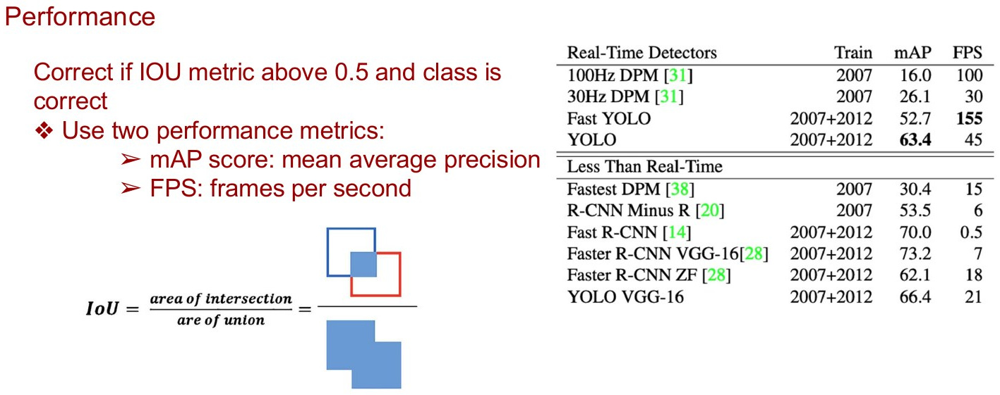

*原图：第 88 页。表中mAP采用VOC评测条件，与本章COCO AP曲线不同。*

## 11. YOLOv2 与 YOLO9000

来源：第 90–95 页。

### 11.1 v2 的改动

课件列出：

1. 每个框各自预测类别，改变v1“每个cell共用一组类别”的安排。
2. 高分辨率分类预训练，课件记录约4个百分点mAP收益。
3. BatchNorm，课件记录约2个百分点收益。
4. 引入anchor，用K-means选择数据适合的先验框尺寸。
5. Pass-through层，把较细分辨率特征重排并合入较粗特征。
6. 多尺度训练，增强对不同输入分辨率的适应性。
7. 骨干Darknet-19，19个卷积层。

原页仍写448×448；这是沿用v1的简写。YOLOv2的论文常用416×416产生13×13网格，也支持多尺度输入，不能把448当唯一固定尺寸。引用依据：[YOLO9000原论文](https://arxiv.org/html/1612.08242v1)。

### 11.2 Pass-through 的数值例题

把26×26×512的细尺度特征每个2×2空间块拆成4个通道组：

```math
26\times26\times512
\longrightarrow13\times13\times2048.
```

元素数保持。再与13×13×1024特征沿通道拼接，得到13×13×3072。它是空间到通道的重排，不是平均/最大池化。

课件4×4编号例[1…16]重排的四张2×2图分别为：

```math
\begin{bmatrix}1&3\\9&11\end{bmatrix},\
\begin{bmatrix}2&4\\10&12\end{bmatrix},\
\begin{bmatrix}5&7\\13&15\end{bmatrix},\
\begin{bmatrix}6&8\\14&16\end{bmatrix}.
```

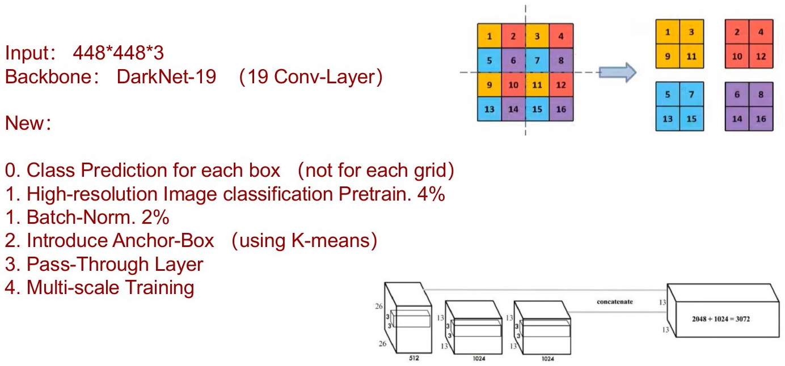

*原图：第 91 页。保留所有16个编号、通道计算及课件记录的增强收益。*

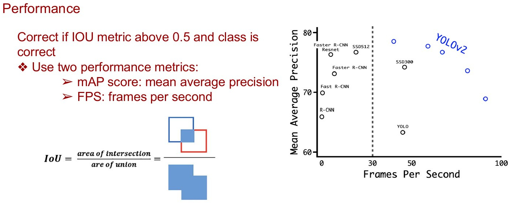

*原图：第 92 页。不同输入尺寸形成速度与精度取舍；与Fast/Faster R-CNN、SSD等原图基线对照。*

### 11.3 YOLO9000 与 WordTree

COCO提供框标注但物体类别较少，ImageNet提供更多细类别但通常仅有分类标注。WordTree用层级关系统一两套标签：例如animal→dog→具体犬种，宽泛标签和细标签可以共存，而不是都放进一个扁平互斥Softmax。

在同父节点的子类别之间分别做Softmax，沿根到目标节点的路径组合条件概率。检测数据监督定位和类别，分类数据增加细粒度类别监督，从而联合训练超过9,000类的YOLO9000。层级关系不意味着“只凭分类标签就拥有这些类别同等质量的框监督”。

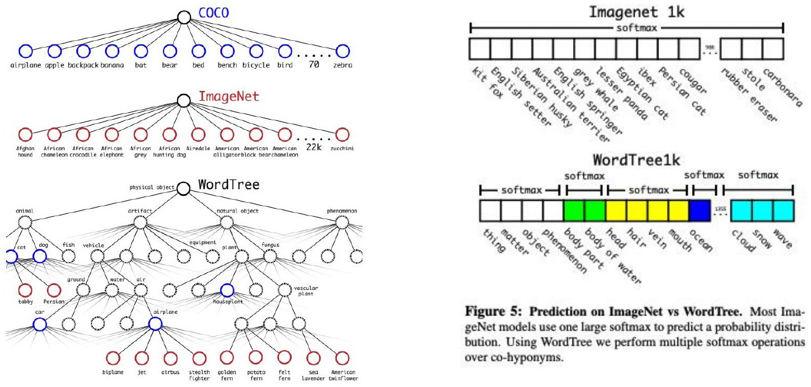

*原图：第 95 页。保留cat/dog、车辆、自然物、具体犬种与飞机/植物等层级示例。*

## 12. YOLOv3、v4 与训练技巧

### 12.1 YOLOv3 的课件内容

来源：第 96 页。

骨干为Darknet-53，性能图比较COCO AP与推断时间：

| 课件v3配置 | COCO AP | 推断时间 |
| --- | --- | --- |
| YOLOv3-320 | 28.2 | 22ms |
| YOLOv3-416 | 31.0 | 29ms |
| YOLOv3-608 | 33.0 | 51ms |

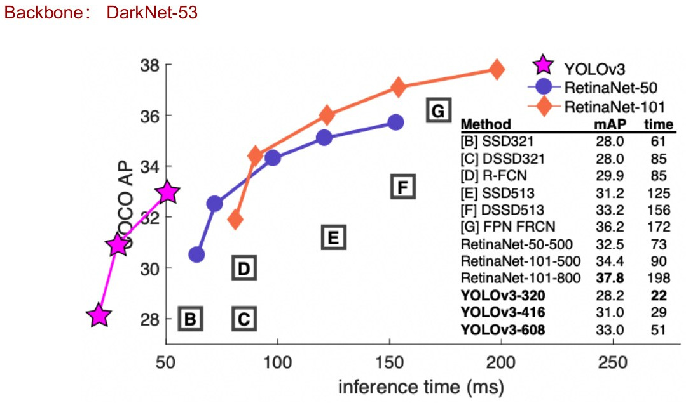

*原图：第 96 页。完整保留SSD321/513、DSSD321/513、R-FCN、FPN FRCN、RetinaNet的AP和时间。输入变大通常提高该实验AP也增加延迟；曲线不构成当前硬件的通用排名。*

### 12.2 YOLOv4 的速度—精度曲线

来源：第 98 页。

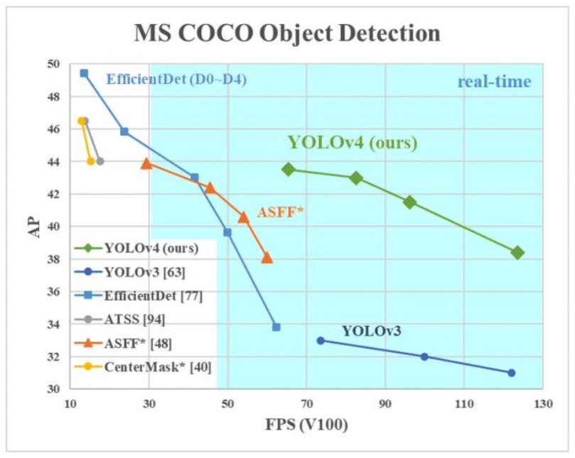

*原图：第 98 页。保留YOLOv3、EfficientDet、ATSS、ASFF、CenterMask等曲线，横轴标明FPS(V100)。COCO AP与AP50不是同一指标。*

### 12.3 Bag of Freebies 与 Mosaic

来源：第 99 页。

Bag of freebies指主要在训练端改进、尽量不增加推断成本的技巧。课件列了普通裁剪、旋转、翻转、hue/saturation/exposure/aspect变化、Mixup、CutMix、Mosaic、模糊，并强调Mosaic、Self-Adversarial Training与DropBlock。

Mosaic将多图（经典例为四图）拼接，使模型看到不同场景、尺度和上下文；检测框须随每个图块的缩放、裁剪、拼接同步变换。它不同于Mixup的像素加权混合。

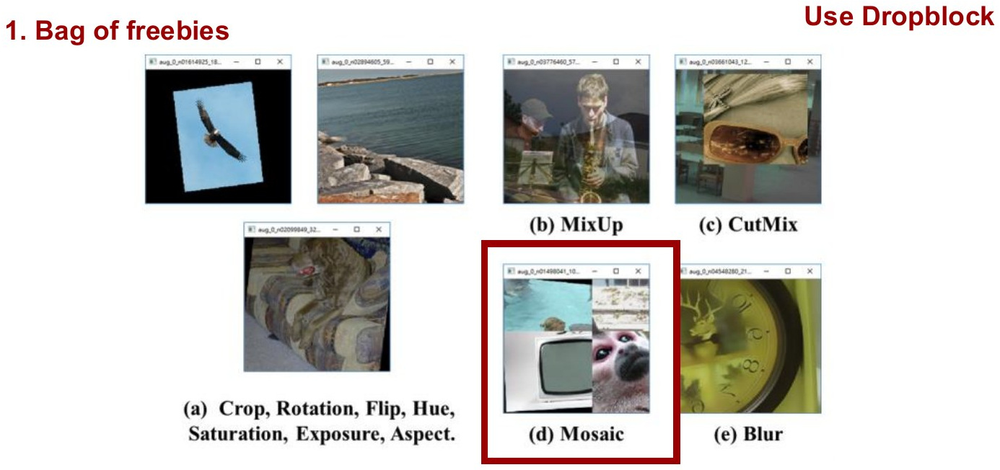

*原图：第 99 页。原图各增强示例保留；第三章已讲Mixup，定义不再重复。*

### 12.4 Self-Adversarial Training 与图中对抗例

来源：第 100 页。

课件图示给输入加微小扰动，说明外观近似不变也可能让模型输出大变：

```math
x'=x+\epsilon\,\mathrm{sign}(\nabla_xJ(\theta,x,y)).
```

图中ε=0.007：原图“panda”57.7%，扰动图“nematode”8.2%，相加后图“gibbon”99.3%。这些是示例模型给出的类别置信度，不是精度统计。右侧把梯度变量写成θ容易误读；生成与图像同形状的扰动应对输入x求梯度。

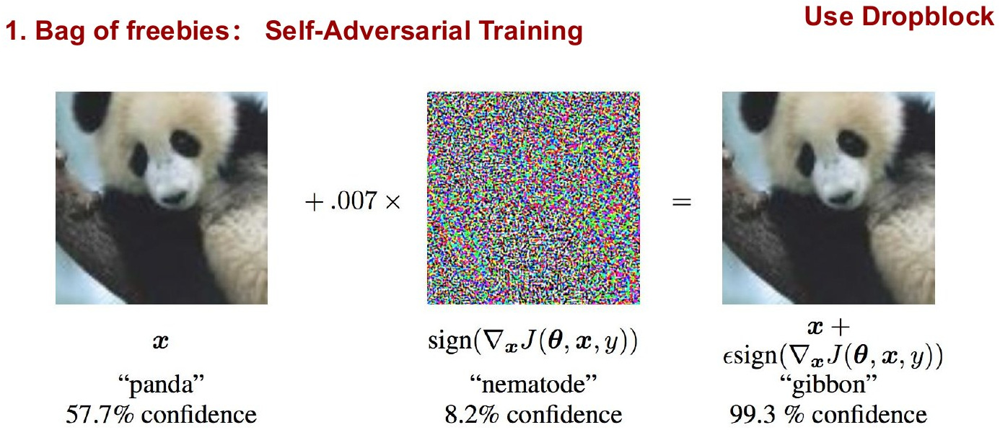

*原图：第 100 页。该图用于解释对抗扰动原理，并非YOLOv4的检测实验。*

必要区分：YOLOv4的SAT先按当前检测器修改输入图像以制造更难样本，再用修改图像更新检测器；不能把上面的经典分类FGSM示例直接当作SAT全部算法。技巧出处：[YOLOv4原论文](https://arxiv.org/abs/2004.10934)。

### 12.5 DropBlock 与 Label Smoothing

来源：第 101–102 页。

普通Dropout随机丢弃零散激活，附近激活高度相关，可能仍携带相同语义；DropBlock丢弃连续区域，迫使网络用其他位置的线索。例如挡住狗头或脚相关区域，其余特征仍要支持分类。它作用于特征图，不等于只在原始图片上剪去某个矩形。

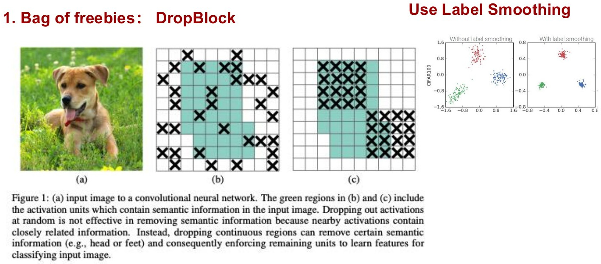

*原图：第 102 页，合并第101页重复部分。*

Label Smoothing避免把训练目标设为完全确信的one-hot。必要数学说明，K类、平滑率ε：

```math
y_k^{\mathrm{smooth}}=(1-\epsilon)y_k+\frac{\epsilon}{K}.
```

再用这些软目标计算分类损失。右图对比无/有平滑的特征分布；横纵范围不同，不能仅按图上簇大小直接量化提升。平滑率与DropBlock强度需要验证，课件未指定唯一默认值。

## 13. YOLO 谱系与演示记录

来源：第 60–61、77–78、93–94、97、103 页。

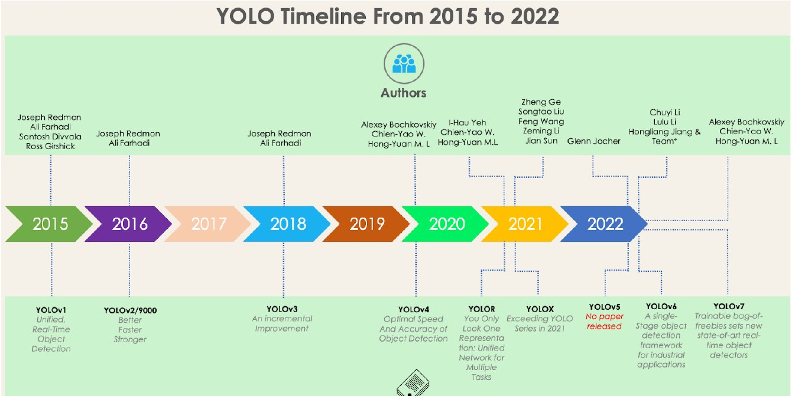

*原图：第 103 页。合并重复时间线，保留作者与论文索引；底部装饰和网页宣传不作为知识。图是课件中的2015–2022历史视图，YOLOv5“no paper released”也是图当时的记录，不延伸为当前事实。*

| 历史节点 | 课件列出的题名/关系 |
| --- | --- |
| YOLOv1，2015预印本 | Unified, Real-Time Object Detection |
| YOLOv2/9000，2016预印本 | Better, Faster, Stronger；会议发表于2017 |
| YOLOv3，2018 | An Incremental Improvement |
| YOLOv4，2020 | Optimal Speed and Accuracy of Object Detection |
| YOLOR，2021 | You Only Look One Representation: Unified Network for Multiple Tasks |
| YOLOX，2021 | Exceeding YOLO Series in 2021 |
| YOLOv5 | 课件标Glenn Jocher与工程实现支线；未展开内部机制 |
| YOLOv6，2022 | A Single-Stage Object Detection Framework for Industrial Applications |
| YOLOv7，2022 | Trainable Bag-of-Freebies Sets New State-of-the-Art for Real-Time Object Detectors |

这些分支来自不同作者和团队，名称连续不意味着同一个模型按统一技术路线逐版递增。课件另有YOLOv5/6/7/8的输出演示：

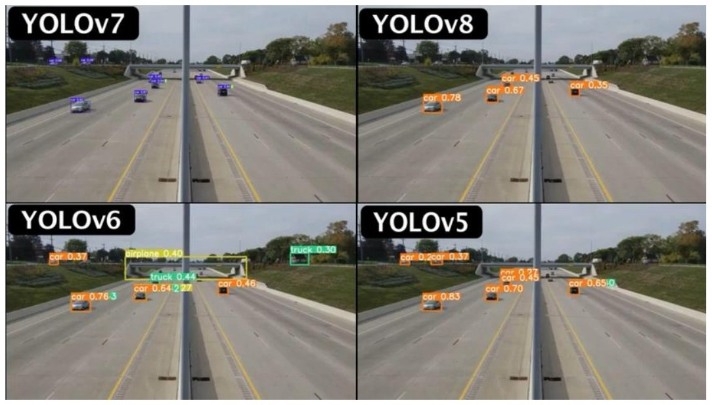

*原图：第 78 页，与第61页重复图合并。框、类别及分数是演示输出；图片未提供同数据、同硬件的定量评测，不能据此判断哪个版本最好。*

## 14. 章节关系与校正索引

检测从独立窗口分类发展到共享骨干，再到学习候选和一次密集预测；分割将空间类别预测推进到像素，并用解码和skip路径补足定位。分类头、框回归头与掩码/像素头的输出和监督不同，但都依赖前章讨论的视觉特征。

本章明确校正：VOC漏列类别和历史统计口径，GIoU图中的损失/IoU区别，转置卷积output_padding，U-Net拼接与ResNet相加，YOLOv1示意B=3与实际B=2、C不含背景，v1与anchor偏移的区别，v2的输入分辨率，对抗扰动的输入梯度。

完整页码去向见 [覆盖表](../COVERAGE.md)，原图出处见 [图片清单](../assets/manifest.json)。前章已讲的卷积、池化、骨干、Mixup等不重复推导；这里保留它们在检测与分割中的新增用法。

返回 [总目录](../README.md) · 前一章：[卷积与视觉骨干](03-计算机视觉导论-卷积与视觉骨干.md)。
